### Underlay. OSPF

### Цель
- Настроить OSPF для Underlay сети

### Схема с адресацией IPv4

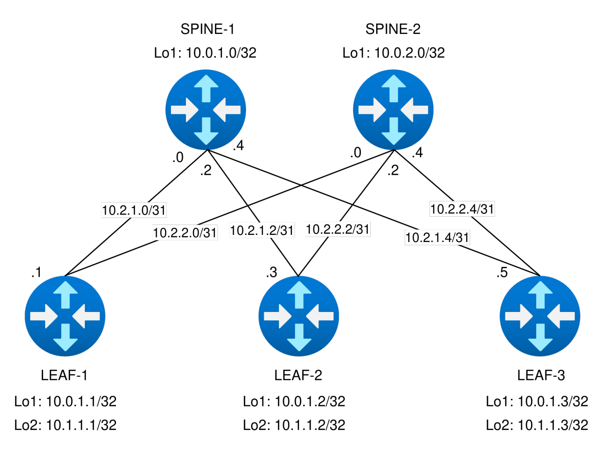

### Настройка оборудования

- На устройствах используются Loopback1 для построения Underlay связности.
- Для OSPF в качестве router ID используются IPv4 адреса Loopback1.
- На интерфейсах для OSPF настроен BFD для быстрого реагирования на изменения состояния линков.
- Настроена простая аутентификация для OSPF.
- Последовательность настройки:
    - Настраивается IP адресация на интерфейсах c проверкой доступности (ping) физических интерфейсов,
    - Настраивается OSPF с проверкой связности всех Loopback1 интерфейсов и создания ECMP маршрутов.

#### SPINE-1
```
configure
hostname spine-1
interface Loopback1
 ip address 10.0.1.0/32
 exit
interface Ethernet1
 description to-leaf-1
 no switchport
 mtu 9214
 ip address 10.2.1.0/31
 exit
interface Ethernet2
 no switchport
 mtu 9214
 ip address 10.2.1.2/31
 description to-leaf-2
 exit
interface Ethernet3
 description to-leaf-3
 no switchport
 mtu 9214
 ip address 10.2.1.4/31
 exit
ip routing
router ospf 1
 router-id 10.0.1.0
 passive-interface default
 no passive-interface Ethernet 1-3
 exit
interface Loopback1
 ip ospf area 0.0.0.0
 exit
interface Ethernet 1-3
 ip ospf area 0.0.0.0
 ip ospf network point-to-point
 ip ospf authentication
 ip ospf authentication-key lab2
 ip ospf neighbor bfd
 bfd interval 100 min_rx 100 multiplier 3
 exit
```

#### SPINE-2
```
configure
hostname spine-2
interface Loopback1
 ip address 10.0.2.0/32
 exit
interface Ethernet1
 no switchport
 mtu 9214
 ip address 10.2.2.0/31
 description to-leaf-1
 exit
interface Ethernet2
 description to-leaf-2
 no switchport
 mtu 9214
 ip address 10.2.2.2/31
 exit
interface Ethernet3
 description to-leaf-3
 no switchport
 mtu 9214
 ip address 10.2.2.4/31
 exit
ip routing
router ospf 1
 router-id 10.0.2.0
 passive-interface default
 no passive-interface Ethernet 1-3
 exit
interface Loopback1
 ip ospf area 0.0.0.0
 exit
interface Ethernet 1-3
 ip ospf area 0.0.0.0
 ip ospf network point-to-point
 ip ospf authentication
 ip ospf authentication-key lab2
 ip ospf neighbor bfd
 bfd interval 100 min_rx 100 multiplier 3
 exit
```

#### LEAF-1
```
configure
hostname leaf-1
interface Loopback1
 ip address 10.0.1.1/32
 exit
interface Loopback2
 ip address 10.1.1.1/32
 exit
interface Ethernet1
 description to-spine-1
 no switchport
 mtu 9214
 ip address 10.2.1.1/31
 exit
interface Ethernet2
 description to-spine-2
 no switchport
 mtu 9214
 ip address 10.2.2.1/31
 exit
ip routing
router ospf 1
 router-id 10.0.1.1
 passive-interface default
 no passive-interface Ethernet 1-2
 exit
interface Loopback1
 ip ospf area 0.0.0.0
 exit
interface Ethernet 1-2
 ip ospf area 0.0.0.0
 ip ospf network point-to-point
 ip ospf authentication
 ip ospf authentication-key lab2
 ip ospf neighbor bfd
 bfd interval 100 min_rx 100 multiplier 3
 exit
```

#### LEAF-2
```
configure
hostname leaf-2
interface Loopback1
 ip address 10.0.1.2/32
 exit
interface Loopback2
 ip address 10.1.1.2/32
 exit
interface Ethernet1
 description to-spine-1
 no switchport
 mtu 9214
 ip address 10.2.1.3/31
 exit
interface Ethernet2
 description to-spine-2
 no switchport
 mtu 9214
 ip address 10.2.2.3/31
 exit
ip routing
router ospf 1
 router-id 10.0.1.2
 passive-interface default
 no passive-interface Ethernet 1-2
 exit
interface Loopback1
 ip ospf area 0.0.0.0
 exit
interface Ethernet 1-2
 ip ospf area 0.0.0.0
 ip ospf network point-to-point
 ip ospf authentication
 ip ospf authentication-key lab2
 ip ospf neighbor bfd
 bfd interval 100 min_rx 100 multiplier 3
 exit
```

#### LEAF-3
```
configure
hostname leaf-3
interface Loopback1
 ip address 10.0.1.3/32
 exit
interface Loopback2
 ip address 10.1.1.3/32
 exit
interface Ethernet1
 description to-spine-1
 no switchport
 mtu 9214
 ip address 10.2.1.5/31
 exit
interface Ethernet2
 description to-spine-2
 no switchport
 mtu 9214
 ip address 10.2.2.5/31
 exit
ip routing
router ospf 1
 router-id 10.0.1.3
 passive-interface default
 no passive-interface Ethernet 1-2
 exit
interface Loopback1
 ip ospf area 0.0.0.0
 exit
interface Ethernet 1-2
 ip ospf area 0.0.0.0
 ip ospf network point-to-point
 ip ospf authentication
 ip ospf authentication-key lab2
 ip ospf neighbor bfd
 bfd interval 100 min_rx 100 multiplier 3
 exit
```

### Проверка примененных настроек

#### SPINE-1

Таблица маршрутизации (ECMP до SPINE-2 через каждый LEAF):

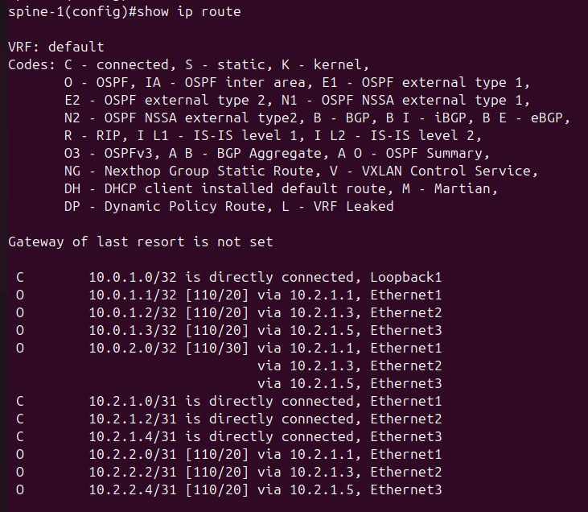

Проверка связности в следующей последовательности:
- ping Loopback1 LEAF-1,
- ping Loopback1 LEAF-2,
- ping Loopback1 LEAF-3,
- ping Loopback1 SPINE-2.

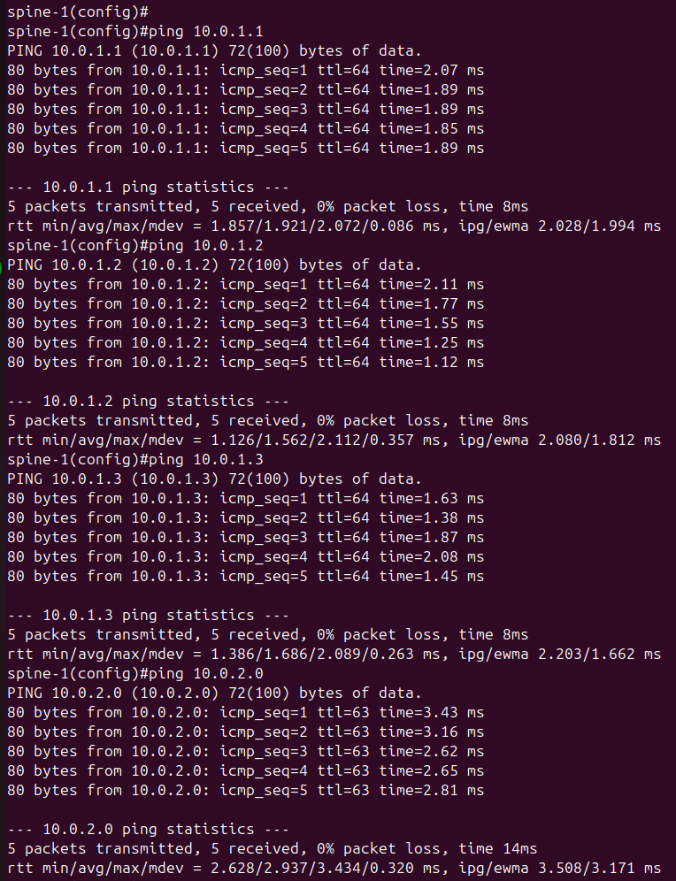

#### SPINE-2

Таблица маршрутизации (ECMP до SPINE-1 через каждый LEAF):

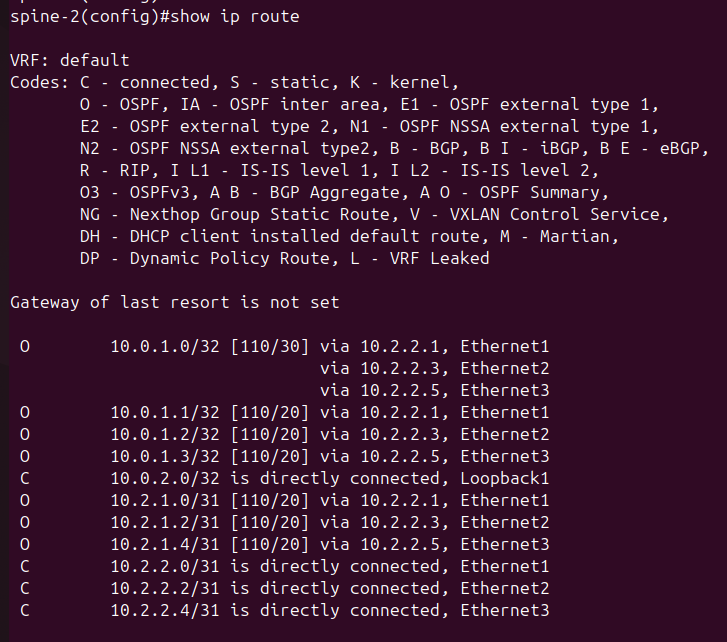

Проверка связности в следующей последовательности:
- ping Loopback1 LEAF-1,
- ping Loopback1 LEAF-2,
- ping Loopback1 LEAF-3,
- ping Loopback1 SPINE-1.

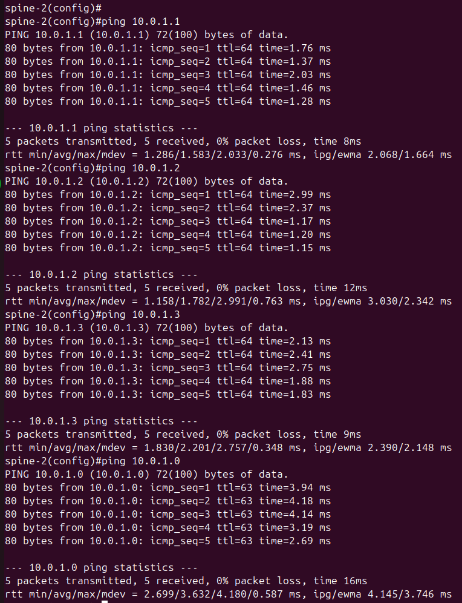

#### LEAF-1

Таблица маршрутизации (два ECMP до каждого LEAF через каждый SPINE):

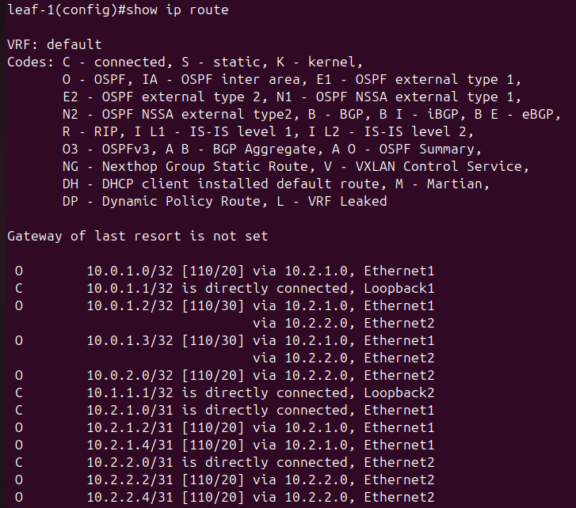

Проверка связности в следующей последовательности:
- ping Loopback1 LEAF-2,
- ping Loopback1 LEAF-3,
- ping Loopback1 SPINE-1,
- ping Loopback1 SPINE-2.

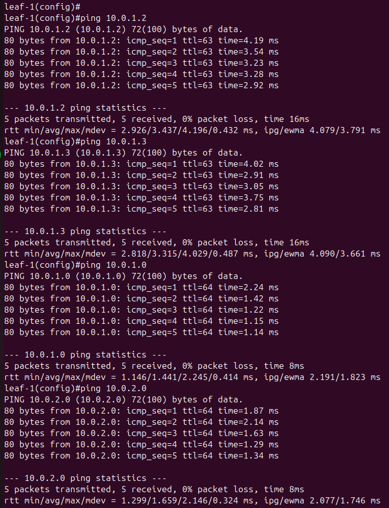


#### LEAF-2

Таблица маршрутизации (два ECMP до каждого LEAF через каждый SPINE):

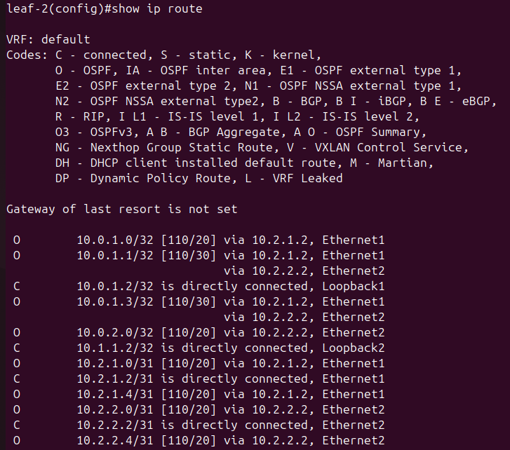

Проверка связности в следующей последовательности:
- ping Loopback1 LEAF-1,
- ping Loopback1 LEAF-3,
- ping Loopback1 SPINE-1,
- ping Loopback1 SPINE-2.

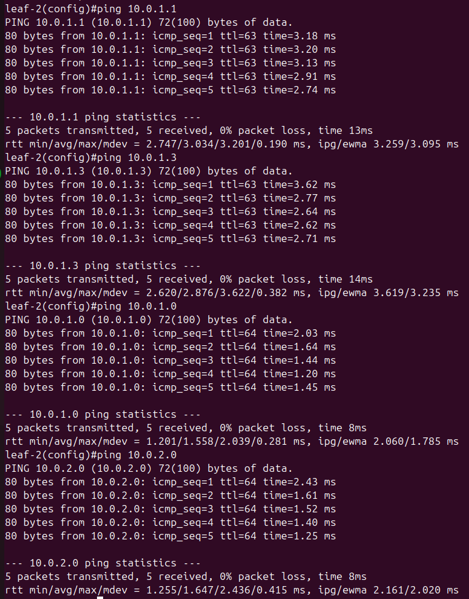

#### LEAF-3

Таблица маршрутизации (два ECMP до каждого LEAF через каждый SPINE):

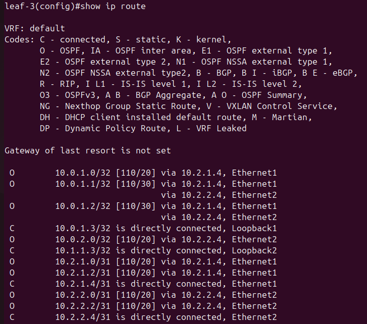

Проверка связности в следующей последовательности:
- ping Loopback1 LEAF-1,
- ping Loopback1 LEAF-2,
- ping Loopback1 SPINE-1,
- ping Loopback1 SPINE-2.

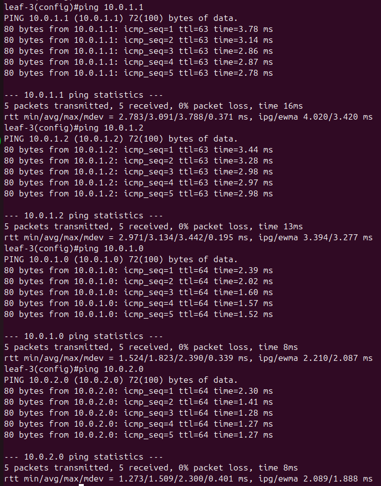