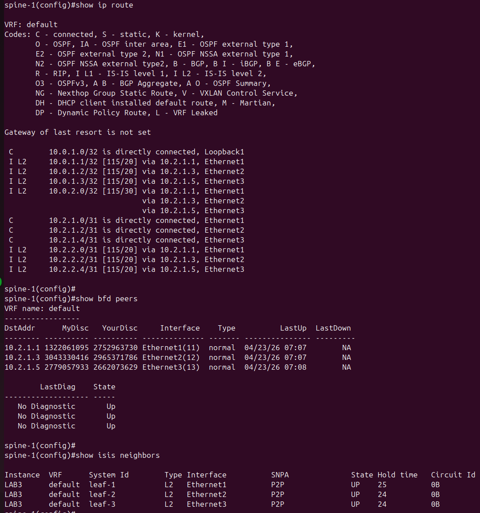
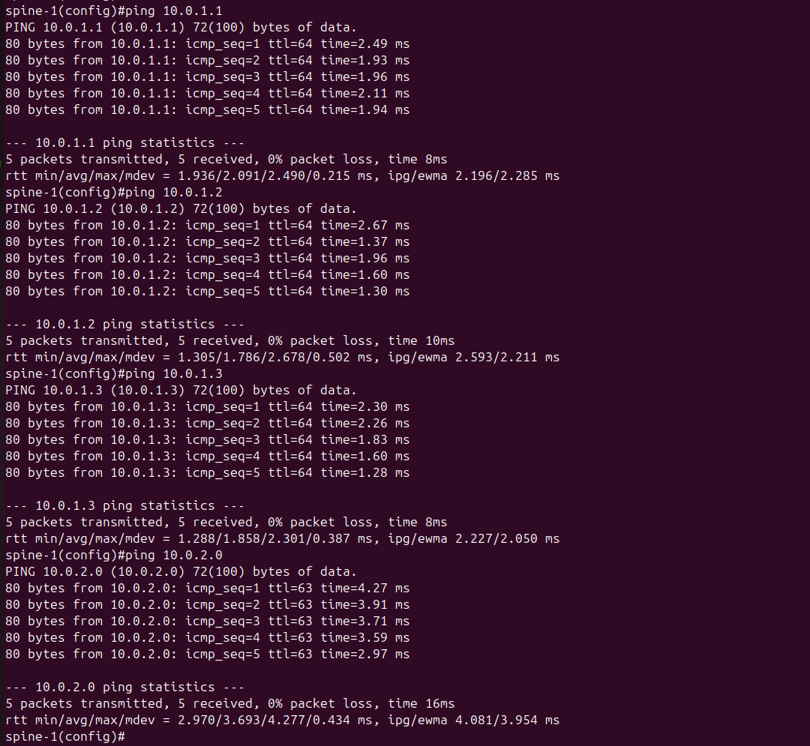
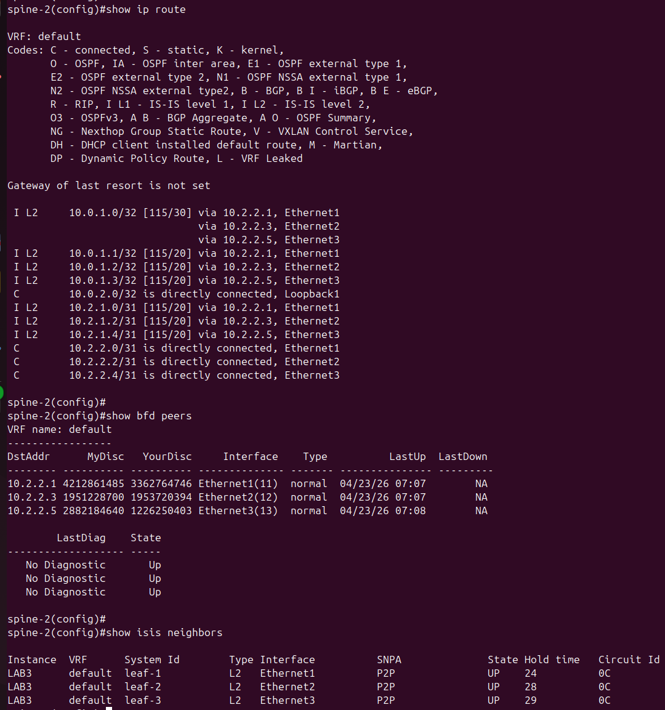
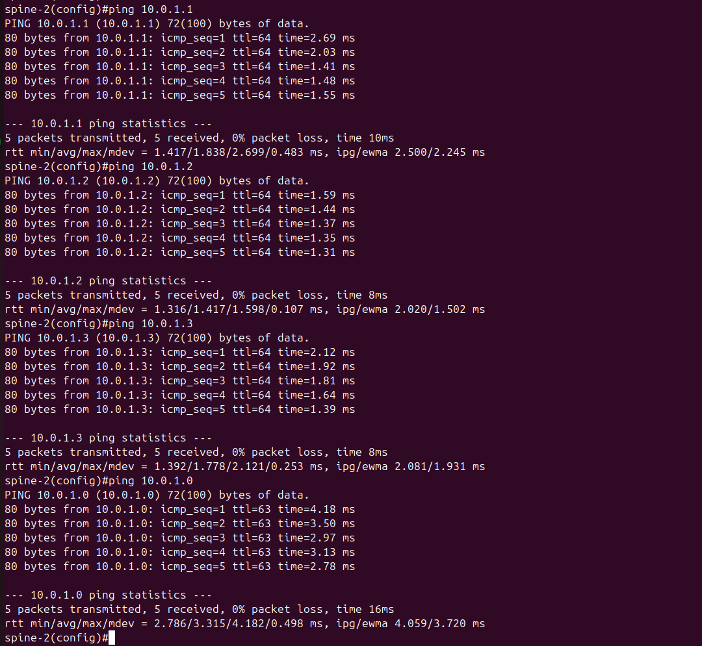
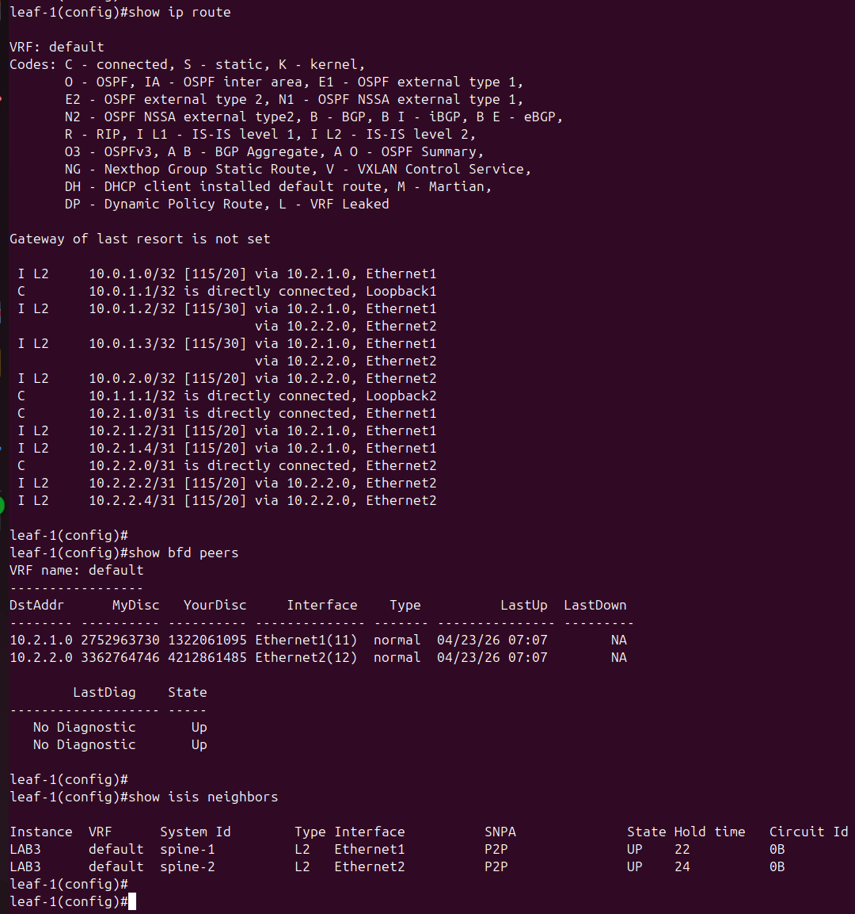
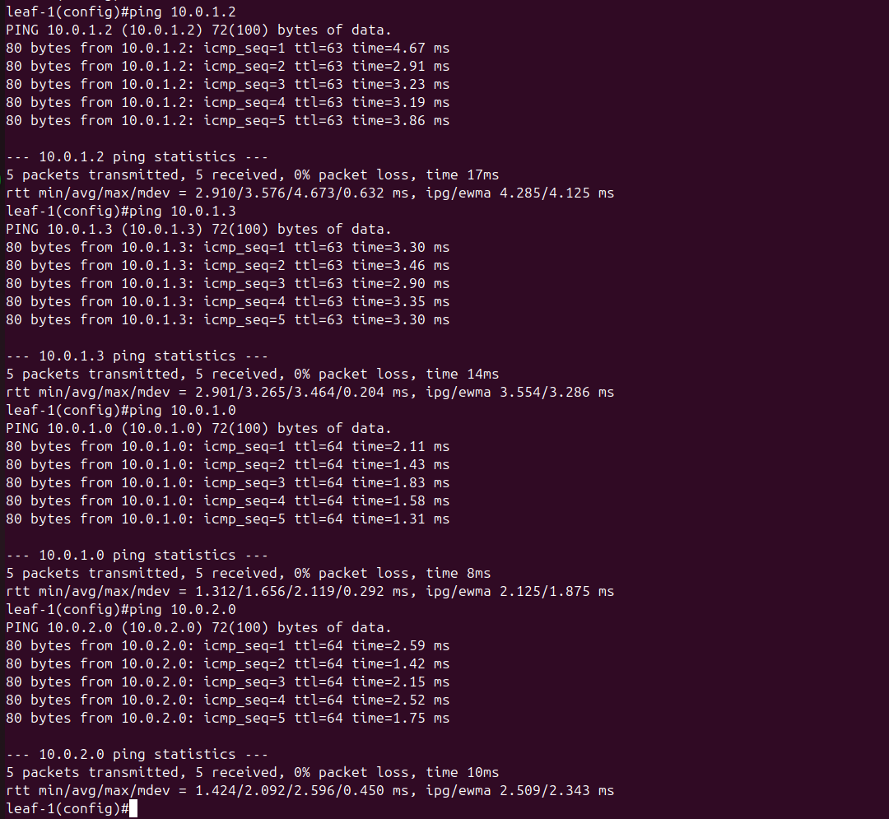
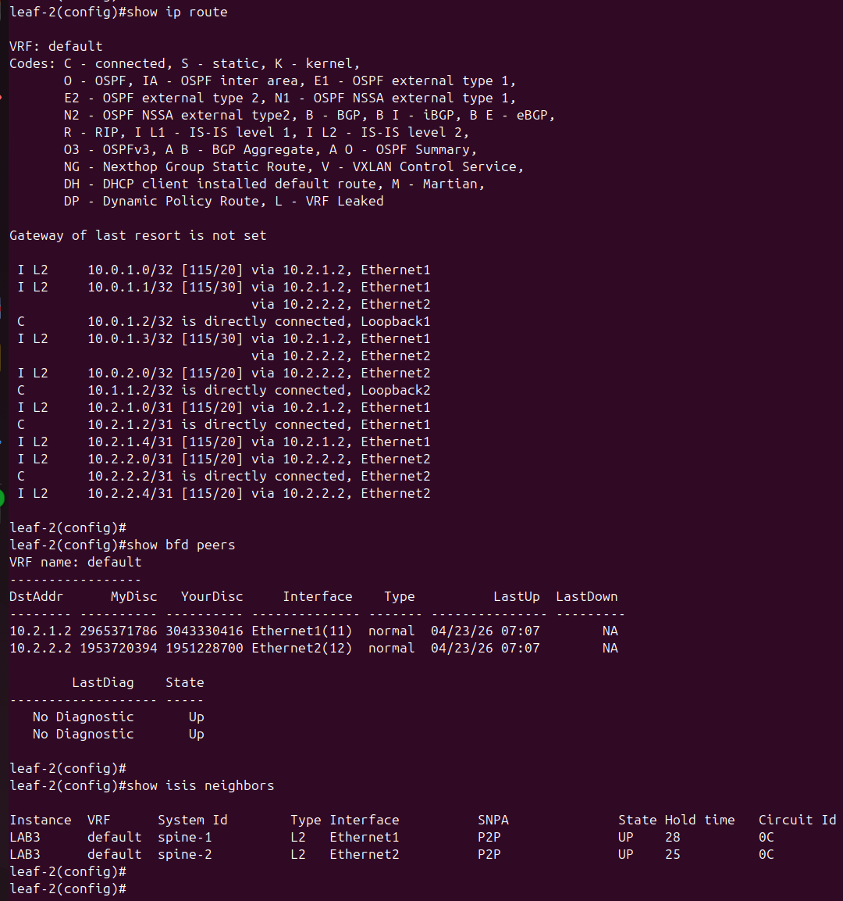
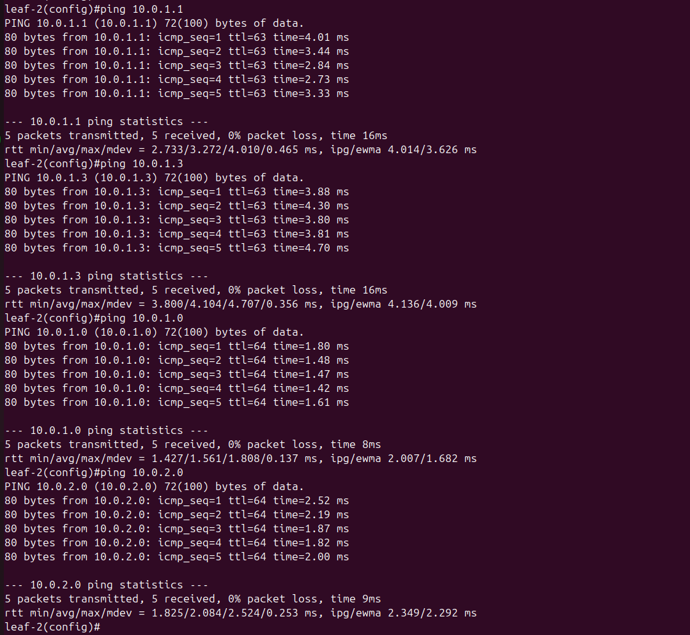
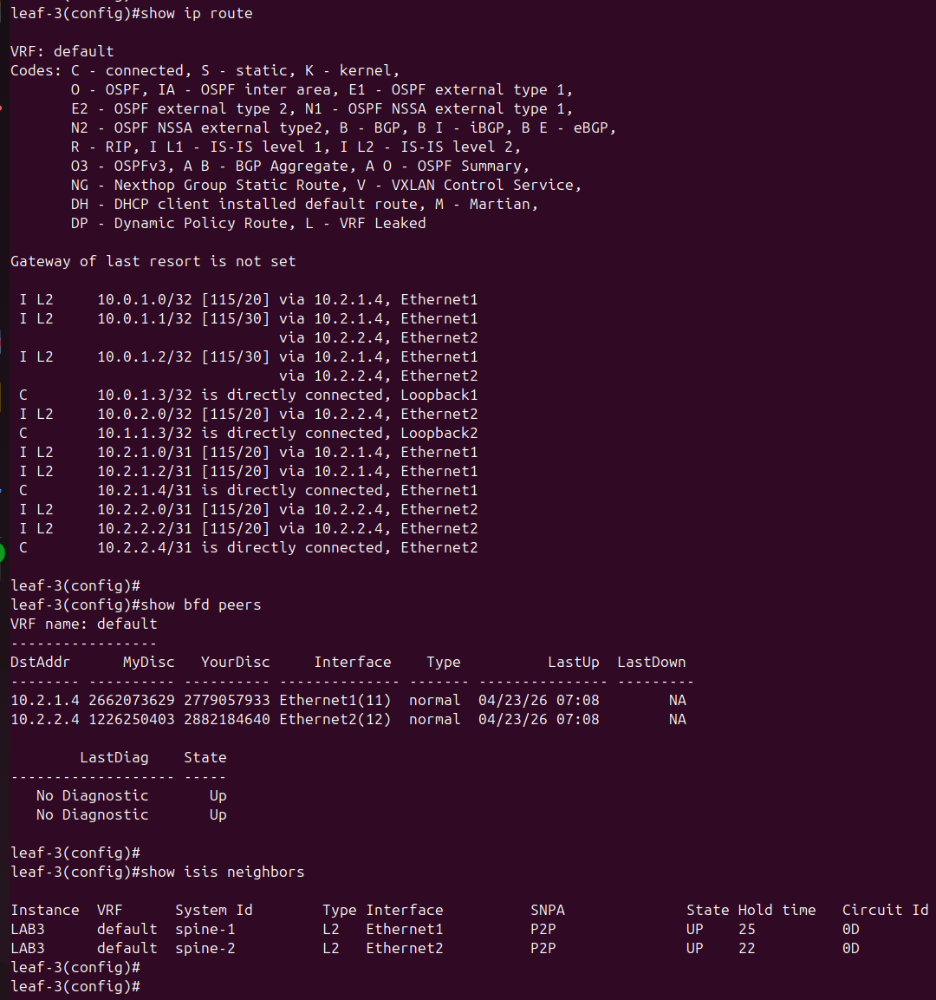
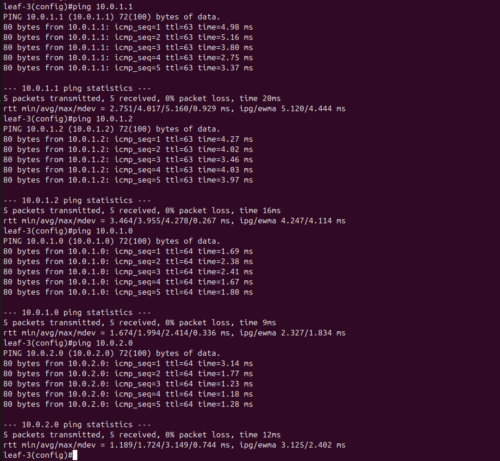

### Underlay. IS-IS

### Цель
- Настроить IS-IS для Underlay сети

### Схема с адресацией IPv4


### Настройка оборудования

- На маршрутизаторх используются Loopback1 для построения Underlay связности.
- Уменьшен MTU на интерфейсах для того, чтобы IS-IS HELLO пакеты могли быть доставлены между маршрутизаторами.
  По умолчанию IS-IS HELLO пакеты имеют padding до размера MTU для установления соседства с интерфейсами с одинаковой пропускной способностью по размеру пакета.
- Для IS-IS настроены следующие ID:
  - Для router ID используются IPv4 адреса Loopback1,
  - Для system ID используются IPv4 адреса Loopback1 с дополнением октетов IPv4 адреса ведущими нулями и разделением полученного значения на три части.
- На интерфейсах для IS-IS настроен BFD для быстрого реагирования на изменения состояния линков.
- Настроена простая аутентификация для IS-IS на интерфейсах для HELLO пакетов.
- Последовательность настройки:
    - Настраивается IP адресация на интерфейсах c проверкой доступности (ping) физических интерфейсов,
    - Настраивается IS-IS с проверкой связности всех Loopback1 интерфейсов и создания ECMP маршрутов.

#### SPINE-1
```
configure
hostname spine-1
interface Loopback1
 ip address 10.0.1.0/32
 exit
interface Ethernet1
 description to-leaf-1
 no switchport
 mtu 9000
 ip address 10.2.1.0/31
 exit
interface Ethernet2
 no switchport
 mtu 9000
 ip address 10.2.1.2/31
 description to-leaf-2
 exit
interface Ethernet3
 description to-leaf-3
 no switchport
 mtu 9000
 ip address 10.2.1.4/31
 exit
ip routing
router isis LAB3
 net 49.0001.0100.0000.1000.00
 address-family ipv4 unicast
 router-id ipv4 10.0.1.0
 passive Ethernet 4-8
 no passive Ethernet 1-3
 exit
interface Loopback1
 isis enable LAB3
 exit
interface Ethernet 1-3
 isis enable LAB3
 isis network point-to-point
 isis circuit-type level-2
 isis authentication mode text
 isis authentication key LAB3KEY
 isis bfd
 bfd interval 100 min_rx 100 multiplier 3
 exit
```

#### SPINE-2
```
configure
hostname spine-2
interface Loopback1
 ip address 10.0.2.0/32
 exit
interface Ethernet1
 no switchport
 mtu 9000
 ip address 10.2.2.0/31
 description to-leaf-1
 exit
interface Ethernet2
 description to-leaf-2
 no switchport
 mtu 9000
 ip address 10.2.2.2/31
 exit
interface Ethernet3
 description to-leaf-3
 no switchport
 mtu 9000
 ip address 10.2.2.4/31
 exit
ip routing
router isis LAB3
 net 49.0001.0100.0000.2000.00
 address-family ipv4 unicast
 router-id ipv4 10.0.2.0
 passive Ethernet 4-8
 no passive Ethernet 1-3
 exit
interface Loopback1
 isis enable LAB3
 exit
interface Ethernet 1-3
 isis enable LAB3
 isis network point-to-point
 isis circuit-type level-2
 isis authentication mode text
 isis authentication key LAB3KEY
 isis bfd
 bfd interval 100 min_rx 100 multiplier 3
 exit
```

#### LEAF-1
```
configure
hostname leaf-1
interface Loopback1
 ip address 10.0.1.1/32
 exit
interface Loopback2
 ip address 10.1.1.1/32
 exit
interface Ethernet1
 description to-spine-1
 no switchport
 mtu 9000
 ip address 10.2.1.1/31
 exit
interface Ethernet2
 description to-spine-2
 no switchport
 mtu 9000
 ip address 10.2.2.1/31
 exit
ip routing
router isis LAB3
 net 49.0001.0100.0000.1001.00
 address-family ipv4 unicast
 router-id ipv4 10.0.1.1
 passive Ethernet 3-8
 no passive Ethernet 1-2
 exit
interface Loopback1
 isis enable LAB3
 exit
interface Ethernet 1-2
 isis enable LAB3
 isis network point-to-point
 isis circuit-type level-2
 isis authentication mode text
 isis authentication key LAB3KEY
 isis bfd
 bfd interval 100 min_rx 100 multiplier 3
 exit
```

#### LEAF-2
```
configure
hostname leaf-2
interface Loopback1
 ip address 10.0.1.2/32
 exit
interface Loopback2
 ip address 10.1.1.2/32
 exit
interface Ethernet1
 description to-spine-1
 no switchport
 mtu 9000
 ip address 10.2.1.3/31
 exit
interface Ethernet2
 description to-spine-2
 no switchport
 mtu 9000
 ip address 10.2.2.3/31
 exit
ip routing
router isis LAB3
 net 49.0001.0100.0000.1002.00
 address-family ipv4 unicast
 router-id ipv4 10.0.1.2
 passive Ethernet 3-8
 no passive Ethernet 1-2
 exit
interface Loopback1
 isis enable LAB3
 exit
interface Ethernet 1-2
 isis enable LAB3
 isis network point-to-point
 isis circuit-type level-2
 isis authentication mode text
 isis authentication key LAB3KEY
 isis bfd
 bfd interval 100 min_rx 100 multiplier 3
 exit
```

#### LEAF-3
```
configure
hostname leaf-3
interface Loopback1
 ip address 10.0.1.3/32
 exit
interface Loopback2
 ip address 10.1.1.3/32
 exit
interface Ethernet1
 description to-spine-1
 no switchport
 mtu 9000
 ip address 10.2.1.5/31
 exit
interface Ethernet2
 description to-spine-2
 no switchport
 mtu 9000
 ip address 10.2.2.5/31
 exit
ip routing
router isis LAB3
 net 49.0001.0100.0000.1003.00
 address-family ipv4 unicast
 router-id ipv4 10.0.1.3
 passive Ethernet 3-8
 no passive Ethernet 1-2
 exit
interface Loopback1
 isis enable LAB3
 exit
interface Ethernet 1-2
 isis enable LAB3
 isis network point-to-point
 isis circuit-type level-2
 isis authentication mode text
 isis authentication key LAB3KEY
 isis bfd
 bfd interval 100 min_rx 100 multiplier 3
 exit
```

### Проверка примененных настроек

#### SPINE-1

Вывод информации в следующей последовательности:
1. Таблица маршрутизации (ECMP до SPINE-2 через каждый LEAF),
2. Таблица соседства BFD,
3. Таблица соседства IS-IS.



Проверка связности в следующей последовательности:
1. ping Loopback1 LEAF-1,
2. ping Loopback1 LEAF-2,
3. ping Loopback1 LEAF-3,
4. ping Loopback1 SPINE-2.



#### SPINE-2

Вывод информации в следующей последовательности:
1. Таблица маршрутизации (ECMP до SPINE-1 через каждый LEAF),
2. Таблица соседства BFD,
3. Таблица соседства IS-IS.



Проверка связности в следующей последовательности:
- ping Loopback1 LEAF-1,
- ping Loopback1 LEAF-2,
- ping Loopback1 LEAF-3,
- ping Loopback1 SPINE-1.



#### LEAF-1

Вывод информации в следующей последовательности:
1. Таблица маршрутизации (два ECMP до каждого LEAF через каждый SPINE),
2. Таблица соседства BFD,
3. Таблица соседства IS-IS.



Проверка связности в следующей последовательности:
- ping Loopback1 LEAF-2,
- ping Loopback1 LEAF-3,
- ping Loopback1 SPINE-1,
- ping Loopback1 SPINE-2.




#### LEAF-2

Вывод информации в следующей последовательности:
1. Таблица маршрутизации (два ECMP до каждого LEAF через каждый SPINE),
2. Таблица соседства BFD,
3. Таблица соседства IS-IS.



Проверка связности в следующей последовательности:
- ping Loopback1 LEAF-1,
- ping Loopback1 LEAF-3,
- ping Loopback1 SPINE-1,
- ping Loopback1 SPINE-2.



#### LEAF-3

Вывод информации в следующей последовательности:
1. Таблица маршрутизации (два ECMP до каждого LEAF через каждый SPINE),
2. Таблица соседства BFD,
3. Таблица соседства IS-IS.



Проверка связности в следующей последовательности:
- ping Loopback1 LEAF-1,
- ping Loopback1 LEAF-2,
- ping Loopback1 SPINE-1,
- ping Loopback1 SPINE-2.

