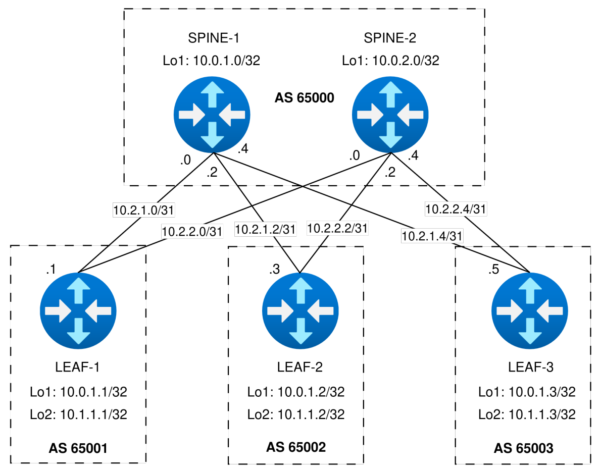

### Underlay. BGP

### Цель
- Настроить BGP для Underlay сети

### Схема с адресацией IPv4



### Настройка оборудования

- На маршрутизаторах используются Loopback1 для построения Underlay связности.
- Для router ID в BGP используются IPv4 адреса Loopback1.
- Для BGP настроен BFD для быстрого реагирования на изменения состояния линков.
- Настроена простая аутентификация для BGP.
- Последовательность настройки:
    - Настраивается IP адресация на интерфейсах c проверкой доступности (ping) физических интерфейсов,
    - Настраивается eBGP с проверкой связности Loopback1 интерфейсов Leaf-ов и создания ECMP маршрутов.

#### SPINE-1
```
configure
hostname spine-1
interface Loopback1
 ip address 10.0.1.0/32
 exit
interface Ethernet1
 description to-leaf-1
 no switchport
 mtu 9214
 ip address 10.2.1.0/31
 exit
interface Ethernet2
 no switchport
 mtu 9214
 ip address 10.2.1.2/31
 description to-leaf-2
 exit
interface Ethernet3
 description to-leaf-3
 no switchport
 mtu 9214
 ip address 10.2.1.4/31
 exit
ip routing
router bgp 65000
 router-id 10.0.1.0
 maximum-paths 8 ecmp 8
 neighbor LEAFS peer group
 neighbor LEAFS bfd
 neighbor LEAFS timers 3 9
 neighbor LEAFS password LAB4KEY
 neighbor 10.2.1.1 remote-as 65001
 neighbor 10.2.1.1 peer group LEAFS
 neighbor 10.2.1.3 remote-as 65002
 neighbor 10.2.1.3 peer group LEAFS
 neighbor 10.2.1.5 remote-as 65003
 neighbor 10.2.1.5 peer group LEAFS
 !
 address-family ipv4
  neighbor LEAFS activate
  network 10.0.1.0/32
  exit
interface Ethernet 1-3
 bfd interval 100 min_rx 100 multiplier 3
 exit
```

#### SPINE-2
```
configure
hostname spine-2
interface Loopback1
 ip address 10.0.2.0/32
 exit
interface Ethernet1
 no switchport
 mtu 9214
 ip address 10.2.2.0/31
 description to-leaf-1
 exit
interface Ethernet2
 description to-leaf-2
 no switchport
 mtu 9214
 ip address 10.2.2.2/31
 exit
interface Ethernet3
 description to-leaf-3
 no switchport
 mtu 9214
 ip address 10.2.2.4/31
 exit
ip routing
router bgp 65000
 router-id 10.0.2.0
 maximum-paths 8 ecmp 8
 neighbor LEAFS peer group
 neighbor LEAFS bfd
 neighbor LEAFS timers 3 9
 neighbor LEAFS password LAB4KEY
 neighbor 10.2.2.1 remote-as 65001
 neighbor 10.2.2.1 peer group LEAFS
 neighbor 10.2.2.3 remote-as 65002
 neighbor 10.2.2.3 peer group LEAFS
 neighbor 10.2.2.5 remote-as 65003
 neighbor 10.2.2.5 peer group LEAFS
 !
 address-family ipv4
  neighbor LEAFS activate
  network 10.0.2.0/32
  exit
interface Ethernet 1-3
 bfd interval 100 min_rx 100 multiplier 3
 exit
```

#### LEAF-1
```
configure
hostname leaf-1
interface Loopback1
 ip address 10.0.1.1/32
 exit
interface Loopback2
 ip address 10.1.1.1/32
 exit
interface Ethernet1
 description to-spine-1
 no switchport
 mtu 9214
 ip address 10.2.1.1/31
 exit
interface Ethernet2
 description to-spine-2
 no switchport
 mtu 9214
 ip address 10.2.2.1/31
 exit
ip routing
router bgp 65001
 router-id 10.0.1.1
 maximum-paths 8 ecmp 8
 neighbor SPINES peer group
 neighbor LEAFS bfd
 neighbor SPINES timers 3 9
 neighbor SPINES password LAB4KEY
 neighbor SPINES remote-as 65000
 neighbor 10.2.1.0 peer group SPINES
 neighbor 10.2.2.0 peer group SPINES
 !
 address-family ipv4
  neighbor SPINES activate
  network 10.0.1.1/32
  exit
interface Ethernet 1-2
 bfd interval 100 min_rx 100 multiplier 3
 exit
```

#### LEAF-2
```
configure
hostname leaf-2
interface Loopback1
 ip address 10.0.1.2/32
 exit
interface Loopback2
 ip address 10.1.1.2/32
 exit
interface Ethernet1
 description to-spine-1
 no switchport
 mtu 9214
 ip address 10.2.1.3/31
 exit
interface Ethernet2
 description to-spine-2
 no switchport
 mtu 9214
 ip address 10.2.2.3/31
 exit
ip routing
router bgp 65002
 router-id 10.0.1.2
 maximum-paths 8 ecmp 8
 neighbor SPINES peer group
 neighbor SPINES bfd
 neighbor SPINES timers 3 9
 neighbor SPINES password LAB4KEY
 neighbor SPINES remote-as 65000
 neighbor 10.2.1.2 peer group SPINES
 neighbor 10.2.2.2 peer group SPINES
 !
 address-family ipv4
  neighbor SPINES activate
  network 10.0.1.2/32
  exit
interface Ethernet 1-2
 bfd interval 100 min_rx 100 multiplier 3
 exit
```

#### LEAF-3
```
configure
hostname leaf-3
interface Loopback1
 ip address 10.0.1.3/32
 exit
interface Loopback2
 ip address 10.1.1.3/32
 exit
interface Ethernet1
 description to-spine-1
 no switchport
 mtu 9214
 ip address 10.2.1.5/31
 exit
interface Ethernet2
 description to-spine-2
 no switchport
 mtu 9214
 ip address 10.2.2.5/31
 exit
ip routing
router bgp 65003
 router-id 10.0.1.3
 maximum-paths 8 ecmp 8
 neighbor SPINES peer group
 neighbor SPINES bfd
 neighbor SPINES timers 3 9
 neighbor SPINES password LAB4KEY
 neighbor SPINES remote-as 65000
 neighbor 10.2.1.4 peer group SPINES
 neighbor 10.2.2.4 peer group SPINES
 !
 address-family ipv4
  neighbor SPINES activate
  network 10.0.1.3/32
  exit
interface Ethernet 1-2
 bfd interval 100 min_rx 100 multiplier 3
 exit
```

### Проверка примененных настроек

#### SPINE-1

Вывод информации в следующей последовательности:
1. Таблица маршрутизации,
2. Таблица соседства BFD,
3. Таблица соседства BGP.

```
spine-1(config)#show ip route

VRF: default
Codes: C - connected, S - static, K - kernel, 
       O - OSPF, IA - OSPF inter area, E1 - OSPF external type 1,
       E2 - OSPF external type 2, N1 - OSPF NSSA external type 1,
       N2 - OSPF NSSA external type2, B - BGP, B I - iBGP, B E - eBGP,
       R - RIP, I L1 - IS-IS level 1, I L2 - IS-IS level 2,
       O3 - OSPFv3, A B - BGP Aggregate, A O - OSPF Summary,
       NG - Nexthop Group Static Route, V - VXLAN Control Service,
       DH - DHCP client installed default route, M - Martian,
       DP - Dynamic Policy Route, L - VRF Leaked

Gateway of last resort is not set

 C        10.0.1.0/32 is directly connected, Loopback1
 B E      10.0.1.1/32 [200/0] via 10.2.1.1, Ethernet1
 B E      10.0.1.2/32 [200/0] via 10.2.1.3, Ethernet2
 B E      10.0.1.3/32 [200/0] via 10.2.1.5, Ethernet3
 C        10.2.1.0/31 is directly connected, Ethernet1
 C        10.2.1.2/31 is directly connected, Ethernet2
 C        10.2.1.4/31 is directly connected, Ethernet3

spine-1(config)#
spine-1(config)#show bfd peers
VRF name: default
-----------------
DstAddr      MyDisc   YourDisc     Interface    Type          LastUp  LastDown  
-------- ---------- ---------- -------------- ------- --------------- --------- 
10.2.1.1  283196475  851052604 Ethernet1(11)  normal  05/05/26 12:28        NA  
10.2.1.3 4017183333 4054521263 Ethernet2(12)  normal  05/05/26 12:27        NA  
10.2.1.5 2760434418 2332882201 Ethernet3(13)  normal  05/05/26 12:27        NA  

        LastDiag    State 
------------------- ----- 
   No Diagnostic       Up 
   No Diagnostic       Up 
   No Diagnostic       Up 

spine-1(config)#
spine-1(config)#sh ip bgp summary 
BGP summary information for VRF default
Router identifier 10.0.1.0, local AS number 65000
Neighbor Status Codes: m - Under maintenance
  Neighbor         V  AS           MsgRcvd   MsgSent  InQ OutQ  Up/Down State   PfxRcd PfxAcc
  10.2.1.1         4  65001             49        48    0    0 00:02:04 Estab   1      1
  10.2.1.3         4  65002             48        47    0    0 00:02:02 Estab   1      1
  10.2.1.5         4  65003             48        47    0    0 00:02:00 Estab   1      1
```

Проверка связности в следующей последовательности:
1. ping Loopback1 LEAF-1,
2. ping Loopback1 LEAF-2,
3. ping Loopback1 LEAF-3.

```
spine-1(config)#ping 10.0.1.1
PING 10.0.1.1 (10.0.1.1) 72(100) bytes of data.
80 bytes from 10.0.1.1: icmp_seq=1 ttl=64 time=1.54 ms
80 bytes from 10.0.1.1: icmp_seq=2 ttl=64 time=1.36 ms
80 bytes from 10.0.1.1: icmp_seq=3 ttl=64 time=1.31 ms
80 bytes from 10.0.1.1: icmp_seq=4 ttl=64 time=1.49 ms
80 bytes from 10.0.1.1: icmp_seq=5 ttl=64 time=1.47 ms

--- 10.0.1.1 ping statistics ---
5 packets transmitted, 5 received, 0% packet loss, time 7ms
rtt min/avg/max/mdev = 1.312/1.439/1.546/0.096 ms, ipg/ewma 1.754/1.494 ms
spine-1(config)#
spine-1(config)#ping 10.0.1.2
PING 10.0.1.2 (10.0.1.2) 72(100) bytes of data.
80 bytes from 10.0.1.2: icmp_seq=1 ttl=64 time=2.31 ms
80 bytes from 10.0.1.2: icmp_seq=2 ttl=64 time=1.95 ms
80 bytes from 10.0.1.2: icmp_seq=3 ttl=64 time=1.62 ms
80 bytes from 10.0.1.2: icmp_seq=4 ttl=64 time=1.37 ms
80 bytes from 10.0.1.2: icmp_seq=5 ttl=64 time=1.25 ms

--- 10.0.1.2 ping statistics ---
5 packets transmitted, 5 received, 0% packet loss, time 8ms
rtt min/avg/max/mdev = 1.256/1.701/2.310/0.389 ms, ipg/ewma 2.161/1.979 ms
spine-1(config)#
spine-1(config)#ping 10.0.1.3
PING 10.0.1.3 (10.0.1.3) 72(100) bytes of data.
80 bytes from 10.0.1.3: icmp_seq=1 ttl=64 time=2.77 ms
80 bytes from 10.0.1.3: icmp_seq=2 ttl=64 time=1.69 ms
80 bytes from 10.0.1.3: icmp_seq=3 ttl=64 time=1.30 ms
80 bytes from 10.0.1.3: icmp_seq=4 ttl=64 time=1.21 ms
80 bytes from 10.0.1.3: icmp_seq=5 ttl=64 time=1.21 ms

--- 10.0.1.3 ping statistics ---
5 packets transmitted, 5 received, 0% packet loss, time 10ms
rtt min/avg/max/mdev = 1.218/1.640/2.775/0.595 ms, ipg/ewma 2.500/2.178 ms
```

#### SPINE-2

Вывод информации в следующей последовательности:
1. Таблица маршрутизации,
2. Таблица соседства BFD,
3. Таблица соседства BGP.

```
spine-2(config)#show ip route 

VRF: default
Codes: C - connected, S - static, K - kernel, 
       O - OSPF, IA - OSPF inter area, E1 - OSPF external type 1,
       E2 - OSPF external type 2, N1 - OSPF NSSA external type 1,
       N2 - OSPF NSSA external type2, B - BGP, B I - iBGP, B E - eBGP,
       R - RIP, I L1 - IS-IS level 1, I L2 - IS-IS level 2,
       O3 - OSPFv3, A B - BGP Aggregate, A O - OSPF Summary,
       NG - Nexthop Group Static Route, V - VXLAN Control Service,
       DH - DHCP client installed default route, M - Martian,
       DP - Dynamic Policy Route, L - VRF Leaked

Gateway of last resort is not set

 B E      10.0.1.1/32 [200/0] via 10.2.2.1, Ethernet1
 B E      10.0.1.2/32 [200/0] via 10.2.2.3, Ethernet2
 B E      10.0.1.3/32 [200/0] via 10.2.2.5, Ethernet3
 C        10.0.2.0/32 is directly connected, Loopback1
 C        10.2.2.0/31 is directly connected, Ethernet1
 C        10.2.2.2/31 is directly connected, Ethernet2
 C        10.2.2.4/31 is directly connected, Ethernet3

spine-2(config)#
spine-2(config)#show bfd peers 
VRF name: default
-----------------
DstAddr         MyDisc     YourDisc       Interface     Type           LastUp   
---------- ------------ ------------ --------------- -------- ----------------- 
10.2.2.1    2677047884    981642016   Ethernet1(11)   normal   05/05/26 12:28   
10.2.2.3    1502409198    456767328   Ethernet2(12)   normal   05/05/26 12:19   
10.2.2.5    3321457729   4064239169   Ethernet3(13)   normal   05/05/26 12:18   

         LastDown            LastDiag    State 
-------------------- ------------------- ----- 
               NA       No Diagnostic       Up 
   05/05/26 12:17       No Diagnostic       Up 
               NA       No Diagnostic       Up 

spine-2(config)#
spine-2(config)#show ip bgp summary 
BGP summary information for VRF default
Router identifier 10.0.2.0, local AS number 65000
Neighbor Status Codes: m - Under maintenance
  Neighbor         V  AS           MsgRcvd   MsgSent  InQ OutQ  Up/Down State   PfxRcd PfxAcc
  10.2.2.1         4  65001            268       264    0    0 00:12:51 Estab   1      1
  10.2.2.3         4  65002            281       277    0    0 00:12:32 Estab   1      1
  10.2.2.5         4  65003            298       294    0    0 00:14:22 Estab   1      1
```

Проверка связности в следующей последовательности:
- ping Loopback1 LEAF-1,
- ping Loopback1 LEAF-2,
- ping Loopback1 LEAF-3.

```
spine-2(config)#ping 10.0.1.1
PING 10.0.1.1 (10.0.1.1) 72(100) bytes of data.
80 bytes from 10.0.1.1: icmp_seq=1 ttl=64 time=1.92 ms
80 bytes from 10.0.1.1: icmp_seq=2 ttl=64 time=1.64 ms
80 bytes from 10.0.1.1: icmp_seq=3 ttl=64 time=1.43 ms
80 bytes from 10.0.1.1: icmp_seq=4 ttl=64 time=1.54 ms
80 bytes from 10.0.1.1: icmp_seq=5 ttl=64 time=1.54 ms

--- 10.0.1.1 ping statistics ---
5 packets transmitted, 5 received, 0% packet loss, time 8ms
rtt min/avg/max/mdev = 1.437/1.619/1.925/0.168 ms, ipg/ewma 2.079/1.765 ms
spine-2(config)#
spine-2(config)#ping 10.0.1.2
PING 10.0.1.2 (10.0.1.2) 72(100) bytes of data.
80 bytes from 10.0.1.2: icmp_seq=1 ttl=64 time=3.68 ms
80 bytes from 10.0.1.2: icmp_seq=2 ttl=64 time=1.70 ms
80 bytes from 10.0.1.2: icmp_seq=3 ttl=64 time=1.33 ms
80 bytes from 10.0.1.2: icmp_seq=4 ttl=64 time=1.26 ms
80 bytes from 10.0.1.2: icmp_seq=5 ttl=64 time=1.33 ms

--- 10.0.1.2 ping statistics ---
5 packets transmitted, 5 received, 0% packet loss, time 13ms
rtt min/avg/max/mdev = 1.262/1.863/3.687/0.925 ms, ipg/ewma 3.250/2.736 ms
spine-2(config)#
spine-2(config)#ping 10.0.1.3
PING 10.0.1.3 (10.0.1.3) 72(100) bytes of data.
80 bytes from 10.0.1.3: icmp_seq=1 ttl=64 time=2.58 ms
80 bytes from 10.0.1.3: icmp_seq=2 ttl=64 time=1.61 ms
80 bytes from 10.0.1.3: icmp_seq=3 ttl=64 time=1.55 ms
80 bytes from 10.0.1.3: icmp_seq=4 ttl=64 time=1.43 ms
80 bytes from 10.0.1.3: icmp_seq=5 ttl=64 time=1.30 ms

--- 10.0.1.3 ping statistics ---
5 packets transmitted, 5 received, 0% packet loss, time 9ms
rtt min/avg/max/mdev = 1.307/1.699/2.589/0.457 ms, ipg/ewma 2.250/2.121 ms
```

#### LEAF-1

Вывод информации в следующей последовательности:
1. Таблица маршрутизации (два ECMP до каждого LEAF через каждый SPINE),
2. Таблица соседства BFD,
3. Таблица соседства BGP.

```
leaf-1(config)#show ip route 

VRF: default
Codes: C - connected, S - static, K - kernel, 
       O - OSPF, IA - OSPF inter area, E1 - OSPF external type 1,
       E2 - OSPF external type 2, N1 - OSPF NSSA external type 1,
       N2 - OSPF NSSA external type2, B - BGP, B I - iBGP, B E - eBGP,
       R - RIP, I L1 - IS-IS level 1, I L2 - IS-IS level 2,
       O3 - OSPFv3, A B - BGP Aggregate, A O - OSPF Summary,
       NG - Nexthop Group Static Route, V - VXLAN Control Service,
       DH - DHCP client installed default route, M - Martian,
       DP - Dynamic Policy Route, L - VRF Leaked

Gateway of last resort is not set

 B E      10.0.1.0/32 [200/0] via 10.2.1.0, Ethernet1
 C        10.0.1.1/32 is directly connected, Loopback1
 B E      10.0.1.2/32 [200/0] via 10.2.1.0, Ethernet1
                              via 10.2.2.0, Ethernet2
 B E      10.0.1.3/32 [200/0] via 10.2.1.0, Ethernet1
                              via 10.2.2.0, Ethernet2
 B E      10.0.2.0/32 [200/0] via 10.2.2.0, Ethernet2
 C        10.1.1.1/32 is directly connected, Loopback2
 C        10.2.1.0/31 is directly connected, Ethernet1
 C        10.2.2.0/31 is directly connected, Ethernet2

leaf-1(config)#
leaf-1(config)#show bfd peers 
VRF name: default
-----------------
DstAddr     MyDisc   YourDisc      Interface    Type          LastUp  LastDown  
-------- --------- ----------- -------------- ------- --------------- --------- 
10.2.1.0 851052604  283196475  Ethernet1(11)  normal  05/05/26 12:29        NA  
10.2.2.0 981642016 2677047884  Ethernet2(12)  normal  05/05/26 12:29        NA  

        LastDiag    State 
------------------- ----- 
   No Diagnostic       Up 
   No Diagnostic       Up 

leaf-1(config)#
leaf-1(config)#show ip bgp summary 
BGP summary information for VRF default
Router identifier 10.0.1.1, local AS number 65001
Neighbor Status Codes: m - Under maintenance
  Neighbor         V  AS           MsgRcvd   MsgSent  InQ OutQ  Up/Down State   PfxRcd PfxAcc
  10.2.1.0         4  65000            251       253    0    0 00:06:46 Estab   3      3
  10.2.2.0         4  65000            294       298    0    0 00:14:22 Estab   3      3
```

Проверка связности в следующей последовательности:
- ping Loopback1 LEAF-2,
- ping Loopback1 LEAF-3,
- ping Loopback1 SPINE-1,
- ping Loopback1 SPINE-2.

```
leaf-1(config)#ping 10.0.1.2 source 10.0.1.1
PING 10.0.1.2 (10.0.1.2) from 10.0.1.1 : 72(100) bytes of data.
80 bytes from 10.0.1.2: icmp_seq=1 ttl=63 time=4.84 ms
80 bytes from 10.0.1.2: icmp_seq=2 ttl=63 time=3.43 ms
80 bytes from 10.0.1.2: icmp_seq=3 ttl=63 time=2.88 ms
80 bytes from 10.0.1.2: icmp_seq=4 ttl=63 time=2.93 ms
80 bytes from 10.0.1.2: icmp_seq=5 ttl=63 time=3.42 ms

--- 10.0.1.2 ping statistics ---
5 packets transmitted, 5 received, 0% packet loss, time 18ms
rtt min/avg/max/mdev = 2.885/3.503/4.844/0.711 ms, ipg/ewma 4.500/4.151 ms
leaf-1(config)#
leaf-1(config)#ping 10.0.1.3 source 10.0.1.1
PING 10.0.1.3 (10.0.1.3) from 10.0.1.1 : 72(100) bytes of data.
80 bytes from 10.0.1.3: icmp_seq=1 ttl=63 time=3.93 ms
80 bytes from 10.0.1.3: icmp_seq=2 ttl=63 time=3.55 ms
80 bytes from 10.0.1.3: icmp_seq=3 ttl=63 time=3.33 ms
80 bytes from 10.0.1.3: icmp_seq=4 ttl=63 time=3.53 ms
80 bytes from 10.0.1.3: icmp_seq=5 ttl=63 time=4.19 ms

--- 10.0.1.3 ping statistics ---
5 packets transmitted, 5 received, 0% packet loss, time 16ms
rtt min/avg/max/mdev = 3.335/3.710/4.192/0.311 ms, ipg/ewma 4.035/3.834 ms
leaf-1(config)#
leaf-1(config)#ping 10.0.1.0
PING 10.0.1.0 (10.0.1.0) 72(100) bytes of data.
80 bytes from 10.0.1.0: icmp_seq=1 ttl=64 time=2.27 ms
80 bytes from 10.0.1.0: icmp_seq=2 ttl=64 time=1.94 ms
80 bytes from 10.0.1.0: icmp_seq=3 ttl=64 time=1.65 ms
80 bytes from 10.0.1.0: icmp_seq=4 ttl=64 time=1.61 ms
80 bytes from 10.0.1.0: icmp_seq=5 ttl=64 time=2.09 ms

--- 10.0.1.0 ping statistics ---
5 packets transmitted, 5 received, 0% packet loss, time 8ms
rtt min/avg/max/mdev = 1.610/1.916/2.279/0.259 ms, ipg/ewma 2.141/2.095 ms
leaf-1(config)#
leaf-1(config)#ping 10.0.2.0
PING 10.0.2.0 (10.0.2.0) 72(100) bytes of data.
80 bytes from 10.0.2.0: icmp_seq=1 ttl=64 time=2.28 ms
80 bytes from 10.0.2.0: icmp_seq=2 ttl=64 time=2.15 ms
80 bytes from 10.0.2.0: icmp_seq=3 ttl=64 time=12.6 ms
80 bytes from 10.0.2.0: icmp_seq=4 ttl=64 time=3.62 ms
80 bytes from 10.0.2.0: icmp_seq=5 ttl=64 time=1.87 ms

--- 10.0.2.0 ping statistics ---
5 packets transmitted, 5 received, 0% packet loss, time 18ms
rtt min/avg/max/mdev = 1.876/4.508/12.602/4.092 ms, pipe 2, ipg/ewma 4.712/3.354 ms
```

#### LEAF-2

Вывод информации в следующей последовательности:
1. Таблица маршрутизации (два ECMP до каждого LEAF через каждый SPINE),
2. Таблица соседства BFD,
3. Таблица соседства BGP.

```
leaf-2(config)#show ip route 

VRF: default
Codes: C - connected, S - static, K - kernel, 
       O - OSPF, IA - OSPF inter area, E1 - OSPF external type 1,
       E2 - OSPF external type 2, N1 - OSPF NSSA external type 1,
       N2 - OSPF NSSA external type2, B - BGP, B I - iBGP, B E - eBGP,
       R - RIP, I L1 - IS-IS level 1, I L2 - IS-IS level 2,
       O3 - OSPFv3, A B - BGP Aggregate, A O - OSPF Summary,
       NG - Nexthop Group Static Route, V - VXLAN Control Service,
       DH - DHCP client installed default route, M - Martian,
       DP - Dynamic Policy Route, L - VRF Leaked

Gateway of last resort is not set

 B E      10.0.1.0/32 [200/0] via 10.2.1.2, Ethernet1
 B E      10.0.1.1/32 [200/0] via 10.2.1.2, Ethernet1
                              via 10.2.2.2, Ethernet2
 C        10.0.1.2/32 is directly connected, Loopback1
 B E      10.0.1.3/32 [200/0] via 10.2.1.2, Ethernet1
                              via 10.2.2.2, Ethernet2
 B E      10.0.2.0/32 [200/0] via 10.2.2.2, Ethernet2
 C        10.1.1.2/32 is directly connected, Loopback2
 C        10.2.1.2/31 is directly connected, Ethernet1
 C        10.2.2.2/31 is directly connected, Ethernet2

leaf-2(config)#
leaf-2(config)#show bfd peers 
VRF name: default
-----------------
DstAddr      MyDisc   YourDisc     Interface    Type          LastUp  LastDown  
-------- ---------- ---------- -------------- ------- --------------- --------- 
10.2.1.2 4054521263 4017183333 Ethernet1(11)  normal  05/05/26 12:27        NA  
10.2.2.2  456767328 1502409198 Ethernet2(12)  normal  05/05/26 12:19        NA  

        LastDiag    State 
------------------- ----- 
   No Diagnostic       Up 
   No Diagnostic       Up 

leaf-2(config)#
leaf-2(config)#show ip bgp summary 
BGP summary information for VRF default
Router identifier 10.0.1.2, local AS number 65002
Neighbor Status Codes: m - Under maintenance
  Neighbor         V  AS           MsgRcvd   MsgSent  InQ OutQ  Up/Down State   PfxRcd PfxAcc
  10.2.1.2         4  65000            278       280    0    0 00:08:28 Estab   3      3
  10.2.2.2         4  65000            322       326    0    0 00:15:46 Estab   3      3
```

Проверка связности в следующей последовательности:
- ping Loopback1 LEAF-1,
- ping Loopback1 LEAF-3,
- ping Loopback1 SPINE-1,
- ping Loopback1 SPINE-2.

```
leaf-2(config)#ping 10.0.1.1 source 10.0.1.2
PING 10.0.1.1 (10.0.1.1) from 10.0.1.2 : 72(100) bytes of data.
80 bytes from 10.0.1.1: icmp_seq=1 ttl=63 time=3.87 ms
80 bytes from 10.0.1.1: icmp_seq=2 ttl=63 time=2.95 ms
80 bytes from 10.0.1.1: icmp_seq=3 ttl=63 time=2.87 ms
80 bytes from 10.0.1.1: icmp_seq=4 ttl=63 time=2.93 ms
80 bytes from 10.0.1.1: icmp_seq=5 ttl=63 time=2.86 ms

--- 10.0.1.1 ping statistics ---
5 packets transmitted, 5 received, 0% packet loss, time 16ms
rtt min/avg/max/mdev = 2.861/3.099/3.872/0.389 ms, ipg/ewma 4.083/3.470 ms
leaf-2(config)#
leaf-2(config)#ping 10.0.1.3 source 10.0.1.2
PING 10.0.1.3 (10.0.1.3) from 10.0.1.2 : 72(100) bytes of data.
80 bytes from 10.0.1.3: icmp_seq=1 ttl=63 time=3.81 ms
80 bytes from 10.0.1.3: icmp_seq=2 ttl=63 time=2.94 ms
80 bytes from 10.0.1.3: icmp_seq=3 ttl=63 time=2.72 ms
80 bytes from 10.0.1.3: icmp_seq=4 ttl=63 time=2.83 ms
80 bytes from 10.0.1.3: icmp_seq=5 ttl=63 time=3.02 ms

--- 10.0.1.3 ping statistics ---
5 packets transmitted, 5 received, 0% packet loss, time 15ms
rtt min/avg/max/mdev = 2.723/3.066/3.812/0.390 ms, ipg/ewma 3.818/3.429 ms
leaf-2(config)#
leaf-2(config)#ping 10.0.1.0
PING 10.0.1.0 (10.0.1.0) 72(100) bytes of data.
80 bytes from 10.0.1.0: icmp_seq=1 ttl=64 time=1.71 ms
80 bytes from 10.0.1.0: icmp_seq=2 ttl=64 time=1.37 ms
80 bytes from 10.0.1.0: icmp_seq=3 ttl=64 time=1.33 ms
80 bytes from 10.0.1.0: icmp_seq=4 ttl=64 time=1.32 ms
80 bytes from 10.0.1.0: icmp_seq=5 ttl=64 time=1.30 ms

--- 10.0.1.0 ping statistics ---
5 packets transmitted, 5 received, 0% packet loss, time 8ms
rtt min/avg/max/mdev = 1.308/1.411/1.716/0.157 ms, ipg/ewma 2.120/1.557 ms
leaf-2(config)#
leaf-2(config)#ping 10.0.2.0
PING 10.0.2.0 (10.0.2.0) 72(100) bytes of data.
80 bytes from 10.0.2.0: icmp_seq=1 ttl=64 time=1.70 ms
80 bytes from 10.0.2.0: icmp_seq=2 ttl=64 time=1.37 ms
80 bytes from 10.0.2.0: icmp_seq=3 ttl=64 time=1.24 ms
80 bytes from 10.0.2.0: icmp_seq=4 ttl=64 time=1.22 ms
80 bytes from 10.0.2.0: icmp_seq=5 ttl=64 time=1.22 ms

--- 10.0.2.0 ping statistics ---
5 packets transmitted, 5 received, 0% packet loss, time 8ms
rtt min/avg/max/mdev = 1.226/1.354/1.705/0.187 ms, ipg/ewma 2.055/1.520 ms
```

#### LEAF-3

Вывод информации в следующей последовательности:
1. Таблица маршрутизации (два ECMP до каждого LEAF через каждый SPINE),
2. Таблица соседства BFD,
3. Таблица соседства BGP.

```
leaf-3(config)#show ip route 

VRF: default
Codes: C - connected, S - static, K - kernel, 
       O - OSPF, IA - OSPF inter area, E1 - OSPF external type 1,
       E2 - OSPF external type 2, N1 - OSPF NSSA external type 1,
       N2 - OSPF NSSA external type2, B - BGP, B I - iBGP, B E - eBGP,
       R - RIP, I L1 - IS-IS level 1, I L2 - IS-IS level 2,
       O3 - OSPFv3, A B - BGP Aggregate, A O - OSPF Summary,
       NG - Nexthop Group Static Route, V - VXLAN Control Service,
       DH - DHCP client installed default route, M - Martian,
       DP - Dynamic Policy Route, L - VRF Leaked

Gateway of last resort is not set

 B E      10.0.1.0/32 [200/0] via 10.2.1.4, Ethernet1
 B E      10.0.1.1/32 [200/0] via 10.2.1.4, Ethernet1
                              via 10.2.2.4, Ethernet2
 B E      10.0.1.2/32 [200/0] via 10.2.1.4, Ethernet1
                              via 10.2.2.4, Ethernet2
 C        10.0.1.3/32 is directly connected, Loopback1
 B E      10.0.2.0/32 [200/0] via 10.2.2.4, Ethernet2
 C        10.1.1.3/32 is directly connected, Loopback2
 C        10.2.1.4/31 is directly connected, Ethernet1
 C        10.2.2.4/31 is directly connected, Ethernet2

leaf-3(config)#
leaf-3(config)#show bfd peers 
VRF name: default
-----------------
DstAddr      MyDisc   YourDisc     Interface    Type          LastUp  LastDown  
-------- ---------- ---------- -------------- ------- --------------- --------- 
10.2.1.4 2332882201 2760434418 Ethernet1(11)  normal  05/05/26 12:27        NA  
10.2.2.4 4064239169 3321457729 Ethernet2(12)  normal  05/05/26 12:18        NA  

        LastDiag    State 
------------------- ----- 
   No Diagnostic       Up 
   No Diagnostic       Up 

leaf-3(config)#
leaf-3(config)#show ip bgp summary 
BGP summary information for VRF default
Router identifier 10.0.1.3, local AS number 65003
Neighbor Status Codes: m - Under maintenance
  Neighbor         V  AS           MsgRcvd   MsgSent  InQ OutQ  Up/Down State   PfxRcd PfxAcc
  10.2.1.4         4  65000            341       343    0    0 00:09:46 Estab   3      3
  10.2.2.4         4  65000            385       389    0    0 00:18:56 Estab   3      3
```

Проверка связности в следующей последовательности:
- ping Loopback1 LEAF-1,
- ping Loopback1 LEAF-2,
- ping Loopback1 SPINE-1,
- ping Loopback1 SPINE-2.

```
leaf-3(config)#ping 10.0.1.1 source 10.0.1.3
PING 10.0.1.1 (10.0.1.1) from 10.0.1.3 : 72(100) bytes of data.
80 bytes from 10.0.1.1: icmp_seq=1 ttl=63 time=3.80 ms
80 bytes from 10.0.1.1: icmp_seq=2 ttl=63 time=2.76 ms
80 bytes from 10.0.1.1: icmp_seq=3 ttl=63 time=2.84 ms
80 bytes from 10.0.1.1: icmp_seq=4 ttl=63 time=2.75 ms
80 bytes from 10.0.1.1: icmp_seq=5 ttl=63 time=2.70 ms

--- 10.0.1.1 ping statistics ---
5 packets transmitted, 5 received, 0% packet loss, time 14ms
rtt min/avg/max/mdev = 2.704/2.973/3.800/0.415 ms, ipg/ewma 3.731/3.370 ms
leaf-3(config)#
leaf-3(config)#ping 10.0.1.2 source 10.0.1.3
PING 10.0.1.2 (10.0.1.2) from 10.0.1.3 : 72(100) bytes of data.
80 bytes from 10.0.1.2: icmp_seq=1 ttl=63 time=3.53 ms
80 bytes from 10.0.1.2: icmp_seq=2 ttl=63 time=3.32 ms
80 bytes from 10.0.1.2: icmp_seq=3 ttl=63 time=2.92 ms
80 bytes from 10.0.1.2: icmp_seq=4 ttl=63 time=2.87 ms
80 bytes from 10.0.1.2: icmp_seq=5 ttl=63 time=2.96 ms

--- 10.0.1.2 ping statistics ---
5 packets transmitted, 5 received, 0% packet loss, time 14ms
rtt min/avg/max/mdev = 2.873/3.124/3.538/0.263 ms, ipg/ewma 3.721/3.316 ms
leaf-3(config)#
leaf-3(config)#ping 10.0.1.0
PING 10.0.1.0 (10.0.1.0) 72(100) bytes of data.
80 bytes from 10.0.1.0: icmp_seq=1 ttl=64 time=2.54 ms
80 bytes from 10.0.1.0: icmp_seq=2 ttl=64 time=1.58 ms
80 bytes from 10.0.1.0: icmp_seq=3 ttl=64 time=1.31 ms
80 bytes from 10.0.1.0: icmp_seq=4 ttl=64 time=1.38 ms
80 bytes from 10.0.1.0: icmp_seq=5 ttl=64 time=1.22 ms

--- 10.0.1.0 ping statistics ---
5 packets transmitted, 5 received, 0% packet loss, time 9ms
rtt min/avg/max/mdev = 1.224/1.609/2.546/0.484 ms, ipg/ewma 2.251/2.054 ms
leaf-3(config)#
leaf-3(config)#ping 10.0.2.0
PING 10.0.2.0 (10.0.2.0) 72(100) bytes of data.
80 bytes from 10.0.2.0: icmp_seq=1 ttl=64 time=2.63 ms
80 bytes from 10.0.2.0: icmp_seq=2 ttl=64 time=1.72 ms
80 bytes from 10.0.2.0: icmp_seq=3 ttl=64 time=1.33 ms
80 bytes from 10.0.2.0: icmp_seq=4 ttl=64 time=1.24 ms
80 bytes from 10.0.2.0: icmp_seq=5 ttl=64 time=1.26 ms

--- 10.0.2.0 ping statistics ---
5 packets transmitted, 5 received, 0% packet loss, time 10ms
rtt min/avg/max/mdev = 1.248/1.641/2.633/0.527 ms, ipg/ewma 2.500/2.110 ms
```
