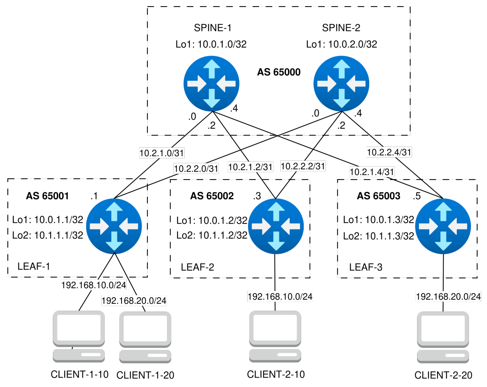

### VxLAN. L2 VNI

### Цель
- Настроить Overlay на основе VxLAN EVPN для L2 связанности между клиентами.

### Схема



### Настройка оборудования

#### SPINE-1
```
configure
hostname spine-1
!
interface Loopback1
 ip address 10.0.1.0/32
 exit
interface Ethernet1
 description to-leaf-1
 no switchport
 mtu 9214
 ip address 10.2.1.0/31
 exit
interface Ethernet2
 no switchport
 mtu 9214
 ip address 10.2.1.2/31
 description to-leaf-2
 exit
interface Ethernet3
 description to-leaf-3
 no switchport
 mtu 9214
 ip address 10.2.1.4/31
 exit
!
peer-filter PF_LEAFS_AS_RANGE
 match as-range 65001-65003 result accept
!
ip routing
router bgp 65000
 router-id 10.0.1.0
 maximum-paths 4 ecmp 4
 neighbor LEAFS peer group
 neighbor LEAFS bfd
 neighbor LEAFS timers 3 9
 neighbor LEAFS password LAB5KEY
 bgp listen range 10.2.1.0/29 peer-group LEAFS peer-filter PF_LEAFS_AS_RANGE
 neighbor EVPN peer group
 neighbor EVPN update-source Loopback1
 neighbor EVPN send-community extended
 bgp listen range 10.0.1.0/30 peer-group EVPN peer-filter PF_LEAFS_AS_RANGE
 !
 address-family ipv4
  neighbor LEAFS activate
  network 10.0.1.0/32
  exit
 !
 address-family evpn
   neighbor EVPN activate
 !
interface Ethernet 1-3
 bfd interval 100 min_rx 100 multiplier 3
 exit
```

#### SPINE-2
```
configure
hostname spine-2
!
interface Loopback1
 ip address 10.0.2.0/32
 exit
interface Ethernet1
 no switchport
 mtu 9214
 ip address 10.2.2.0/31
 description to-leaf-1
 exit
interface Ethernet2
 description to-leaf-2
 no switchport
 mtu 9214
 ip address 10.2.2.2/31
 exit
interface Ethernet3
 description to-leaf-3
 no switchport
 mtu 9214
 ip address 10.2.2.4/31
 exit
!
peer-filter PF_LEAFS_AS_RANGE
 match as-range 65001-65003 result accept
!
ip routing
router bgp 65000
 router-id 10.0.2.0
 maximum-paths 4 ecmp 4
 neighbor LEAFS peer group
 neighbor LEAFS send-community
 neighbor LEAFS bfd
 neighbor LEAFS timers 3 9
 neighbor LEAFS password LAB5KEY
 bgp listen range 10.2.2.0/29 peer-group LEAFS peer-filter PF_LEAFS_AS_RANGE
 neighbor EVPN peer group
 neighbor EVPN update-source Loopback1
 neighbor EVPN send-community extended
 bgp listen range 10.0.1.0/30 peer-group EVPN peer-filter PF_LEAFS_AS_RANGE
 !
 address-family ipv4
  neighbor LEAFS activate
  network 10.0.2.0/32
  exit
 !
 address-family evpn
   neighbor EVPN activate
 !
interface Ethernet 1-3
 bfd interval 100 min_rx 100 multiplier 3
 exit
```

#### LEAF-1
```
configure
hostname leaf-1
!
vlan 10
vlan 20
!
interface Loopback1
 ip address 10.0.1.1/32
 exit
interface Loopback2
 ip address 10.1.1.1/32
 exit
interface Ethernet1
 description to-spine-1
 no switchport
 mtu 9214
 ip address 10.2.1.1/31
 exit
interface Ethernet2
 description to-spine-2
 no switchport
 mtu 9214
 ip address 10.2.2.1/31
 exit
!
interface Ethernet3
 description to-client-1
 switchport access vlan 10
 mtu 9214
 exit
interface Ethernet4
 description to-client-2
 switchport access vlan 20
 mtu 9214
 exit
!
ip virtual-router mac-address 00:11:22:33:44:55
interface vlan 10
 ip address virtual 192.168.10.254/24
interface vlan 20
 ip address virtual 192.168.20.254/24
!
interface vxlan 1
 vxlan source-interface Loopback1
 vxlan udp-port 4789
 vxlan vlan 10 vni 10010
 vxlan vlan 20 vni 10020
!
ip routing
router bgp 65001
 router-id 10.0.1.1
 maximum-paths 4 ecmp 4
 neighbor SPINES peer group
 neighbor SPINES bfd
 neighbor SPINES timers 3 9
 neighbor SPINES password LAB5KEY
 neighbor SPINES allowas-in 1
 neighbor SPINES remote-as 65000
 neighbor 10.2.1.0 peer group SPINES
 neighbor 10.2.2.0 peer group SPINES
 neighbor EVPN peer group
 neighbor EVPN remote-as 65000
 neighbor EVPN update-source Loopback1
 neighbor EVPN ebgp-multihop 3
 neighbor EVPN send-community extended
 neighbor 10.0.1.0 peer group EVPN
 neighbor 10.0.2.0 peer group EVPN
 !
 vlan 10
  rd 65001:10010
  route-target both 10:10010
  redistribute learned
 vlan 20
  rd 65001:10020
  route-target both 20:10020
  redistribute learned
 !
 address-family ipv4
 neighbor SPINES activate
 network 10.0.1.1/32
 exit
 !
 address-family evpn
  neighbor EVPN activate
 !
interface Ethernet 1-2
 bfd interval 100 min_rx 100 multiplier 3
 exit
```

#### LEAF-2
```
configure
hostname leaf-2
!
vlan 10
!
interface Loopback1
 ip address 10.0.1.2/32
 exit
interface Loopback2
 ip address 10.1.1.2/32
 exit
interface Ethernet1
 description to-spine-1
 no switchport
 mtu 9214
 ip address 10.2.1.3/31
 exit
interface Ethernet2
 description to-spine-2
 no switchport
 mtu 9214
 ip address 10.2.2.3/31
 exit
!
interface Ethernet3
 description to-client-1
 switchport access vlan 10
 mtu 9214
 exit
!
ip virtual-router mac-address 00:11:22:33:44:55
interface vlan 10
 ip address virtual 192.168.10.254/24
!
interface vxlan 1
 vxlan source-interface Loopback1
 vxlan udp-port 4789
 vxlan vlan 10 vni 10010
!
ip routing
router bgp 65002
 router-id 10.0.1.2
 maximum-paths 4 ecmp 4
 neighbor SPINES peer group
 neighbor SPINES bfd
 neighbor SPINES timers 3 9
 neighbor SPINES password LAB5KEY
 neighbor SPINES allowas-in 1
 neighbor SPINES remote-as 65000
 neighbor 10.2.1.2 peer group SPINES
 neighbor 10.2.2.2 peer group SPINES
 neighbor EVPN peer group
 neighbor EVPN remote-as 65000
 neighbor EVPN update-source Loopback1
 neighbor EVPN ebgp-multihop 3
 neighbor EVPN send-community extended
 neighbor 10.0.1.0 peer group EVPN
 neighbor 10.0.2.0 peer group EVPN
 !
 vlan 10
  rd 65002:10010
  route-target both 10:10010
  redistribute learned
 !
 address-family ipv4
 neighbor SPINES activate
 network 10.0.1.2/32
 exit
 !
 address-family evpn
  neighbor EVPN activate
 !
interface Ethernet 1-2
 bfd interval 100 min_rx 100 multiplier 3
 exit
```

#### LEAF-3
```
configure
hostname leaf-3
!
vlan 20
!
interface Loopback1
 ip address 10.0.1.3/32
 exit
interface Loopback2
 ip address 10.1.1.3/32
 exit
interface Ethernet1
 description to-spine-1
 no switchport
 mtu 9214
 ip address 10.2.1.5/31
 exit
interface Ethernet2
 description to-spine-2
 no switchport
 mtu 9214
 ip address 10.2.2.5/31
 exit
!
interface Ethernet4
 description to-client-2
 switchport access vlan 20
 mtu 9214
 exit
!
ip virtual-router mac-address 00:11:22:33:44:55
interface vlan 20
 ip address virtual 192.168.20.254/24
!
interface vxlan 1
 vxlan source-interface Loopback1
 vxlan udp-port 4789
 vxlan vlan 20 vni 10020
!
ip routing
router bgp 65003
 router-id 10.0.1.3
 maximum-paths 4 ecmp 4
 neighbor SPINES peer group
 neighbor SPINES bfd
 neighbor SPINES timers 3 9
 neighbor SPINES password LAB5KEY
 neighbor SPINES allowas-in 1
 neighbor SPINES remote-as 65000
 neighbor 10.2.1.4 peer group SPINES
 neighbor 10.2.2.4 peer group SPINES
 neighbor EVPN peer group
 neighbor EVPN remote-as 65000
 neighbor EVPN update-source Loopback1
 neighbor EVPN ebgp-multihop 3
 neighbor EVPN send-community extended
 neighbor 10.0.1.0 peer group EVPN
 neighbor 10.0.2.0 peer group EVPN
 !
 vlan 20
  rd 65003:10020
  route-target both 20:10020
  redistribute learned
 !
 address-family ipv4
 neighbor SPINES activate
 network 10.0.1.3/32
 exit
 !
 address-family evpn
  neighbor EVPN activate
 !
interface Ethernet 1-2
 bfd interval 100 min_rx 100 multiplier 3
 exit
```

### Проверка примененных настроек

#### LEAF-1

```
leaf-1(config)#show ip bgp summary 
BGP summary information for VRF default
Router identifier 10.0.1.1, local AS number 65001
Neighbor Status Codes: m - Under maintenance
  Neighbor         V  AS           MsgRcvd   MsgSent  InQ OutQ  Up/Down State   PfxRcd PfxAcc
  10.0.1.0         4  65000             17        24    0    0 00:03:29 Estab   3      3
  10.0.2.0         4  65000             17        21    0    0 00:03:30 Estab   3      3
  10.2.1.0         4  65000             88        88    0    0 00:03:30 Estab   3      3
  10.2.2.0         4  65000             86        87    0    0 00:03:30 Estab   3      3
leaf-1(config)#
leaf-1(config)#show bgp evpn route-type imet
BGP routing table information for VRF default
Router identifier 10.0.1.1, local AS number 65001
Route status codes: s - suppressed, * - valid, > - active, # - not installed, E - ECMP head, e - ECMP
                    S - Stale, c - Contributing to ECMP, b - backup
                    % - Pending BGP convergence
Origin codes: i - IGP, e - EGP, ? - incomplete
AS Path Attributes: Or-ID - Originator ID, C-LST - Cluster List, LL Nexthop - Link Local Nexthop

          Network                Next Hop              Metric  LocPref Weight  Path
 * >     RD: 65001:10010 imet 10.0.1.1
                                -                     -       -       0       i
 * >     RD: 65001:10020 imet 10.0.1.1
                                -                     -       -       0       i
 * >Ec   RD: 65002:10010 imet 10.0.1.2
                                10.0.1.2              -       100     0       65000 65002 i
 *  ec   RD: 65002:10010 imet 10.0.1.2
                                10.0.1.2              -       100     0       65000 65002 i
 * >Ec   RD: 65003:10020 imet 10.0.1.3
                                10.0.1.3              -       100     0       65000 65003 i
 *  ec   RD: 65003:10020 imet 10.0.1.3
                                10.0.1.3              -       100     0       65000 65003 i
leaf-1(config)#
leaf-1(config)#show bgp evpn route-type mac-ip
BGP routing table information for VRF default
Router identifier 10.0.1.1, local AS number 65001
Route status codes: s - suppressed, * - valid, > - active, # - not installed, E - ECMP head, e - ECMP
                    S - Stale, c - Contributing to ECMP, b - backup
                    % - Pending BGP convergence
Origin codes: i - IGP, e - EGP, ? - incomplete
AS Path Attributes: Or-ID - Originator ID, C-LST - Cluster List, LL Nexthop - Link Local Nexthop

          Network                Next Hop              Metric  LocPref Weight  Path
 * >     RD: 65001:10010 mac-ip 0050.7966.685f
                                -                     -       -       0       i
 * >     RD: 65001:10010 mac-ip 0050.7966.685f 192.168.10.1
                                -                     -       -       0       i
 * >Ec   RD: 65003:10020 mac-ip 0050.7966.6860
                                10.0.1.3              -       100     0       65000 65003 i
 *  ec   RD: 65003:10020 mac-ip 0050.7966.6860
                                10.0.1.3              -       100     0       65000 65003 i
 * >Ec   RD: 65003:10020 mac-ip 0050.7966.6860 192.168.20.2
                                10.0.1.3              -       100     0       65000 65003 i
 *  ec   RD: 65003:10020 mac-ip 0050.7966.6860 192.168.20.2
                                10.0.1.3              -       100     0       65000 65003 i
 * >Ec   RD: 65002:10010 mac-ip 0050.7966.6861
                                10.0.1.2              -       100     0       65000 65002 i
 *  ec   RD: 65002:10010 mac-ip 0050.7966.6861
                                10.0.1.2              -       100     0       65000 65002 i
 * >Ec   RD: 65002:10010 mac-ip 0050.7966.6861 192.168.10.2
                                10.0.1.2              -       100     0       65000 65002 i
 *  ec   RD: 65002:10010 mac-ip 0050.7966.6861 192.168.10.2
                                10.0.1.2              -       100     0       65000 65002 i
 * >     RD: 65001:10020 mac-ip 0050.7966.6869
                                -                     -       -       0       i
 * >     RD: 65001:10020 mac-ip 0050.7966.6869 192.168.20.1
                                -                     -       -       0       i
leaf-1(config)#
leaf-1(config)#show mac address-table 
          Mac Address Table
------------------------------------------------------------------

Vlan    Mac Address       Type        Ports      Moves   Last Move
----    -----------       ----        -----      -----   ---------
  10    0050.7966.685f    DYNAMIC     Et3        1       0:03:25 ago
  10    0050.7966.6861    DYNAMIC     Vx1        1       0:03:16 ago
  20    0050.7966.6860    DYNAMIC     Vx1        1       0:03:10 ago
  20    0050.7966.6869    DYNAMIC     Et4        1       0:03:20 ago
Total Mac Addresses for this criterion: 4

          Multicast Mac Address Table
------------------------------------------------------------------

Vlan    Mac Address       Type        Ports
----    -----------       ----        -----
Total Mac Addresses for this criterion: 0
```

#### LEAF-2

```
leaf-2(config)#show ip bgp summary 
BGP summary information for VRF default
Router identifier 10.0.1.2, local AS number 65002
Neighbor Status Codes: m - Under maintenance
  Neighbor         V  AS           MsgRcvd   MsgSent  InQ OutQ  Up/Down State   PfxRcd PfxAcc
  10.0.1.0         4  65000             22        26    0    0 00:05:12 Estab   3      3
  10.0.2.0         4  65000             22        19    0    0 00:05:13 Estab   3      3
  10.2.1.2         4  65000            126       132    0    0 00:05:13 Estab   3      3
  10.2.2.2         4  65000            130       130    0    0 00:05:14 Estab   3      3
leaf-2(config)#
leaf-2(config)#show bgp evpn route-type imet 
BGP routing table information for VRF default
Router identifier 10.0.1.2, local AS number 65002
Route status codes: s - suppressed, * - valid, > - active, # - not installed, E - ECMP head, e - ECMP
                    S - Stale, c - Contributing to ECMP, b - backup
                    % - Pending BGP convergence
Origin codes: i - IGP, e - EGP, ? - incomplete
AS Path Attributes: Or-ID - Originator ID, C-LST - Cluster List, LL Nexthop - Link Local Nexthop

          Network                Next Hop              Metric  LocPref Weight  Path
 * >Ec   RD: 65001:10010 imet 10.0.1.1
                                10.0.1.1              -       100     0       65000 65001 i
 *  ec   RD: 65001:10010 imet 10.0.1.1
                                10.0.1.1              -       100     0       65000 65001 i
 * >Ec   RD: 65001:10020 imet 10.0.1.1
                                10.0.1.1              -       100     0       65000 65001 i
 *  ec   RD: 65001:10020 imet 10.0.1.1
                                10.0.1.1              -       100     0       65000 65001 i
 * >     RD: 65002:10010 imet 10.0.1.2
                                -                     -       -       0       i
 * >Ec   RD: 65003:10020 imet 10.0.1.3
                                10.0.1.3              -       100     0       65000 65003 i
 *  ec   RD: 65003:10020 imet 10.0.1.3
                                10.0.1.3              -       100     0       65000 65003 i
leaf-2(config)#
leaf-2(config)#show bgp evpn route-type mac-ip 
BGP routing table information for VRF default
Router identifier 10.0.1.2, local AS number 65002
Route status codes: s - suppressed, * - valid, > - active, # - not installed, E - ECMP head, e - ECMP
                    S - Stale, c - Contributing to ECMP, b - backup
                    % - Pending BGP convergence
Origin codes: i - IGP, e - EGP, ? - incomplete
AS Path Attributes: Or-ID - Originator ID, C-LST - Cluster List, LL Nexthop - Link Local Nexthop

          Network                Next Hop              Metric  LocPref Weight  Path
 * >Ec   RD: 65001:10010 mac-ip 0050.7966.685f
                                10.0.1.1              -       100     0       65000 65001 i
 *  ec   RD: 65001:10010 mac-ip 0050.7966.685f
                                10.0.1.1              -       100     0       65000 65001 i
 * >Ec   RD: 65001:10010 mac-ip 0050.7966.685f 192.168.10.1
                                10.0.1.1              -       100     0       65000 65001 i
 *  ec   RD: 65001:10010 mac-ip 0050.7966.685f 192.168.10.1
                                10.0.1.1              -       100     0       65000 65001 i
 * >Ec   RD: 65003:10020 mac-ip 0050.7966.6860
                                10.0.1.3              -       100     0       65000 65003 i
 *  ec   RD: 65003:10020 mac-ip 0050.7966.6860
                                10.0.1.3              -       100     0       65000 65003 i
 * >Ec   RD: 65003:10020 mac-ip 0050.7966.6860 192.168.20.2
                                10.0.1.3              -       100     0       65000 65003 i
 *  ec   RD: 65003:10020 mac-ip 0050.7966.6860 192.168.20.2
                                10.0.1.3              -       100     0       65000 65003 i
 * >     RD: 65002:10010 mac-ip 0050.7966.6861
                                -                     -       -       0       i
 * >     RD: 65002:10010 mac-ip 0050.7966.6861 192.168.10.2
                                -                     -       -       0       i
 * >Ec   RD: 65001:10020 mac-ip 0050.7966.6869
                                10.0.1.1              -       100     0       65000 65001 i
 *  ec   RD: 65001:10020 mac-ip 0050.7966.6869
                                10.0.1.1              -       100     0       65000 65001 i
 * >Ec   RD: 65001:10020 mac-ip 0050.7966.6869 192.168.20.1
                                10.0.1.1              -       100     0       65000 65001 i
 *  ec   RD: 65001:10020 mac-ip 0050.7966.6869 192.168.20.1
                                10.0.1.1              -       100     0       65000 65001 i
leaf-2(config)#
leaf-2(config)#show mac address-table 
          Mac Address Table
------------------------------------------------------------------

Vlan    Mac Address       Type        Ports      Moves   Last Move
----    -----------       ----        -----      -----   ---------
  10    0050.7966.685f    DYNAMIC     Vx1        1       0:05:23 ago
  10    0050.7966.6861    DYNAMIC     Et3        1       0:05:14 ago
Total Mac Addresses for this criterion: 2

          Multicast Mac Address Table
------------------------------------------------------------------

Vlan    Mac Address       Type        Ports
----    -----------       ----        -----
Total Mac Addresses for this criterion: 0
```

#### LEAF-3

```
leaf-3(config)#show ip bgp summary 
BGP summary information for VRF default
Router identifier 10.0.1.3, local AS number 65003
Neighbor Status Codes: m - Under maintenance
  Neighbor         V  AS           MsgRcvd   MsgSent  InQ OutQ  Up/Down State   PfxRcd PfxAcc
  10.0.1.0         4  65000             24        28    0    0 00:06:26 Estab   3      3
  10.0.2.0         4  65000             24        20    0    0 00:06:26 Estab   3      3
  10.2.1.4         4  65000            158       160    0    0 00:06:27 Estab   3      3
  10.2.2.4         4  65000            157       157    0    0 00:06:27 Estab   3      3
leaf-3(config)#
leaf-3(config)#show bgp evpn route-type imet 
BGP routing table information for VRF default
Router identifier 10.0.1.3, local AS number 65003
Route status codes: s - suppressed, * - valid, > - active, # - not installed, E - ECMP head, e - ECMP
                    S - Stale, c - Contributing to ECMP, b - backup
                    % - Pending BGP convergence
Origin codes: i - IGP, e - EGP, ? - incomplete
AS Path Attributes: Or-ID - Originator ID, C-LST - Cluster List, LL Nexthop - Link Local Nexthop

          Network                Next Hop              Metric  LocPref Weight  Path
 * >Ec   RD: 65001:10010 imet 10.0.1.1
                                10.0.1.1              -       100     0       65000 65001 i
 *  ec   RD: 65001:10010 imet 10.0.1.1
                                10.0.1.1              -       100     0       65000 65001 i
 * >Ec   RD: 65001:10020 imet 10.0.1.1
                                10.0.1.1              -       100     0       65000 65001 i
 *  ec   RD: 65001:10020 imet 10.0.1.1
                                10.0.1.1              -       100     0       65000 65001 i
 * >Ec   RD: 65002:10010 imet 10.0.1.2
                                10.0.1.2              -       100     0       65000 65002 i
 *  ec   RD: 65002:10010 imet 10.0.1.2
                                10.0.1.2              -       100     0       65000 65002 i
 * >     RD: 65003:10020 imet 10.0.1.3
                                -                     -       -       0       i
leaf-3(config)#
leaf-3(config)#show bgp evpn route-type mac-ip 
BGP routing table information for VRF default
Router identifier 10.0.1.3, local AS number 65003
Route status codes: s - suppressed, * - valid, > - active, # - not installed, E - ECMP head, e - ECMP
                    S - Stale, c - Contributing to ECMP, b - backup
                    % - Pending BGP convergence
Origin codes: i - IGP, e - EGP, ? - incomplete
AS Path Attributes: Or-ID - Originator ID, C-LST - Cluster List, LL Nexthop - Link Local Nexthop

          Network                Next Hop              Metric  LocPref Weight  Path
 * >Ec   RD: 65001:10010 mac-ip 0050.7966.685f
                                10.0.1.1              -       100     0       65000 65001 i
 *  ec   RD: 65001:10010 mac-ip 0050.7966.685f
                                10.0.1.1              -       100     0       65000 65001 i
 * >Ec   RD: 65001:10010 mac-ip 0050.7966.685f 192.168.10.1
                                10.0.1.1              -       100     0       65000 65001 i
 *  ec   RD: 65001:10010 mac-ip 0050.7966.685f 192.168.10.1
                                10.0.1.1              -       100     0       65000 65001 i
 * >     RD: 65003:10020 mac-ip 0050.7966.6860
                                -                     -       -       0       i
 * >     RD: 65003:10020 mac-ip 0050.7966.6860 192.168.20.2
                                -                     -       -       0       i
 * >Ec   RD: 65002:10010 mac-ip 0050.7966.6861
                                10.0.1.2              -       100     0       65000 65002 i
 *  ec   RD: 65002:10010 mac-ip 0050.7966.6861
                                10.0.1.2              -       100     0       65000 65002 i
 * >Ec   RD: 65002:10010 mac-ip 0050.7966.6861 192.168.10.2
                                10.0.1.2              -       100     0       65000 65002 i
 *  ec   RD: 65002:10010 mac-ip 0050.7966.6861 192.168.10.2
                                10.0.1.2              -       100     0       65000 65002 i
 * >Ec   RD: 65001:10020 mac-ip 0050.7966.6869
                                10.0.1.1              -       100     0       65000 65001 i
 *  ec   RD: 65001:10020 mac-ip 0050.7966.6869
                                10.0.1.1              -       100     0       65000 65001 i
 * >Ec   RD: 65001:10020 mac-ip 0050.7966.6869 192.168.20.1
                                10.0.1.1              -       100     0       65000 65001 i
 *  ec   RD: 65001:10020 mac-ip 0050.7966.6869 192.168.20.1
                                10.0.1.1              -       100     0       65000 65001 i
leaf-3(config)#
leaf-3(config)#show mac address-table 
          Mac Address Table
------------------------------------------------------------------

Vlan    Mac Address       Type        Ports      Moves   Last Move
----    -----------       ----        -----      -----   ---------
  20    0050.7966.6860    DYNAMIC     Et4        1       0:06:38 ago
  20    0050.7966.6869    DYNAMIC     Vx1        1       0:06:47 ago
Total Mac Addresses for this criterion: 2

          Multicast Mac Address Table
------------------------------------------------------------------

Vlan    Mac Address       Type        Ports
----    -----------       ----        -----
Total Mac Addresses for this criterion: 0
```

Проверка связности клиентов:

- ping CLIENT-1-10 CLIENT-2-10:
```
CLIENT-1-10> show ip

NAME        : CLIENT-1-10[1]
IP/MASK     : 192.168.10.1/24
GATEWAY     : 192.168.10.254
DNS         : 
MAC         : 00:50:79:66:68:5f
LPORT       : 20000
RHOST:PORT  : 127.0.0.1:30000
MTU         : 1500

CLIENT-1-10> ping 192.168.10.2

84 bytes from 192.168.10.2 icmp_seq=1 ttl=64 time=14.560 ms
84 bytes from 192.168.10.2 icmp_seq=2 ttl=64 time=8.005 ms
84 bytes from 192.168.10.2 icmp_seq=3 ttl=64 time=8.203 ms
84 bytes from 192.168.10.2 icmp_seq=4 ttl=64 time=8.873 ms
84 bytes from 192.168.10.2 icmp_seq=5 ttl=64 time=8.993 ms

```
- ping CLIENT-1-20 CLIENT-2-20:
```
CLIENT-1-20> show ip

NAME        : CLIENT-1-20[1]
IP/MASK     : 192.168.20.1/24
GATEWAY     : 192.168.20.254
DNS         : 
MAC         : 00:50:79:66:68:69
LPORT       : 20000
RHOST:PORT  : 127.0.0.1:30000
MTU         : 1500

CLIENT-1-20> 
CLIENT-1-20> ping 192.168.20.2

84 bytes from 192.168.20.2 icmp_seq=1 ttl=64 time=8.129 ms
84 bytes from 192.168.20.2 icmp_seq=2 ttl=64 time=8.499 ms
84 bytes from 192.168.20.2 icmp_seq=3 ttl=64 time=7.705 ms
84 bytes from 192.168.20.2 icmp_seq=4 ttl=64 time=7.448 ms
84 bytes from 192.168.20.2 icmp_seq=5 ttl=64 time=8.917 ms

```


