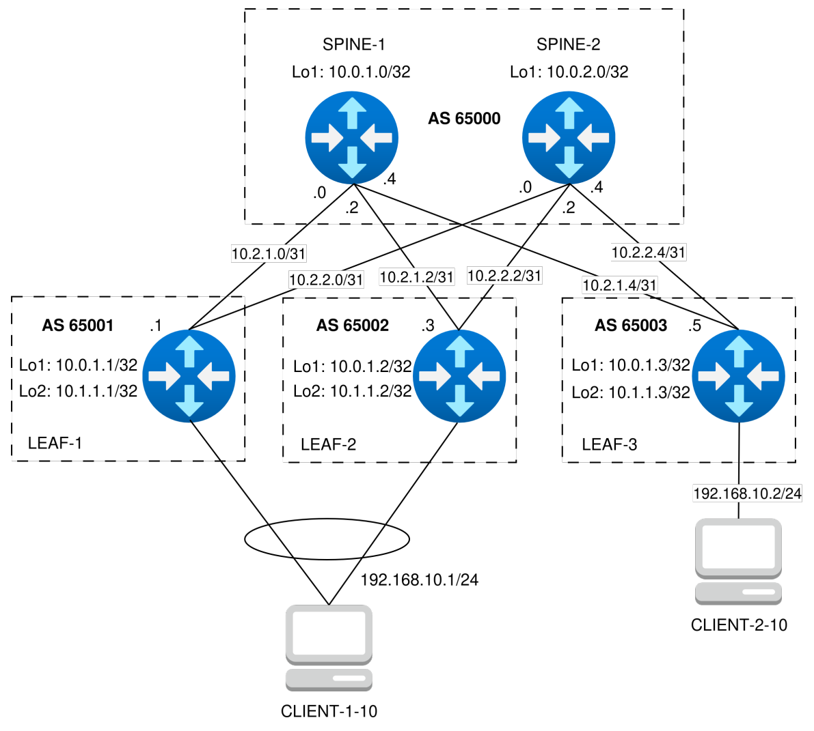
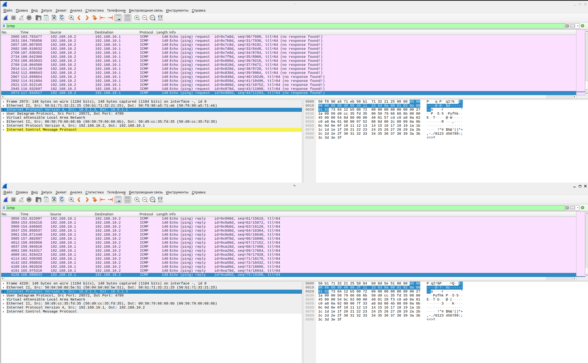

### VXLAN. Multihoming

### Цель
- Настроить отказоустойчивое подключение клиентов с использованием EVPN Multihoming.

### Схема



### Настройка оборудования

#### SPINE-1
```
configure
!
hostname spine-1
!
interface Loopback1
 ip address 10.0.1.0/32
 exit
interface Ethernet1
 description to-leaf-1
 no switchport
 mtu 9214
 ip address 10.2.1.0/31
 exit
interface Ethernet2
 no switchport
 mtu 9214
 ip address 10.2.1.2/31
 description to-leaf-2
 exit
interface Ethernet3
 description to-leaf-3
 no switchport
 mtu 9214
 ip address 10.2.1.4/31
 exit
!
peer-filter PF_LEAFS_AS_RANGE
 match as-range 65001-65003 result accept
!
ip routing
router bgp 65000
 router-id 10.0.1.0
 maximum-paths 4 ecmp 4
 neighbor UNDERLAY peer group
 neighbor UNDERLAY bfd
 neighbor UNDERLAY timers 3 9
 neighbor UNDERLAY password LAB7KEY
 bgp listen range 10.2.1.0/29 peer-group UNDERLAY peer-filter PF_LEAFS_AS_RANGE
 neighbor EVPN peer group
 neighbor EVPN update-source Loopback1
 neighbor EVPN next-hop-unchanged
 neighbor EVPN send-community extended
 bgp listen range 10.0.1.0/30 peer-group EVPN peer-filter PF_LEAFS_AS_RANGE
 !
 address-family ipv4
  neighbor UNDERLAY activate
  network 10.0.1.0/32
  exit
 !
 address-family evpn
   neighbor EVPN activate
 !
interface Ethernet 1-3
 bfd interval 100 min_rx 100 multiplier 3
 exit
```

#### SPINE-2
```
configure
!
hostname spine-2
!
interface Loopback1
 ip address 10.0.2.0/32
 exit
interface Ethernet1
 no switchport
 mtu 9214
 ip address 10.2.2.0/31
 description to-leaf-1
 exit
interface Ethernet2
 description to-leaf-2
 no switchport
 mtu 9214
 ip address 10.2.2.2/31
 exit
interface Ethernet3
 description to-leaf-3
 no switchport
 mtu 9214
 ip address 10.2.2.4/31
 exit
!
peer-filter PF_LEAFS_AS_RANGE
 match as-range 65001-65003 result accept
!
ip routing
router bgp 65000
 router-id 10.0.2.0
 maximum-paths 4 ecmp 4
 neighbor UNDERLAY peer group
 neighbor UNDERLAY send-community
 neighbor UNDERLAY bfd
 neighbor UNDERLAY timers 3 9
 neighbor UNDERLAY password LAB7KEY
 bgp listen range 10.2.2.0/29 peer-group UNDERLAY peer-filter PF_LEAFS_AS_RANGE
 neighbor EVPN peer group
 neighbor EVPN update-source Loopback1
 neighbor EVPN next-hop-unchanged
 neighbor EVPN send-community extended
 bgp listen range 10.0.1.0/30 peer-group EVPN peer-filter PF_LEAFS_AS_RANGE
 !
 address-family ipv4
  neighbor UNDERLAY activate
  network 10.0.2.0/32
  exit
 !
 address-family evpn
   neighbor EVPN activate
 !
interface Ethernet 1-3
 bfd interval 100 min_rx 100 multiplier 3
 exit
```

#### LEAF-1
```
configure
!
hostname leaf-1
!
vlan 10
!
interface Loopback1
 ip address 10.0.1.1/32
 exit
interface Loopback2
 ip address 10.1.1.1/32
 exit
interface Ethernet1
 description to-spine-1
 no switchport
 mtu 9214
 ip address 10.2.1.1/31
 exit
interface Ethernet2
 description to-spine-2
 no switchport
 mtu 9214
 ip address 10.2.2.1/31
 exit
!
interface port-channel 1
 description pc-to-mh-client-1
 switchport mode access
 switchport access vlan 10
 evpn ethernet-segment
 identifier 0000:0000:0000:0000:0001
 route-target import 00:00:00:00:00:01
 lacp system-id 0000.0000.1111
!
interface Ethernet3
 description to-mh-client-1
 channel-group 1 mode active
 mtu 9214
 exit
!
ip virtual-router mac-address 00:11:22:33:44:55
!
interface vlan 10
 ip address virtual 192.168.10.254/24
!
interface vxlan 1
 vxlan source-interface Loopback1
 vxlan udp-port 4789
 vxlan vlan 10 vni 10010
!
ip routing
router bgp 65001
 router-id 10.0.1.1
 maximum-paths 4 ecmp 4
 neighbor UNDERLAY peer group
 neighbor UNDERLAY bfd
 neighbor UNDERLAY timers 3 9
 neighbor UNDERLAY password LAB7KEY
 neighbor UNDERLAY allowas-in 1
 neighbor UNDERLAY remote-as 65000
 neighbor 10.2.1.0 peer group UNDERLAY
 neighbor 10.2.2.0 peer group UNDERLAY
 neighbor EVPN peer group
 neighbor EVPN remote-as 65000
 neighbor EVPN update-source Loopback1
 neighbor EVPN ebgp-multihop 3
 neighbor EVPN send-community extended
 neighbor 10.0.1.0 peer group EVPN
 neighbor 10.0.2.0 peer group EVPN
 !
 vlan 10
  rd 65001:10010
  route-target both 10:10010
  redistribute learned
 !
 address-family ipv4
 neighbor UNDERLAY activate
 network 10.0.1.1/32
 exit
 !
 address-family evpn
  neighbor EVPN activate
  exit
 !
interface Ethernet 1-2
 bfd interval 100 min_rx 100 multiplier 3
 exit
```

#### LEAF-2
```
configure
!
hostname leaf-2
!
vlan 10
!
interface Loopback1
 ip address 10.0.1.2/32
 exit
interface Loopback2
 ip address 10.1.1.2/32
 exit
interface Ethernet1
 description to-spine-1
 no switchport
 mtu 9214
 ip address 10.2.1.3/31
 exit
!
interface port-channel 1
 description pc-to-mh-client-1
 switchport mode access
 switchport access vlan 10
 evpn ethernet-segment
 identifier 0000:0000:0000:0000:0001
 route-target import 00:00:00:00:00:01
 lacp system-id 0000.0000.1111
!
interface Ethernet3
 description to-mh-client-1
 channel-group 1 mode active
 mtu 9214
 exit
!
ip virtual-router mac-address 00:11:22:33:44:55
!
interface vlan 10
 ip address virtual 192.168.10.254/24
!
interface vxlan 1
 vxlan source-interface Loopback1
 vxlan udp-port 4789
 vxlan vlan 10 vni 10010
!
ip routing
router bgp 65002
 router-id 10.0.1.2
 maximum-paths 4 ecmp 4
 neighbor UNDERLAY peer group
 neighbor UNDERLAY bfd
 neighbor UNDERLAY timers 3 9
 neighbor UNDERLAY password LAB7KEY
 neighbor UNDERLAY allowas-in 1
 neighbor UNDERLAY remote-as 65000
 neighbor 10.2.1.2 peer group UNDERLAY
 neighbor 10.2.2.2 peer group UNDERLAY
 neighbor EVPN peer group
 neighbor EVPN remote-as 65000
 neighbor EVPN update-source Loopback1
 neighbor EVPN ebgp-multihop 3
 neighbor EVPN send-community extended
 neighbor 10.0.1.0 peer group EVPN
 neighbor 10.0.2.0 peer group EVPN
 !
 vlan 10
  rd 65002:10010
  route-target both 10:10010
  redistribute learned
 !
 address-family ipv4
  neighbor UNDERLAY activate
  network 10.0.1.2/32
  exit
 !
 address-family evpn
  neighbor EVPN activate
  exit
 !
interface Ethernet 1-2
 bfd interval 100 min_rx 100 multiplier 3
 exit
```

#### LEAF-3
```
configure
!
hostname leaf-3
!
vlan 10
!
interface Loopback1
 ip address 10.0.1.3/32
 exit
interface Loopback2
 ip address 10.1.1.3/32
 exit
interface Ethernet1
 description to-spine-1
 no switchport
 mtu 9214
 ip address 10.2.1.5/31
 exit
interface Ethernet2
 description to-spine-2
 no switchport
 mtu 9214
 ip address 10.2.2.5/31
 exit
!
interface Ethernet4
 description to-client-2
 switchport access vlan 10
 mtu 9214
 exit
!
ip virtual-router mac-address 00:11:22:33:44:55
!
interface vlan 10
 ip address virtual 192.168.10.254/24
!
interface vxlan 1
 vxlan source-interface Loopback1
 vxlan udp-port 4789
 vxlan vlan 10 vni 10010
!
ip routing
router bgp 65003
 router-id 10.0.1.3
 maximum-paths 4 ecmp 4
 neighbor UNDERLAY peer group
 neighbor UNDERLAY bfd
 neighbor UNDERLAY timers 3 9
 neighbor UNDERLAY password LAB7KEY
 neighbor UNDERLAY allowas-in 1
 neighbor UNDERLAY remote-as 65000
 neighbor 10.2.1.4 peer group UNDERLAY
 neighbor 10.2.2.4 peer group UNDERLAY
 neighbor EVPN peer group
 neighbor EVPN remote-as 65000
 neighbor EVPN update-source Loopback1
 neighbor EVPN ebgp-multihop 3
 neighbor EVPN send-community extended
 neighbor 10.0.1.0 peer group EVPN
 neighbor 10.0.2.0 peer group EVPN
 !
 vlan 10
  rd 65003:10010
  route-target both 10:10010
  redistribute learned
 !
 address-family ipv4
 neighbor UNDERLAY activate
 network 10.0.1.3/32
 exit
 !
 address-family evpn
  neighbor EVPN activate
  exit
 !
interface Ethernet 1-2
 bfd interval 100 min_rx 100 multiplier 3
 exit
```

#### CLIENT-1-10
```
configure
!
hostname CLIENT-1-10
!
vlan 10
!
interface port-channel 1
 description pc-to-leaf-1-2
 switchport mode access
 switchport access vlan 10
!
interface Ethernet1
 description to-leaf-1
 channel-group 1 mode active
 mtu 9214
 exit
!
interface Ethernet2
 description to-leaf-2
 channel-group 1 mode active
 mtu 9214
 exit
!
interface Vlan10
 ip address 192.168.10.1/24
!
```

### Проверка примененных настроек

#### LEAF-1

```
leaf-1(config)#show mac address-table
          Mac Address Table
------------------------------------------------------------------

Vlan    Mac Address       Type        Ports      Moves   Last Move
----    -----------       ----        -----      -----   ---------
  10    0050.7966.686b    DYNAMIC     Vx1        1       0:03:13 ago
  10    50d9.cc35.fd35    DYNAMIC     Po1        2       0:02:15 ago
Total Mac Addresses for this criterion: 2

          Multicast Mac Address Table
------------------------------------------------------------------

Vlan    Mac Address       Type        Ports
----    -----------       ----        -----
Total Mac Addresses for this criterion: 0
leaf-1(config)#
leaf-1(config)#show vxlan address-table 
          Vxlan Mac Address Table
----------------------------------------------------------------------

VLAN  Mac Address     Type     Prt  VTEP             Moves   Last Move
----  -----------     ----     ---  ----             -----   ---------
  10  0050.7966.686b  EVPN     Vx1  10.0.1.3         1       0:03:17 ago
Total Remote Mac Addresses for this criterion: 1
leaf-1(config)#
leaf-1(config)#show bgp evpn route-type auto-discovery 
BGP routing table information for VRF default
Router identifier 10.0.1.1, local AS number 65001
Route status codes: s - suppressed, * - valid, > - active, # - not installed, E - ECMP head, e - ECMP
                    S - Stale, c - Contributing to ECMP, b - backup
                    % - Pending BGP convergence
Origin codes: i - IGP, e - EGP, ? - incomplete
AS Path Attributes: Or-ID - Originator ID, C-LST - Cluster List, LL Nexthop - Link Local Nexthop

          Network                Next Hop              Metric  LocPref Weight  Path
 * >     RD: 65001:10010 auto-discovery 0 0000:0000:0000:0000:0001
                                -                     -       -       0       i
 * >     RD: 65002:10010 auto-discovery 0 0000:0000:0000:0000:0001
                                10.0.1.2              -       100     0       65000 65002 i
 * >     RD: 10.0.1.1:1 auto-discovery 0000:0000:0000:0000:0001
                                -                     -       -       0       i
 * >     RD: 10.0.1.2:1 auto-discovery 0000:0000:0000:0000:0001
                                10.0.1.2              -       100     0       65000 65002 i
leaf-1(config)#
leaf-1(config)#show bgp evpn route-type ethernet-segment 
BGP routing table information for VRF default
Router identifier 10.0.1.1, local AS number 65001
Route status codes: s - suppressed, * - valid, > - active, # - not installed, E - ECMP head, e - ECMP
                    S - Stale, c - Contributing to ECMP, b - backup
                    % - Pending BGP convergence
Origin codes: i - IGP, e - EGP, ? - incomplete
AS Path Attributes: Or-ID - Originator ID, C-LST - Cluster List, LL Nexthop - Link Local Nexthop

          Network                Next Hop              Metric  LocPref Weight  Path
 * >     RD: 10.0.1.1:1 ethernet-segment 0000:0000:0000:0000:0001 10.0.1.1
                                -                     -       -       0       i
 * >     RD: 10.0.1.2:1 ethernet-segment 0000:0000:0000:0000:0001 10.0.1.2
                                10.0.1.2              -       100     0       65000 65002 i
leaf-1(config)#
leaf-1(config)#show bgp evpn route-type mac-ip 
BGP routing table information for VRF default
Router identifier 10.0.1.1, local AS number 65001
Route status codes: s - suppressed, * - valid, > - active, # - not installed, E - ECMP head, e - ECMP
                    S - Stale, c - Contributing to ECMP, b - backup
                    % - Pending BGP convergence
Origin codes: i - IGP, e - EGP, ? - incomplete
AS Path Attributes: Or-ID - Originator ID, C-LST - Cluster List, LL Nexthop - Link Local Nexthop

          Network                Next Hop              Metric  LocPref Weight  Path
 * >Ec   RD: 65003:10010 mac-ip 0050.7966.686b
                                10.0.1.3              -       100     0       65000 65003 i
 *  ec   RD: 65003:10010 mac-ip 0050.7966.686b
                                10.0.1.3              -       100     0       65000 65003 i
 * >Ec   RD: 65003:10010 mac-ip 0050.7966.686b 192.168.10.2
                                10.0.1.3              -       100     0       65000 65003 i
 *  ec   RD: 65003:10010 mac-ip 0050.7966.686b 192.168.10.2
                                10.0.1.3              -       100     0       65000 65003 i
 * >     RD: 65001:10010 mac-ip 50d9.cc35.fd35
                                -                     -       -       0       i
 * >     RD: 65002:10010 mac-ip 50d9.cc35.fd35
                                10.0.1.2              -       100     0       65000 65002 i
 * >     RD: 65001:10010 mac-ip 50d9.cc35.fd35 192.168.10.1
                                -                     -       -       0       i
 * >     RD: 65002:10010 mac-ip 50d9.cc35.fd35 192.168.10.1
                                10.0.1.2              -       100     0       65000 65002 i
```

#### LEAF-2
```
leaf-2(config)#show mac address-table 
          Mac Address Table
------------------------------------------------------------------

Vlan    Mac Address       Type        Ports      Moves   Last Move
----    -----------       ----        -----      -----   ---------
  10    0050.7966.686b    DYNAMIC     Vx1        1       0:04:34 ago
  10    50d9.cc35.fd35    DYNAMIC     Po1        2       0:30:59 ago
Total Mac Addresses for this criterion: 2

          Multicast Mac Address Table
------------------------------------------------------------------

Vlan    Mac Address       Type        Ports
----    -----------       ----        -----
Total Mac Addresses for this criterion: 0
leaf-2(config)#
leaf-2(config)#show vxlan address-table 
          Vxlan Mac Address Table
----------------------------------------------------------------------

VLAN  Mac Address     Type     Prt  VTEP             Moves   Last Move
----  -----------     ----     ---  ----             -----   ---------
  10  0050.7966.686b  EVPN     Vx1  10.0.1.3         1       0:04:37 ago
Total Remote Mac Addresses for this criterion: 1
leaf-2(config)#          
leaf-2(config)#show bgp evpn route-type auto-discovery 
BGP routing table information for VRF default
Router identifier 10.0.1.2, local AS number 65002
Route status codes: s - suppressed, * - valid, > - active, # - not installed, E - ECMP head, e - ECMP
                    S - Stale, c - Contributing to ECMP, b - backup
                    % - Pending BGP convergence
Origin codes: i - IGP, e - EGP, ? - incomplete
AS Path Attributes: Or-ID - Originator ID, C-LST - Cluster List, LL Nexthop - Link Local Nexthop

          Network                Next Hop              Metric  LocPref Weight  Path
 * >     RD: 65001:10010 auto-discovery 0 0000:0000:0000:0000:0001
                                10.0.1.1              -       100     0       65000 65001 i
 * >     RD: 65002:10010 auto-discovery 0 0000:0000:0000:0000:0001
                                -                     -       -       0       i
 * >     RD: 10.0.1.1:1 auto-discovery 0000:0000:0000:0000:0001
                                10.0.1.1              -       100     0       65000 65001 i
 * >     RD: 10.0.1.2:1 auto-discovery 0000:0000:0000:0000:0001
                                -                     -       -       0       i
leaf-2(config)#
leaf-2(config)#show bgp evpn route-type ethernet-segment 
BGP routing table information for VRF default
Router identifier 10.0.1.2, local AS number 65002
Route status codes: s - suppressed, * - valid, > - active, # - not installed, E - ECMP head, e - ECMP
                    S - Stale, c - Contributing to ECMP, b - backup
                    % - Pending BGP convergence
Origin codes: i - IGP, e - EGP, ? - incomplete
AS Path Attributes: Or-ID - Originator ID, C-LST - Cluster List, LL Nexthop - Link Local Nexthop

          Network                Next Hop              Metric  LocPref Weight  Path
 * >     RD: 10.0.1.1:1 ethernet-segment 0000:0000:0000:0000:0001 10.0.1.1
                                10.0.1.1              -       100     0       65000 65001 i
 * >     RD: 10.0.1.2:1 ethernet-segment 0000:0000:0000:0000:0001 10.0.1.2
                                -                     -       -       0       i
leaf-2(config)#
leaf-2(config)#show bgp evpn route-type mac-ip 
BGP routing table information for VRF default
Router identifier 10.0.1.2, local AS number 65002
Route status codes: s - suppressed, * - valid, > - active, # - not installed, E - ECMP head, e - ECMP
                    S - Stale, c - Contributing to ECMP, b - backup
                    % - Pending BGP convergence
Origin codes: i - IGP, e - EGP, ? - incomplete
AS Path Attributes: Or-ID - Originator ID, C-LST - Cluster List, LL Nexthop - Link Local Nexthop

          Network                Next Hop              Metric  LocPref Weight  Path
 * >     RD: 65003:10010 mac-ip 0050.7966.686b
                                10.0.1.3              -       100     0       65000 65003 i
 * >     RD: 65003:10010 mac-ip 0050.7966.686b 192.168.10.2
                                10.0.1.3              -       100     0       65000 65003 i
 * >     RD: 65001:10010 mac-ip 50d9.cc35.fd35
                                10.0.1.1              -       100     0       65000 65001 i
 * >     RD: 65002:10010 mac-ip 50d9.cc35.fd35
                                -                     -       -       0       i
 * >     RD: 65001:10010 mac-ip 50d9.cc35.fd35 192.168.10.1
                                10.0.1.1              -       100     0       65000 65001 i
 * >     RD: 65002:10010 mac-ip 50d9.cc35.fd35 192.168.10.1
                                -                     -       -       0       i
```

#### LEAF-3

MAC адрес хоста, подключенного в схеме с MH доступен через два leaf-а


```
leaf-3(config)#show mac address-table 
          Mac Address Table
------------------------------------------------------------------

Vlan    Mac Address       Type        Ports      Moves   Last Move
----    -----------       ----        -----      -----   ---------
  10    0050.7966.686b    DYNAMIC     Et4        1       0:01:43 ago
  10    50d9.cc35.fd35    DYNAMIC     Vx1        2       0:02:00 ago
Total Mac Addresses for this criterion: 2

          Multicast Mac Address Table
------------------------------------------------------------------

Vlan    Mac Address       Type        Ports
----    -----------       ----        -----
Total Mac Addresses for this criterion: 0
leaf-3(config)#
leaf-3(config)#show vxlan address-table 
          Vxlan Mac Address Table
----------------------------------------------------------------------

VLAN  Mac Address     Type     Prt  VTEP             Moves   Last Move
----  -----------     ----     ---  ----             -----   ---------
  10  50d9.cc35.fd35  EVPN     Vx1  10.0.1.1         2       0:02:04 ago
                                    10.0.1.2
Total Remote Mac Addresses for this criterion: 1
leaf-3(config)#
leaf-3(config)#show l2Rib output 
50d9.cc35.fd35, VLAN 10, seq 2, pref 16, evpnDynamicRemoteMac, source: BGP
   VTEP 10.0.1.1
   VTEP 10.0.1.2
0050.7966.686b, VLAN 10, seq 1, pref 16, learnedDynamicMac, source: Local Dynamic
   Ethernet4
0050.7966.686b, VLAN 1, seq 1, pref 16, learnedDynamicMac, source: Local Dynamic
   Ethernet4
50f8.90a5.71eb, VLAN 1007, seq 1, pref 16, learnedDynamicMac, source: Local Dynamic
   Ethernet2
5004.b08d.5e51, VLAN 1006, seq 1, pref 16, learnedDynamicMac, source: Local Dynamic
   Ethernet1
leaf-3(config)#
leaf-3(config)#show bgp evpn route-type auto-discovery
BGP routing table information for VRF default
Router identifier 10.0.1.3, local AS number 65003
Route status codes: s - suppressed, * - valid, > - active, # - not installed, E - ECMP head, e - ECMP
                    S - Stale, c - Contributing to ECMP, b - backup
                    % - Pending BGP convergence
Origin codes: i - IGP, e - EGP, ? - incomplete
AS Path Attributes: Or-ID - Originator ID, C-LST - Cluster List, LL Nexthop - Link Local Nexthop

          Network                Next Hop              Metric  LocPref Weight  Path
 * >Ec   RD: 65001:10010 auto-discovery 0 0000:0000:0000:0000:0001
                                10.0.1.1              -       100     0       65000 65001 i
 *  ec   RD: 65001:10010 auto-discovery 0 0000:0000:0000:0000:0001
                                10.0.1.1              -       100     0       65000 65001 i
 * >     RD: 65002:10010 auto-discovery 0 0000:0000:0000:0000:0001
                                10.0.1.2              -       100     0       65000 65002 i
 * >Ec   RD: 10.0.1.1:1 auto-discovery 0000:0000:0000:0000:0001
                                10.0.1.1              -       100     0       65000 65001 i
 *  ec   RD: 10.0.1.1:1 auto-discovery 0000:0000:0000:0000:0001
                                10.0.1.1              -       100     0       65000 65001 i
 * >     RD: 10.0.1.2:1 auto-discovery 0000:0000:0000:0000:0001
                                10.0.1.2              -       100     0       65000 65002 i
leaf-3(config)#
leaf-3(config)#show bgp evpn route-type ethernet-segment
BGP routing table information for VRF default
Router identifier 10.0.1.3, local AS number 65003
Route status codes: s - suppressed, * - valid, > - active, # - not installed, E - ECMP head, e - ECMP
                    S - Stale, c - Contributing to ECMP, b - backup
                    % - Pending BGP convergence
Origin codes: i - IGP, e - EGP, ? - incomplete
AS Path Attributes: Or-ID - Originator ID, C-LST - Cluster List, LL Nexthop - Link Local Nexthop

          Network                Next Hop              Metric  LocPref Weight  Path
 * >Ec   RD: 10.0.1.1:1 ethernet-segment 0000:0000:0000:0000:0001 10.0.1.1
                                10.0.1.1              -       100     0       65000 65001 i
 *  ec   RD: 10.0.1.1:1 ethernet-segment 0000:0000:0000:0000:0001 10.0.1.1
                                10.0.1.1              -       100     0       65000 65001 i
 * >     RD: 10.0.1.2:1 ethernet-segment 0000:0000:0000:0000:0001 10.0.1.2
                                10.0.1.2              -       100     0       65000 65002 i
leaf-3(config)#
leaf-3(config)#show bgp evpn route-type mac-ip
BGP routing table information for VRF default
Router identifier 10.0.1.3, local AS number 65003
Route status codes: s - suppressed, * - valid, > - active, # - not installed, E - ECMP head, e - ECMP
                    S - Stale, c - Contributing to ECMP, b - backup
                    % - Pending BGP convergence
Origin codes: i - IGP, e - EGP, ? - incomplete
AS Path Attributes: Or-ID - Originator ID, C-LST - Cluster List, LL Nexthop - Link Local Nexthop

          Network                Next Hop              Metric  LocPref Weight  Path
 * >     RD: 65003:10010 mac-ip 0050.7966.686b
                                -                     -       -       0       i
 * >     RD: 65003:10010 mac-ip 0050.7966.686b 192.168.10.2
                                -                     -       -       0       i
 * >Ec   RD: 65001:10010 mac-ip 50d9.cc35.fd35
                                10.0.1.1              -       100     0       65000 65001 i
 *  ec   RD: 65001:10010 mac-ip 50d9.cc35.fd35
                                10.0.1.1              -       100     0       65000 65001 i
 * >     RD: 65002:10010 mac-ip 50d9.cc35.fd35
                                10.0.1.2              -       100     0       65000 65002 i
 * >Ec   RD: 65001:10010 mac-ip 50d9.cc35.fd35 192.168.10.1
                                10.0.1.1              -       100     0       65000 65001 i
 *  ec   RD: 65001:10010 mac-ip 50d9.cc35.fd35 192.168.10.1
                                10.0.1.1              -       100     0       65000 65001 i
 * >     RD: 65002:10010 mac-ip 50d9.cc35.fd35 192.168.10.1
                                10.0.1.2              -       100     0       65000 65002 i
```

Проверка связности клиентов:

- ping со стороны клиента CLIENT-1-10, имеющего MH подключение:
```
CLIENT-1-10#ping 192.168.10.2
PING 192.168.10.2 (192.168.10.2) 72(100) bytes of data.
80 bytes from 192.168.10.2: icmp_seq=1 ttl=64 time=9.94 ms
80 bytes from 192.168.10.2: icmp_seq=2 ttl=64 time=9.08 ms
80 bytes from 192.168.10.2: icmp_seq=3 ttl=64 time=8.42 ms
80 bytes from 192.168.10.2: icmp_seq=4 ttl=64 time=9.93 ms
80 bytes from 192.168.10.2: icmp_seq=5 ttl=64 time=9.56 ms

--- 192.168.10.2 ping statistics ---
5 packets transmitted, 5 received, 0% packet loss, time 41ms
rtt min/avg/max/mdev = 8.427/9.391/9.943/0.577 ms, ipg/ewma 10.257/9.678 ms
```

- ping со стороны CLIENT-2-10:
```
CLIENT-2-10> ping 192.168.10.1

84 bytes from 192.168.10.1 icmp_seq=1 ttl=64 time=11.040 ms
84 bytes from 192.168.10.1 icmp_seq=2 ttl=64 time=11.170 ms
84 bytes from 192.168.10.1 icmp_seq=3 ttl=64 time=10.086 ms
84 bytes from 192.168.10.1 icmp_seq=4 ttl=64 time=11.091 ms
```


