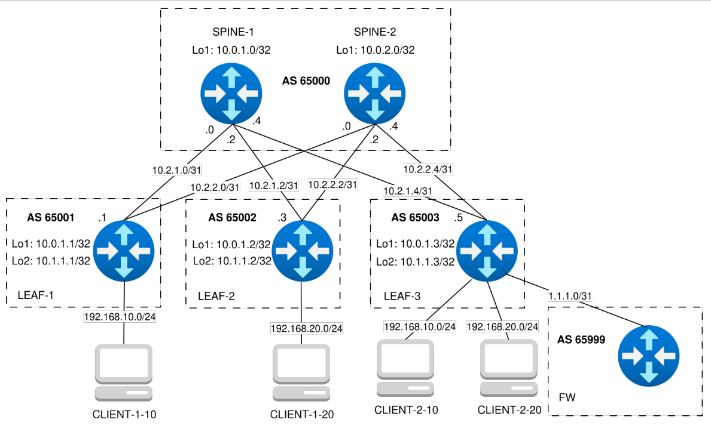

### VxLAN. Routing

### Цель
- Реализовать передачу суммарных префиксов через EVPN route-type 5.

### Схема



### Настройка оборудования

#### SPINE-1
```
configure
!
hostname spine-1
!
interface Loopback1
 ip address 10.0.1.0/32
 exit
interface Ethernet1
 description to-leaf-1
 no switchport
 mtu 9214
 ip address 10.2.1.0/31
 exit
interface Ethernet2
 no switchport
 mtu 9214
 ip address 10.2.1.2/31
 description to-leaf-2
 exit
interface Ethernet3
 description to-leaf-3
 no switchport
 mtu 9214
 ip address 10.2.1.4/31
 exit
!
peer-filter PF_LEAFS_AS_RANGE
 match as-range 65001-65003 result accept
!
ip routing
router bgp 65000
 router-id 10.0.1.0
 maximum-paths 4 ecmp 4
 neighbor UNDERLAY peer group
 neighbor UNDERLAY bfd
 neighbor UNDERLAY timers 3 9
 neighbor UNDERLAY password LAB7KEY
 bgp listen range 10.2.1.0/29 peer-group UNDERLAY peer-filter PF_LEAFS_AS_RANGE
 neighbor EVPN peer group
 neighbor EVPN update-source Loopback1
 neighbor EVPN next-hop-unchanged
 neighbor EVPN send-community extended
 bgp listen range 10.0.1.0/30 peer-group EVPN peer-filter PF_LEAFS_AS_RANGE
 !
 address-family ipv4
  neighbor UNDERLAY activate
  network 10.0.1.0/32
  exit
 !
 address-family evpn
   neighbor EVPN activate
 !
interface Ethernet 1-3
 bfd interval 100 min_rx 100 multiplier 3
 exit
```

#### SPINE-2
```
configure
!
hostname spine-2
!
interface Loopback1
 ip address 10.0.2.0/32
 exit
interface Ethernet1
 no switchport
 mtu 9214
 ip address 10.2.2.0/31
 description to-leaf-1
 exit
interface Ethernet2
 description to-leaf-2
 no switchport
 mtu 9214
 ip address 10.2.2.2/31
 exit
interface Ethernet3
 description to-leaf-3
 no switchport
 mtu 9214
 ip address 10.2.2.4/31
 exit
!
peer-filter PF_LEAFS_AS_RANGE
 match as-range 65001-65003 result accept
!
ip routing
router bgp 65000
 router-id 10.0.2.0
 maximum-paths 4 ecmp 4
 neighbor UNDERLAY peer group
 neighbor UNDERLAY send-community
 neighbor UNDERLAY bfd
 neighbor UNDERLAY timers 3 9
 neighbor UNDERLAY password LAB7KEY
 bgp listen range 10.2.2.0/29 peer-group UNDERLAY peer-filter PF_LEAFS_AS_RANGE
 neighbor EVPN peer group
 neighbor EVPN update-source Loopback1
 neighbor EVPN next-hop-unchanged
 neighbor EVPN send-community extended
 bgp listen range 10.0.1.0/30 peer-group EVPN peer-filter PF_LEAFS_AS_RANGE
 !
 address-family ipv4
  neighbor UNDERLAY activate
  network 10.0.2.0/32
  exit
 !
 address-family evpn
   neighbor EVPN activate
 !
interface Ethernet 1-3
 bfd interval 100 min_rx 100 multiplier 3
 exit
```

#### LEAF-1
```
configure
!
hostname leaf-1
!
vlan 10
!
interface Loopback1
 ip address 10.0.1.1/32
 exit
interface Loopback2
 ip address 10.1.1.1/32
 exit
interface Ethernet1
 description to-spine-1
 no switchport
 mtu 9214
 ip address 10.2.1.1/31
 exit
interface Ethernet2
 description to-spine-2
 no switchport
 mtu 9214
 ip address 10.2.2.1/31
 exit
!
interface Ethernet3
 description to-client-1
 switchport access vlan 10
 mtu 9214
 exit
!
interface vxlan 1
 vxlan source-interface Loopback1
 vxlan udp-port 4789
 vxlan vlan 10 vni 10010
!
ip routing
router bgp 65001
 router-id 10.0.1.1
 maximum-paths 4 ecmp 4
 neighbor UNDERLAY peer group
 neighbor UNDERLAY bfd
 neighbor UNDERLAY timers 3 9
 neighbor UNDERLAY password LAB7KEY
 neighbor UNDERLAY allowas-in 1
 neighbor UNDERLAY remote-as 65000
 neighbor 10.2.1.0 peer group UNDERLAY
 neighbor 10.2.2.0 peer group UNDERLAY
 neighbor EVPN peer group
 neighbor EVPN remote-as 65000
 neighbor EVPN update-source Loopback1
 neighbor EVPN ebgp-multihop 3
 neighbor EVPN send-community extended
 neighbor 10.0.1.0 peer group EVPN
 neighbor 10.0.2.0 peer group EVPN
 !
 vlan 10
  rd 65001:10010
  route-target both 10:10010
  redistribute learned
 !
 address-family ipv4
 neighbor UNDERLAY activate
 network 10.0.1.1/32
 exit
 !
 address-family evpn
  neighbor EVPN activate
  exit
 !
interface Ethernet 1-2
 bfd interval 100 min_rx 100 multiplier 3
 exit
```

#### LEAF-2
```
configure
!
hostname leaf-2
!
vlan 20
!
interface Loopback1
 ip address 10.0.1.2/32
 exit
interface Loopback2
 ip address 10.1.1.2/32
 exit
interface Ethernet1
 description to-spine-1
 no switchport
 mtu 9214
 ip address 10.2.1.3/31
 exit
!
interface Ethernet2
 description to-spine-2
 no switchport
 mtu 9214
 ip address 10.2.2.3/31
 exit
!
interface Ethernet4
 description to-client-2
 switchport access vlan 20
 mtu 9214
 exit
!
interface vxlan 1
 vxlan source-interface Loopback1
 vxlan udp-port 4789
 vxlan vlan 20 vni 10020
!
ip routing
router bgp 65002
 router-id 10.0.1.2
 maximum-paths 4 ecmp 4
 neighbor UNDERLAY peer group
 neighbor UNDERLAY bfd
 neighbor UNDERLAY timers 3 9
 neighbor UNDERLAY password LAB7KEY
 neighbor UNDERLAY allowas-in 1
 neighbor UNDERLAY remote-as 65000
 neighbor 10.2.1.2 peer group UNDERLAY
 neighbor 10.2.2.2 peer group UNDERLAY
 neighbor EVPN peer group
 neighbor EVPN remote-as 65000
 neighbor EVPN update-source Loopback1
 neighbor EVPN ebgp-multihop 3
 neighbor EVPN send-community extended
 neighbor 10.0.1.0 peer group EVPN
 neighbor 10.0.2.0 peer group EVPN
 !
 vlan 20
  rd 65002:10020
  route-target both 20:10020
  redistribute learned
 !
 address-family ipv4
  neighbor UNDERLAY activate
  network 10.0.1.2/32
  exit
 !
 address-family evpn
  neighbor EVPN activate
  exit
 !
interface Ethernet 1-2
 bfd interval 100 min_rx 100 multiplier 3
 exit
```

#### LEAF-3
```
configure
!
hostname leaf-3
!
vlan 10,20
!
vrf instance CLIENT_10
ip routing vrf CLIENT_10
!
vrf instance CLIENT_20
ip routing vrf CLIENT_20
!
vrf instance FW_ROUTING
ip routing vrf FW_ROUTING
!
service routing protocols model multi-agent
!
interface Loopback1
 ip address 10.0.1.3/32
 exit
interface Loopback2
 ip address 10.1.1.3/32
 exit
interface Ethernet1
 description to-spine-1
 no switchport
 mtu 9214
 ip address 10.2.1.5/31
 exit
interface Ethernet2
 description to-spine-2
 no switchport
 mtu 9214
 ip address 10.2.2.5/31
 exit
!
interface Ethernet3
 description to-client-1
 switchport access vlan 10
 mtu 9214
 exit
!
interface Ethernet4
 description to-client-2
 switchport access vlan 20
 mtu 9214
 exit
!
interface Ethernet5
 description to-fw
 no switchport
 mtu 9214
 vrf FW_ROUTING
 ip address 1.1.1.1/31
 exit
!
ip virtual-router mac-address 00:11:22:33:44:55
!
interface vlan 10
 vrf CLIENT_10
 ip address virtual 192.168.10.254/24
!
interface vlan 20
 vrf CLIENT_20
 ip address virtual 192.168.20.254/24
!
interface vxlan 1
 vxlan source-interface Loopback1
 vxlan udp-port 4789
 vxlan vlan 10 vni 10010
 vxlan vlan 20 vni 10020
 vxlan vrf CLIENT_10 vni 11010
 vxlan vrf CLIENT_20 vni 11020
!
ip prefix-list PL_CLIENTS permit 192.168.10.0/24
ip prefix-list PL_CLIENTS permit 192.168.20.0/24
!
route-map RM_CLIENTS permit
 match ip address prefix-list PL_CLIENTS
!
ip routing
router bgp 65003
 router-id 10.0.1.3
 maximum-paths 4 ecmp 4
 neighbor UNDERLAY peer group
 neighbor UNDERLAY bfd
 neighbor UNDERLAY timers 3 9
 neighbor UNDERLAY password LAB7KEY
 neighbor UNDERLAY allowas-in 1
 neighbor UNDERLAY remote-as 65000
 neighbor 10.2.1.4 peer group UNDERLAY
 neighbor 10.2.2.4 peer group UNDERLAY
 neighbor EVPN peer group
 neighbor EVPN remote-as 65000
 neighbor EVPN update-source Loopback1
 neighbor EVPN ebgp-multihop 3
 neighbor EVPN send-community extended
 neighbor 10.0.1.0 peer group EVPN
 neighbor 10.0.2.0 peer group EVPN
 !
 vlan 10
  rd 65003:10010
  route-target both 10:10010
  redistribute learned
 !
 vlan 20
  rd 65003:10020
  route-target both 20:10020
  redistribute learned
 !
 vrf CLIENT_10
  rd 65003:11010
  route-target import evpn 65003:11010
  route-target export evpn 65003:11010
  redistribute connected
  exit
 !
 vrf CLIENT_20
  rd 65003:11020
  route-target import evpn 65003:11020
  route-target export evpn 65003:11020
  redistribute connected
  exit
 !
 vrf CLIENT_10
  route-target export evpn 65999:11111
  route-target import evpn 65999:11999
 vrf CLIENT_20
  route-target export evpn 65999:11111
  route-target import evpn 65999:11999
 !
 vrf FW_ROUTING
 router-id 1.1.1.1
 rd 1.1.1.1:15000
 route-target import evpn 65999:11111
 route-target export evpn 65999:11999
 neighbor FW peer group
 neighbor FW remote-as 65999
 neighbor 1.1.1.0 peer group FW
 redistribute connected route-map RM_CLIENTS
 address-family ipv4
  neighbor FW activate
 exit
 exit
 !
 address-family ipv4
 neighbor UNDERLAY activate
 network 10.0.1.3/32
 exit
 !
 address-family evpn
  neighbor EVPN activate
  exit
 !
route-map RM_ROUTES permit
!
router general
 vrf CLIENT_10
  leak routes source-vrf FW_ROUTING subscribe-policy RM_ROUTES
 !
 vrf CLIENT_20
  leak routes source-vrf FW_ROUTING subscribe-policy RM_ROUTES
 !
 vrf FW_ROUTING
  leak routes source-vrf CLIENT_10 subscribe-policy RM_ROUTES
  leak routes source-vrf CLIENT_20 subscribe-policy RM_ROUTES
 !
interface Ethernet 1-2
 bfd interval 100 min_rx 100 multiplier 3
 exit
```

#### FW
```
configure
!
hostname FW
!
interface Ethernet1
 description to-leaf-3
 no switchport
 mtu 9214
 ip address 1.1.1.0/31
 exit
!
ip routing
!
ip prefix-list PL_CLIENTS permit 192.168.10.0/24
ip prefix-list PL_CLIENTS permit 192.168.20.0/24
!
route-map RM_CLIENTS permit
 match ip address prefix-list PL_CLIENTS
!
router bgp 65999
 router-id 1.1.1.0
 neighbor 1.1.1.1 remote-as 65003
 neighbor 1.1.1.1 default-originate
 neighbor 1.1.1.1 route-map RM_CLIENTS in
 !
 address-family ipv4
  neighbor 1.1.1.1 activate
```

### Проверка примененных настроек

#### LEAF-1

```
leaf-1(config)#show bgp evpn route-type mac-ip
BGP routing table information for VRF default
Router identifier 10.0.1.1, local AS number 65001
Route status codes: s - suppressed, * - valid, > - active, # - not installed, E - ECMP head, e - ECMP
                    S - Stale, c - Contributing to ECMP, b - backup
                    % - Pending BGP convergence
Origin codes: i - IGP, e - EGP, ? - incomplete
AS Path Attributes: Or-ID - Originator ID, C-LST - Cluster List, LL Nexthop - Link Local Nexthop

          Network                Next Hop              Metric  LocPref Weight  Path
 * >     RD: 65001:10010 mac-ip 0050.7966.685f
                                -                     -       -       0       i
 * >Ec   RD: 65003:10020 mac-ip 0050.7966.6860
                                10.0.1.3              -       100     0       65000 65003 i
 *  ec   RD: 65003:10020 mac-ip 0050.7966.6860
                                10.0.1.3              -       100     0       65000 65003 i
 * >Ec   RD: 65003:10020 mac-ip 0050.7966.6860 192.168.20.2
                                10.0.1.3              -       100     0       65000 65003 i
 *  ec   RD: 65003:10020 mac-ip 0050.7966.6860 192.168.20.2
                                10.0.1.3              -       100     0       65000 65003 i
 * >Ec   RD: 65003:10010 mac-ip 0050.7966.6861
                                10.0.1.3              -       100     0       65000 65003 i
 *  ec   RD: 65003:10010 mac-ip 0050.7966.6861
                                10.0.1.3              -       100     0       65000 65003 i
 * >Ec   RD: 65003:10010 mac-ip 0050.7966.6861 192.168.10.2
                                10.0.1.3              -       100     0       65000 65003 i
 *  ec   RD: 65003:10010 mac-ip 0050.7966.6861 192.168.10.2
                                10.0.1.3              -       100     0       65000 65003 i
 * >Ec   RD: 65002:10020 mac-ip 0050.7966.6869
                                10.0.1.2              -       100     0       65000 65002 i
 *  ec   RD: 65002:10020 mac-ip 0050.7966.6869
                                10.0.1.2              -       100     0       65000 65002 i
leaf-1(config)#
leaf-1(config)#show bgp evpn route-type ip-prefix ipv4
BGP routing table information for VRF default
Router identifier 10.0.1.1, local AS number 65001
Route status codes: s - suppressed, * - valid, > - active, # - not installed, E - ECMP head, e - ECMP
                    S - Stale, c - Contributing to ECMP, b - backup
                    % - Pending BGP convergence
Origin codes: i - IGP, e - EGP, ? - incomplete
AS Path Attributes: Or-ID - Originator ID, C-LST - Cluster List, LL Nexthop - Link Local Nexthop

          Network                Next Hop              Metric  LocPref Weight  Path
 * >Ec   RD: 65003:11010 ip-prefix 192.168.10.0/24
                                10.0.1.3              -       100     0       65000 65003 i
 *  ec   RD: 65003:11010 ip-prefix 192.168.10.0/24
                                10.0.1.3              -       100     0       65000 65003 i
 * >Ec   RD: 65003:11020 ip-prefix 192.168.20.0/24
                                10.0.1.3              -       100     0       65000 65003 i
 *  ec   RD: 65003:11020 ip-prefix 192.168.20.0/24
                                10.0.1.3              -       100     0       65000 65003 i
```

#### LEAF-2
```
leaf-2(config)#show bgp evpn route-type mac-ip
BGP routing table information for VRF default
Router identifier 10.0.1.2, local AS number 65002
Route status codes: s - suppressed, * - valid, > - active, # - not installed, E - ECMP head, e - ECMP
                    S - Stale, c - Contributing to ECMP, b - backup
                    % - Pending BGP convergence
Origin codes: i - IGP, e - EGP, ? - incomplete
AS Path Attributes: Or-ID - Originator ID, C-LST - Cluster List, LL Nexthop - Link Local Nexthop

          Network                Next Hop              Metric  LocPref Weight  Path
 * >Ec   RD: 65001:10010 mac-ip 0050.7966.685f
                                10.0.1.1              -       100     0       65000 65001 i
 *  ec   RD: 65001:10010 mac-ip 0050.7966.685f
                                10.0.1.1              -       100     0       65000 65001 i
 * >Ec   RD: 65003:10020 mac-ip 0050.7966.6860
                                10.0.1.3              -       100     0       65000 65003 i
 *  ec   RD: 65003:10020 mac-ip 0050.7966.6860
                                10.0.1.3              -       100     0       65000 65003 i
 * >Ec   RD: 65003:10020 mac-ip 0050.7966.6860 192.168.20.2
                                10.0.1.3              -       100     0       65000 65003 i
 *  ec   RD: 65003:10020 mac-ip 0050.7966.6860 192.168.20.2
                                10.0.1.3              -       100     0       65000 65003 i
 * >Ec   RD: 65003:10010 mac-ip 0050.7966.6861
                                10.0.1.3              -       100     0       65000 65003 i
 *  ec   RD: 65003:10010 mac-ip 0050.7966.6861
                                10.0.1.3              -       100     0       65000 65003 i
 * >Ec   RD: 65003:10010 mac-ip 0050.7966.6861 192.168.10.2
                                10.0.1.3              -       100     0       65000 65003 i
 *  ec   RD: 65003:10010 mac-ip 0050.7966.6861 192.168.10.2
                                10.0.1.3              -       100     0       65000 65003 i
 * >     RD: 65002:10020 mac-ip 0050.7966.6869
                                -                     -       -       0       i
leaf-2(config)#
leaf-2(config)#show bgp evpn route-type ip-prefix ipv4
BGP routing table information for VRF default
Router identifier 10.0.1.2, local AS number 65002
Route status codes: s - suppressed, * - valid, > - active, # - not installed, E - ECMP head, e - ECMP
                    S - Stale, c - Contributing to ECMP, b - backup
                    % - Pending BGP convergence
Origin codes: i - IGP, e - EGP, ? - incomplete
AS Path Attributes: Or-ID - Originator ID, C-LST - Cluster List, LL Nexthop - Link Local Nexthop

          Network                Next Hop              Metric  LocPref Weight  Path
 * >Ec   RD: 65003:11010 ip-prefix 192.168.10.0/24
                                10.0.1.3              -       100     0       65000 65003 i
 *  ec   RD: 65003:11010 ip-prefix 192.168.10.0/24
                                10.0.1.3              -       100     0       65000 65003 i
 * >Ec   RD: 65003:11020 ip-prefix 192.168.20.0/24
                                10.0.1.3              -       100     0       65000 65003 i
 *  ec   RD: 65003:11020 ip-prefix 192.168.20.0/24
                                10.0.1.3              -       100     0       65000 65003 i
```

#### LEAF-3
```
leaf-3(config)#show bgp evpn route-type mac-ip
BGP routing table information for VRF default
Router identifier 10.0.1.3, local AS number 65003
Route status codes: s - suppressed, * - valid, > - active, # - not installed, E - ECMP head, e - ECMP
                    S - Stale, c - Contributing to ECMP, b - backup
                    % - Pending BGP convergence
Origin codes: i - IGP, e - EGP, ? - incomplete
AS Path Attributes: Or-ID - Originator ID, C-LST - Cluster List, LL Nexthop - Link Local Nexthop

          Network                Next Hop              Metric  LocPref Weight  Path
 * >Ec   RD: 65001:10010 mac-ip 0050.7966.685f
                                10.0.1.1              -       100     0       65000 65001 i
 *  ec   RD: 65001:10010 mac-ip 0050.7966.685f
                                10.0.1.1              -       100     0       65000 65001 i
 * >     RD: 65003:10020 mac-ip 0050.7966.6860
                                -                     -       -       0       i
 * >     RD: 65003:10020 mac-ip 0050.7966.6860 192.168.20.2
                                -                     -       -       0       i
 * >     RD: 65003:10010 mac-ip 0050.7966.6861
                                -                     -       -       0       i
 * >     RD: 65003:10010 mac-ip 0050.7966.6861 192.168.10.2
                                -                     -       -       0       i
 * >Ec   RD: 65002:10020 mac-ip 0050.7966.6869
                                10.0.1.2              -       100     0       65000 65002 i
 *  ec   RD: 65002:10020 mac-ip 0050.7966.6869
                                10.0.1.2              -       100     0       65000 65002 i
leaf-3(config)#
leaf-3(config)#
leaf-3(config)#show bgp evpn route-type ip-prefix ipv4
BGP routing table information for VRF default
Router identifier 10.0.1.3, local AS number 65003
Route status codes: s - suppressed, * - valid, > - active, # - not installed, E - ECMP head, e - ECMP
                    S - Stale, c - Contributing to ECMP, b - backup
                    % - Pending BGP convergence
Origin codes: i - IGP, e - EGP, ? - incomplete
AS Path Attributes: Or-ID - Originator ID, C-LST - Cluster List, LL Nexthop - Link Local Nexthop

          Network                Next Hop              Metric  LocPref Weight  Path
 * >     RD: 65003:11010 ip-prefix 192.168.10.0/24
                                -                     -       -       0       i
 * >     RD: 65003:11020 ip-prefix 192.168.20.0/24
                                -                     -       -       0       i
leaf-3(config)#
leaf-3(config)#show ip route 

VRF: default
Codes: C - connected, S - static, K - kernel, 
       O - OSPF, IA - OSPF inter area, E1 - OSPF external type 1,
       E2 - OSPF external type 2, N1 - OSPF NSSA external type 1,
       N2 - OSPF NSSA external type2, B - BGP, B I - iBGP, B E - eBGP,
       R - RIP, I L1 - IS-IS level 1, I L2 - IS-IS level 2,
       O3 - OSPFv3, A B - BGP Aggregate, A O - OSPF Summary,
       NG - Nexthop Group Static Route, V - VXLAN Control Service,
       DH - DHCP client installed default route, M - Martian,
       DP - Dynamic Policy Route, L - VRF Leaked

Gateway of last resort is not set

 B E      10.0.1.0/32 [200/0] via 10.2.1.4, Ethernet1
 B E      10.0.1.1/32 [200/0] via 10.2.1.4, Ethernet1
                              via 10.2.2.4, Ethernet2
 B E      10.0.1.2/32 [200/0] via 10.2.1.4, Ethernet1
                              via 10.2.2.4, Ethernet2
 C        10.0.1.3/32 is directly connected, Loopback1
 B E      10.0.2.0/32 [200/0] via 10.2.2.4, Ethernet2
 C        10.1.1.3/32 is directly connected, Loopback2
 C        10.2.1.4/31 is directly connected, Ethernet1
 C        10.2.2.4/31 is directly connected, Ethernet2

leaf-3(config)#
leaf-3(config)#show ip route vrf FW_ROUTING

VRF: FW_ROUTING
Codes: C - connected, S - static, K - kernel, 
       O - OSPF, IA - OSPF inter area, E1 - OSPF external type 1,
       E2 - OSPF external type 2, N1 - OSPF NSSA external type 1,
       N2 - OSPF NSSA external type2, B - BGP, B I - iBGP, B E - eBGP,
       R - RIP, I L1 - IS-IS level 1, I L2 - IS-IS level 2,
       O3 - OSPFv3, A B - BGP Aggregate, A O - OSPF Summary,
       NG - Nexthop Group Static Route, V - VXLAN Control Service,
       DH - DHCP client installed default route, M - Martian,
       DP - Dynamic Policy Route, L - VRF Leaked

Gateway of last resort:
 B E      0.0.0.0/0 [200/0] via 1.1.1.0, Ethernet5

 C        1.1.1.0/31 is directly connected, Ethernet5
 C L      192.168.10.0/24 is directly connected (source VRF CLIENT_10), Vlan10 (egress VRF CLIENT_10)
 C L      192.168.20.0/24 is directly connected (source VRF CLIENT_20), Vlan20 (egress VRF CLIENT_20)
```

#### FW
```
FW(config)#sho ip route 

VRF: default
Codes: C - connected, S - static, K - kernel, 
       O - OSPF, IA - OSPF inter area, E1 - OSPF external type 1,
       E2 - OSPF external type 2, N1 - OSPF NSSA external type 1,
       N2 - OSPF NSSA external type2, B - BGP, B I - iBGP, B E - eBGP,
       R - RIP, I L1 - IS-IS level 1, I L2 - IS-IS level 2,
       O3 - OSPFv3, A B - BGP Aggregate, A O - OSPF Summary,
       NG - Nexthop Group Static Route, V - VXLAN Control Service,
       DH - DHCP client installed default route, M - Martian,
       DP - Dynamic Policy Route, L - VRF Leaked

Gateway of last resort is not set

 C        1.1.1.0/31 is directly connected, Ethernet1
 B E      192.168.10.0/24 [200/0] via 1.1.1.1, Ethernet1
 B E      192.168.20.0/24 [200/0] via 1.1.1.1, Ethernet1

FW(config)#
FW(config)#sho ip bgp summary 
BGP summary information for VRF default
Router identifier 8.8.8.8, local AS number 65999
Neighbor Status Codes: m - Under maintenance
  Neighbor         V  AS           MsgRcvd   MsgSent  InQ OutQ  Up/Down State   PfxRcd PfxAcc
  1.1.1.1          4  65003             55        54    0    0 00:05:43 Estab   2      2
```

Проверка связности клиентов:

- ping со стороны клиента CLIENT-1-10:
```
CLIENT-1-10> show ip

NAME        : CLIENT-1-10[1]
IP/MASK     : 192.168.10.1/24
GATEWAY     : 192.168.10.254
DNS         : 
MAC         : 00:50:79:66:68:5f
LPORT       : 20000
RHOST:PORT  : 127.0.0.1:30000
MTU         : 1500

CLIENT-1-10> 
CLIENT-1-10> ping 192.168.10.2

84 bytes from 192.168.10.2 icmp_seq=1 ttl=64 time=9.454 ms
84 bytes from 192.168.10.2 icmp_seq=2 ttl=64 time=8.018 ms
84 bytes from 192.168.10.2 icmp_seq=3 ttl=64 time=8.867 ms
84 bytes from 192.168.10.2 icmp_seq=4 ttl=64 time=9.067 ms
84 bytes from 192.168.10.2 icmp_seq=5 ttl=64 time=8.698 ms
^C
CLIENT-1-10> 
CLIENT-1-10> ping 192.168.10.254

84 bytes from 192.168.10.254 icmp_seq=1 ttl=64 time=6.870 ms
84 bytes from 192.168.10.254 icmp_seq=2 ttl=64 time=9.317 ms
84 bytes from 192.168.10.254 icmp_seq=3 ttl=64 time=7.272 ms
84 bytes from 192.168.10.254 icmp_seq=4 ttl=64 time=7.794 ms
84 bytes from 192.168.10.254 icmp_seq=5 ttl=64 time=6.480 ms
^C
CLIENT-1-10> 
CLIENT-1-10> ping 192.168.20.254

84 bytes from 192.168.20.254 icmp_seq=1 ttl=62 time=13.695 ms
84 bytes from 192.168.20.254 icmp_seq=2 ttl=62 time=14.192 ms
84 bytes from 192.168.20.254 icmp_seq=3 ttl=62 time=13.949 ms
84 bytes from 192.168.20.254 icmp_seq=4 ttl=62 time=14.344 ms
84 bytes from 192.168.20.254 icmp_seq=5 ttl=62 time=14.726 ms
^C
CLIENT-1-10> 
CLIENT-1-10> ping 192.168.20.1  

84 bytes from 192.168.20.1 icmp_seq=1 ttl=60 time=21.783 ms
84 bytes from 192.168.20.1 icmp_seq=2 ttl=60 time=24.035 ms
84 bytes from 192.168.20.1 icmp_seq=3 ttl=60 time=25.090 ms
84 bytes from 192.168.20.1 icmp_seq=4 ttl=60 time=23.967 ms
84 bytes from 192.168.20.1 icmp_seq=5 ttl=60 time=24.092 ms
^C
CLIENT-1-10> 
CLIENT-1-10> ping 192.168.20.2

84 bytes from 192.168.20.2 icmp_seq=1 ttl=60 time=19.515 ms
84 bytes from 192.168.20.2 icmp_seq=2 ttl=60 time=17.459 ms
84 bytes from 192.168.20.2 icmp_seq=3 ttl=60 time=15.785 ms
84 bytes from 192.168.20.2 icmp_seq=4 ttl=60 time=16.776 ms
84 bytes from 192.168.20.2 icmp_seq=5 ttl=60 time=15.935 ms
```

- ping со стороны CLIENT-1-10, FW отправлен в перезагрузку:
```
CLIENT-1-10> ping 192.168.20.2 -c 10000

84 bytes from 192.168.20.2 icmp_seq=1 ttl=60 time=16.042 ms
84 bytes from 192.168.20.2 icmp_seq=2 ttl=60 time=17.920 ms
84 bytes from 192.168.20.2 icmp_seq=3 ttl=60 time=16.076 ms
*192.168.10.254 icmp_seq=4 ttl=64 time=9.241 ms (ICMP type:3, code:0, Destination network unreachable)
*192.168.10.254 icmp_seq=5 ttl=64 time=7.491 ms (ICMP type:3, code:0, Destination network unreachable)
*192.168.10.254 icmp_seq=6 ttl=64 time=7.187 ms (ICMP type:3, code:0, Destination network unreachable)
*192.168.10.254 icmp_seq=7 ttl=64 time=8.580 ms (ICMP type:3, code:0, Destination network unreachable)
*192.168.10.254 icmp_seq=8 ttl=64 time=7.711 ms (ICMP type:3, code:0, Destination network unreachable)
*192.168.10.254 icmp_seq=9 ttl=64 time=7.152 ms (ICMP type:3, code:0, Destination network unreachable)
*192.168.10.254 icmp_seq=10 ttl=64 time=8.479 ms (ICMP type:3, code:0, Destination network unreachable)
^C
```