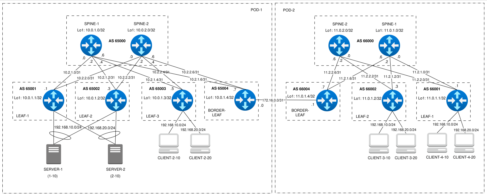
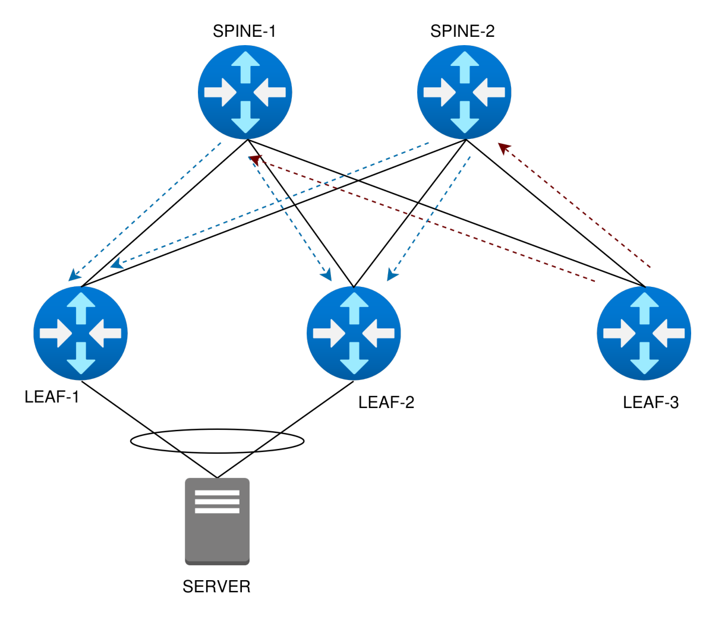
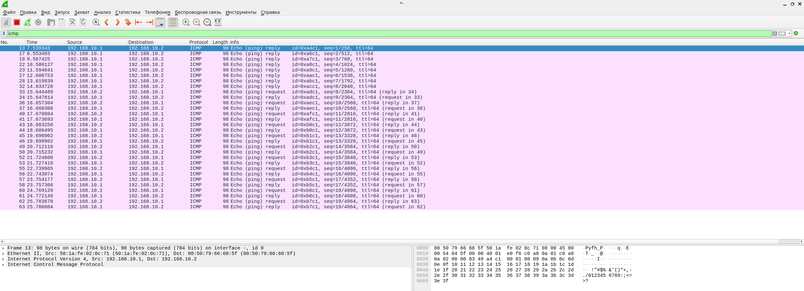
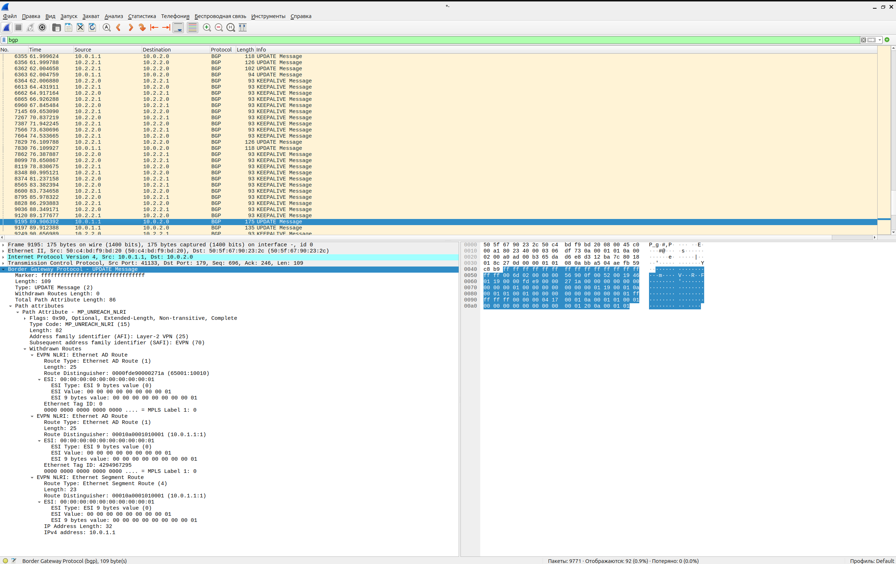

### Проектная работа по курсу "Дизайн сетей ЦОД"

### Тема
### Проектирование сети ЦОД на базе VxLAN EVPN с отказоустойчивым подключением
### клиентов с использованием VxLAN Multihoming

---

### Схема



---

### Настройка оборудования

#### Конфигурация устройств POD-1
[POD-1.md](POD-1.md)

#### Конфигурация устройств POD-2
[POD-2.md](POD-2.md)

---

#### Детали конфигурации:

- На интерфейсах для BGP настроен BFD для быстрого реагирования на изменения состояния линков.
- Настроена простая аутентификация для BGP сессий на устройствах в каждом POD и для DCI.
- В POD-1 сервера подключены по технологии VxLAN Multihoming в режиме Active-Active
  для повышения отказоустойчивости подключения и повышения пропускной способности к серверам.

- Для предотвращения потери трафика на устройствах, подключенных в Multihoming схеме, настроены два механизма:
  Uplink Tracking и VXLAN Fast Reroute.

   - Uplink Tracking предназначен для защиты от потери трафика, поступающего со стороны клиента (сервера) на LEAF,
   который потерял связь со SPINE-ом: в приведенной конфигурации при потере линков до обоих SPINE устройств,
   downlink (к серверу) будет переведен в shutdown, тем самым будет выведен из LAG пары сервера.

   - VXLAN Fast Reroute предназначен для минимизации потерь тарфика при отказе downlink-а. При отказе downlink-а сначала будет отправлен BGP Mass Withdrawal (RT1).
   VXLAN Fast Reroute нужен для того, чтобы снизить время сходимости BGP в фабрике: трафик, пришедший из overlay на VTEP с отказавшим клиентским подключением, будет перенаправляться через резервный туннель на VTEP, подключеннный к тому же сегменту ES, который уже и доставит трафик до клиента.

---

### Проверка настроек оборудования:

### Проверка UNDERLAY (наличие ECMP до каждого из LEAF-ов):

#### Вывод данных на BORDER LEAF DC-1:
```
border-leaf-dc-1(config)#show ip bgp summary 
BGP summary information for VRF default
Router identifier 10.0.1.4, local AS number 65004
Neighbor Status Codes: m - Under maintenance
  Neighbor   V AS           MsgRcvd   MsgSent  InQ OutQ  Up/Down State   PfxRcd PfxAcc
  10.0.1.0   4 65000             72        50    0    0 00:13:34 Estab   4      4
  10.0.2.0   4 65000             70        79    0    0 00:13:34 Estab   4      4
  10.2.1.6   4 65000            326       334    0    0 00:13:35 Estab   4      4
  10.2.2.6   4 65000            326       335    0    0 00:13:35 Estab   4      4
  172.16.0.1 4 66004             29        51    0    0 00:02:23 Estab   5      5
border-leaf-dc-1(config)#
border-leaf-dc-1(config)#show ip route 

VRF: default
Codes: C - connected, S - static, K - kernel, 
       O - OSPF, IA - OSPF inter area, E1 - OSPF external type 1,
       E2 - OSPF external type 2, N1 - OSPF NSSA external type 1,
       N2 - OSPF NSSA external type2, B - Other BGP Routes,
       B I - iBGP, B E - eBGP, R - RIP, I L1 - IS-IS level 1,
       I L2 - IS-IS level 2, O3 - OSPFv3, A B - BGP Aggregate,
       A O - OSPF Summary, NG - Nexthop Group Static Route,
       V - VXLAN Control Service, M - Martian,
       DH - DHCP client installed default route,
       DP - Dynamic Policy Route, L - VRF Leaked,
       G  - gRIBI, RC - Route Cache Route

Gateway of last resort is not set

 B E      10.0.1.0/32 [200/0] via 10.2.1.6, Ethernet1
 B E      10.0.1.1/32 [200/0] via 10.2.1.6, Ethernet1
                              via 10.2.2.6, Ethernet2
 B E      10.0.1.2/32 [200/0] via 10.2.1.6, Ethernet1
                              via 10.2.2.6, Ethernet2
 B E      10.0.1.3/32 [200/0] via 10.2.1.6, Ethernet1
                              via 10.2.2.6, Ethernet2
 C        10.0.1.4/32 is directly connected, Loopback1
 B E      10.0.2.0/32 [200/0] via 10.2.2.6, Ethernet2
 C        10.2.1.6/31 is directly connected, Ethernet1
 C        10.2.2.6/31 is directly connected, Ethernet2
 B E      11.0.1.0/32 [200/0] via 172.16.0.1, Ethernet3
 B E      11.0.1.1/32 [200/0] via 172.16.0.1, Ethernet3
 B E      11.0.1.2/32 [200/0] via 172.16.0.1, Ethernet3
 B E      11.0.1.4/32 [200/0] via 172.16.0.1, Ethernet3
 B E      11.0.2.0/32 [200/0] via 172.16.0.1, Ethernet3
 C        172.16.0.0/31 is directly connected, Ethernet3
```

#### Вывод данных на BORDER LEAF DC-2:
```
border-leaf-dc-2(config)#show ip bgp summary 
BGP summary information for VRF default
Router identifier 11.0.1.4, local AS number 66004
Neighbor Status Codes: m - Under maintenance
  Neighbor   V AS           MsgRcvd   MsgSent  InQ OutQ  Up/Down State   PfxRcd PfxAcc
  11.0.1.0   4 66000             30        42    0    0 00:03:26 Estab   3      3
  11.0.2.0   4 66000             30        33    0    0 00:03:26 Estab   3      3
  11.2.1.6   4 66000             88        95    0    0 00:03:27 Estab   3      3
  11.2.2.6   4 66000             88        91    0    0 00:03:27 Estab   3      3
  172.16.0.0 4 65004             28        24    0    0 00:03:27 Estab   6      6
border-leaf-dc-2(config)#
border-leaf-dc-2(config)#show ip route 

VRF: default
Codes: C - connected, S - static, K - kernel, 
       O - OSPF, IA - OSPF inter area, E1 - OSPF external type 1,
       E2 - OSPF external type 2, N1 - OSPF NSSA external type 1,
       N2 - OSPF NSSA external type2, B - Other BGP Routes,
       B I - iBGP, B E - eBGP, R - RIP, I L1 - IS-IS level 1,
       I L2 - IS-IS level 2, O3 - OSPFv3, A B - BGP Aggregate,
       A O - OSPF Summary, NG - Nexthop Group Static Route,
       V - VXLAN Control Service, M - Martian,
       DH - DHCP client installed default route,
       DP - Dynamic Policy Route, L - VRF Leaked,
       G  - gRIBI, RC - Route Cache Route

Gateway of last resort is not set

 B E      10.0.1.0/32 [200/0] via 172.16.0.0, Ethernet3
 B E      10.0.1.1/32 [200/0] via 172.16.0.0, Ethernet3
 B E      10.0.1.2/32 [200/0] via 172.16.0.0, Ethernet3
 B E      10.0.1.3/32 [200/0] via 172.16.0.0, Ethernet3
 B E      10.0.1.4/32 [200/0] via 172.16.0.0, Ethernet3
 B E      10.0.2.0/32 [200/0] via 172.16.0.0, Ethernet3
 B E      11.0.1.0/32 [200/0] via 11.2.1.6, Ethernet1
 B E      11.0.1.1/32 [200/0] via 11.2.1.6, Ethernet1
                              via 11.2.2.6, Ethernet2
 B E      11.0.1.2/32 [200/0] via 11.2.1.6, Ethernet1
                              via 11.2.2.6, Ethernet2
 C        11.0.1.4/32 is directly connected, Loopback1
 B E      11.0.2.0/32 [200/0] via 11.2.2.6, Ethernet2
 C        11.2.1.6/31 is directly connected, Ethernet1
 C        11.2.2.6/31 is directly connected, Ethernet2
 C        172.16.0.0/31 is directly connected, Ethernet3
```

#### Вывод данных на SERVER-1 (активный Port Channel):
```
SERVER-1(config)#show port-channel 1 detailed 
Port Channel Port-Channel1 (Fallback State: Unconfigured):
Minimum links: unconfigured
Minimum speed: unconfigured
Current weight/Max weight: 2/16
  Active Ports:
       Port            Time Became Active       Protocol       Mode      Weight
    --------------- ------------------------ -------------- ------------ ------
       Ethernet1       5:14:36                  LACP           Active      1   
       Ethernet2       Mon 18:15:15             LACP           Active      1   
```

#### Вывод данных на SERVER-2 (активный Port Channel):
```
SERVER-2(config)#show port-channel 1 detailed 
Port Channel Port-Channel1 (Fallback State: Unconfigured):
Minimum links: unconfigured
Minimum speed: unconfigured
Current weight/Max weight: 2/16
  Active Ports:
       Port            Time Became Active       Protocol       Mode      Weight
    --------------- ------------------------ -------------- ------------ ------
       Ethernet1       Mon 18:15:36             LACP           Active      1   
       Ethernet2       Mon 18:15:36             LACP           Active      1   
```

---

### Проверка OVERLAY

1. Проверка доступности VTEP:

#### Вывод данных на BORDER LEAF DC-1:
```
border-leaf-dc-1(config)#show vxlan vtep 
Remote VTEPS for Vxlan1:

VTEP           Tunnel Type(s)
-------------- --------------
10.0.1.1       unicast, flood
10.0.1.2       unicast, flood
10.0.1.3       unicast, flood
11.0.1.4       unicast, flood

Total number of remote VTEPS:  4
```

#### Вывод данных на BORDER LEAF DC-2:
```
border-leaf-dc-2(config)#show vxlan vtep 
Remote VTEPS for Vxlan1:

VTEP           Tunnel Type(s)
-------------- --------------
10.0.1.4       flood, unicast
11.0.1.1       flood, unicast
11.0.1.2       flood, unicast

Total number of remote VTEPS:  3
```

2. Вывод EVPN маршрутов:

#### Вывод данных на BORDER LEAF DC-1:
```
border-leaf-dc-1(config)#show bgp evpn route-type mac-ip
BGP routing table information for VRF default
Router identifier 10.0.1.4, local AS number 65004
Route status codes: * - valid, > - active, S - Stale, E - ECMP head, e - ECMP
                    c - Contributing to ECMP, % - Pending BGP convergence
Origin codes: i - IGP, e - EGP, ? - incomplete
AS Path Attributes: Or-ID - Originator ID, C-LST - Cluster List, LL Nexthop - Link Local Nexthop

          Network                Next Hop              Metric  LocPref Weight  Path
 * >Ec    RD: 65003:10010 mac-ip 0050.7966.685f
                                 10.0.1.3              -       100     0       65000 65003 i
 *  ec    RD: 65003:10010 mac-ip 0050.7966.685f
                                 10.0.1.3              -       100     0       65000 65003 i
 * >Ec    RD: 65003:10010 mac-ip 0050.7966.685f 192.168.10.2
                                 10.0.1.3              -       100     0       65000 65003 i
 *  ec    RD: 65003:10010 mac-ip 0050.7966.685f 192.168.10.2
                                 10.0.1.3              -       100     0       65000 65003 i
 * >Ec    RD: 65003:10020 mac-ip 0050.7966.6869
                                 10.0.1.3              -       100     0       65000 65003 i
 *  ec    RD: 65003:10020 mac-ip 0050.7966.6869
                                 10.0.1.3              -       100     0       65000 65003 i
 * >Ec    RD: 65003:10020 mac-ip 0050.7966.6869 192.168.20.2
                                 10.0.1.3              -       100     0       65000 65003 i
 *  ec    RD: 65003:10020 mac-ip 0050.7966.6869 192.168.20.2
                                 10.0.1.3              -       100     0       65000 65003 i
 * >      RD: 65004:10010 mac-ip 0050.7966.689a
                                 -                     -       100     0       66004 66000 66002 i
 * >      RD: 65004:10010 mac-ip 0050.7966.689a 192.168.10.3
                                 -                     -       100     0       66004 66000 66002 i
 * >      RD: 65004:10010 mac-ip 0050.7966.689b
                                 -                     -       100     0       66004 66000 66001 i
 * >      RD: 65004:10010 mac-ip 0050.7966.689b 192.168.10.4
                                 -                     -       100     0       66004 66000 66001 i
 * >Ec    RD: 65001:10010 mac-ip 501a.fe02.0c71
                                 10.0.1.1              -       100     0       65000 65001 i
 *  ec    RD: 65001:10010 mac-ip 501a.fe02.0c71
                                 10.0.1.1              -       100     0       65000 65001 i
 * >Ec    RD: 65002:10010 mac-ip 501a.fe02.0c71
                                 10.0.1.2              -       100     0       65000 65002 i
 *  ec    RD: 65002:10010 mac-ip 501a.fe02.0c71
                                 10.0.1.2              -       100     0       65000 65002 i
 * >Ec    RD: 65001:10010 mac-ip 501a.fe02.0c71 192.168.10.1
                                 10.0.1.1              -       100     0       65000 65001 i
 *  ec    RD: 65001:10010 mac-ip 501a.fe02.0c71 192.168.10.1
                                 10.0.1.1              -       100     0       65000 65001 i
 * >Ec    RD: 65002:10010 mac-ip 501a.fe02.0c71 192.168.10.1
                                 10.0.1.2              -       100     0       65000 65002 i
 *  ec    RD: 65002:10010 mac-ip 501a.fe02.0c71 192.168.10.1
                                 10.0.1.2              -       100     0       65000 65002 i
 * >      RD: 65004:10020 mac-ip 504d.0100.0100
                                 -                     -       100     0       66004 66000 66001 i
 * >      RD: 65004:10020 mac-ip 504d.0100.0100 192.168.20.4
                                 -                     -       100     0       66004 66000 66001 i
 * >Ec    RD: 65001:10020 mac-ip 506f.c217.d249
                                 10.0.1.1              -       100     0       65000 65001 i
 *  ec    RD: 65001:10020 mac-ip 506f.c217.d249
                                 10.0.1.1              -       100     0       65000 65001 i
 * >Ec    RD: 65001:10020 mac-ip 506f.c217.d249 192.168.20.1
                                 10.0.1.1              -       100     0       65000 65001 i
 *  ec    RD: 65001:10020 mac-ip 506f.c217.d249 192.168.20.1
                                 10.0.1.1              -       100     0       65000 65001 i
 * >Ec    RD: 65002:10020 mac-ip 506f.c217.d249 192.168.20.1
                                 10.0.1.2              -       100     0       65000 65002 i
 *  ec    RD: 65002:10020 mac-ip 506f.c217.d249 192.168.20.1
                                 10.0.1.2              -       100     0       65000 65002 i
 * >      RD: 65004:10010 mac-ip 0050.7966.685f remote
                                 -                     -       100     0       65000 65003 i
 * >      RD: 65004:10010 mac-ip 0050.7966.685f 192.168.10.2 remote
                                 -                     -       100     0       65000 65003 i
 * >      RD: 65004:10020 mac-ip 0050.7966.6869 remote
                                 -                     -       100     0       65000 65003 i
 * >      RD: 65004:10020 mac-ip 0050.7966.6869 192.168.20.2 remote
                                 -                     -       100     0       65000 65003 i
 * >      RD: 66004:10010 mac-ip 0050.7966.689a remote
                                 11.0.1.4              -       100     0       66004 66000 66002 i
 * >      RD: 66004:10010 mac-ip 0050.7966.689a 192.168.10.3 remote
                                 11.0.1.4              -       100     0       66004 66000 66002 i
 * >      RD: 66004:10010 mac-ip 0050.7966.689b remote
                                 11.0.1.4              -       100     0       66004 66000 66001 i
 * >      RD: 66004:10010 mac-ip 0050.7966.689b 192.168.10.4 remote
                                 11.0.1.4              -       100     0       66004 66000 66001 i
 * >      RD: 65004:10010 mac-ip 501a.fe02.0c71 remote
                                 -                     -       100     0       65000 65002 i
 * >      RD: 65004:10010 mac-ip 501a.fe02.0c71 192.168.10.1 remote
                                 -                     -       100     0       65000 65002 i
 * >      RD: 66004:10020 mac-ip 504d.0100.0100 remote
                                 11.0.1.4              -       100     0       66004 66000 66001 i
 * >      RD: 66004:10020 mac-ip 504d.0100.0100 192.168.20.4 remote
                                 11.0.1.4              -       100     0       66004 66000 66001 i
 * >      RD: 65004:10020 mac-ip 506f.c217.d249 remote
                                 -                     -       100     0       65000 65001 i
 * >      RD: 65004:10020 mac-ip 506f.c217.d249 192.168.20.1 remote
                                 -                     -       100     0       65000 65001 i
border-leaf-dc-1(config)#
border-leaf-dc-1(config)#show bgp evpn route-type ip-prefix ipv4
BGP routing table information for VRF default
Router identifier 10.0.1.4, local AS number 65004
Route status codes: * - valid, > - active, S - Stale, E - ECMP head, e - ECMP
                    c - Contributing to ECMP, % - Pending BGP convergence
Origin codes: i - IGP, e - EGP, ? - incomplete
AS Path Attributes: Or-ID - Originator ID, C-LST - Cluster List, LL Nexthop - Link Local Nexthop

          Network                Next Hop              Metric  LocPref Weight  Path
 * >Ec    RD: 65001:11000 ip-prefix 192.168.10.0/24
                                 10.0.1.1              -       100     0       65000 65001 i
 *  ec    RD: 65001:11000 ip-prefix 192.168.10.0/24
                                 10.0.1.1              -       100     0       65000 65001 i
 * >Ec    RD: 65002:11000 ip-prefix 192.168.10.0/24
                                 10.0.1.2              -       100     0       65000 65002 i
 *  ec    RD: 65002:11000 ip-prefix 192.168.10.0/24
                                 10.0.1.2              -       100     0       65000 65002 i
 * >Ec    RD: 65003:11000 ip-prefix 192.168.10.0/24
                                 10.0.1.3              -       100     0       65000 65003 i
 *  ec    RD: 65003:11000 ip-prefix 192.168.10.0/24
                                 10.0.1.3              -       100     0       65000 65003 i
 * >      RD: 66001:11000 ip-prefix 192.168.10.0/24
                                 11.0.1.4              -       100     0       66004 66000 66001 i
 * >      RD: 66002:11000 ip-prefix 192.168.10.0/24
                                 11.0.1.4              -       100     0       66004 66000 66002 i
 * >Ec    RD: 65001:11000 ip-prefix 192.168.20.0/24
                                 10.0.1.1              -       100     0       65000 65001 i
 *  ec    RD: 65001:11000 ip-prefix 192.168.20.0/24
                                 10.0.1.1              -       100     0       65000 65001 i
 * >Ec    RD: 65002:11000 ip-prefix 192.168.20.0/24
                                 10.0.1.2              -       100     0       65000 65002 i
 *  ec    RD: 65002:11000 ip-prefix 192.168.20.0/24
                                 10.0.1.2              -       100     0       65000 65002 i
 * >Ec    RD: 65003:11000 ip-prefix 192.168.20.0/24
                                 10.0.1.3              -       100     0       65000 65003 i
 *  ec    RD: 65003:11000 ip-prefix 192.168.20.0/24
                                 10.0.1.3              -       100     0       65000 65003 i
 * >      RD: 66001:11000 ip-prefix 192.168.20.0/24
                                 11.0.1.4              -       100     0       66004 66000 66001 i
 * >      RD: 66002:11000 ip-prefix 192.168.20.0/24
                                 11.0.1.4              -       100     0       66004 66000 66002 i
 * >Ec    RD: 65001:11000 ip-prefix 192.168.10.0/24 remote
                                 10.0.1.1              -       100     0       65000 65001 i
 *  ec    RD: 65001:11000 ip-prefix 192.168.10.0/24 remote
                                 10.0.1.1              -       100     0       65000 65001 i
 * >Ec    RD: 65002:11000 ip-prefix 192.168.10.0/24 remote
                                 10.0.1.2              -       100     0       65000 65002 i
 *  ec    RD: 65002:11000 ip-prefix 192.168.10.0/24 remote
                                 10.0.1.2              -       100     0       65000 65002 i
 * >Ec    RD: 65003:11000 ip-prefix 192.168.10.0/24 remote
                                 10.0.1.3              -       100     0       65000 65003 i
 *  ec    RD: 65003:11000 ip-prefix 192.168.10.0/24 remote
                                 10.0.1.3              -       100     0       65000 65003 i
 * >      RD: 66001:11000 ip-prefix 192.168.10.0/24 remote
                                 11.0.1.4              -       100     0       66004 66000 66001 i
 * >      RD: 66002:11000 ip-prefix 192.168.10.0/24 remote
                                 11.0.1.4              -       100     0       66004 66000 66002 i
 * >Ec    RD: 65001:11000 ip-prefix 192.168.20.0/24 remote
                                 10.0.1.1              -       100     0       65000 65001 i
 *  ec    RD: 65001:11000 ip-prefix 192.168.20.0/24 remote
                                 10.0.1.1              -       100     0       65000 65001 i
 * >Ec    RD: 65002:11000 ip-prefix 192.168.20.0/24 remote
                                 10.0.1.2              -       100     0       65000 65002 i
 *  ec    RD: 65002:11000 ip-prefix 192.168.20.0/24 remote
                                 10.0.1.2              -       100     0       65000 65002 i
 * >Ec    RD: 65003:11000 ip-prefix 192.168.20.0/24 remote
                                 10.0.1.3              -       100     0       65000 65003 i
 *  ec    RD: 65003:11000 ip-prefix 192.168.20.0/24 remote
                                 10.0.1.3              -       100     0       65000 65003 i
 * >      RD: 66001:11000 ip-prefix 192.168.20.0/24 remote
                                 11.0.1.4              -       100     0       66004 66000 66001 i
 * >      RD: 66002:11000 ip-prefix 192.168.20.0/24 remote
                                 11.0.1.4              -       100     0       66004 66000 66002 i
```

#### Вывод данных на BORDER LEAF DC-2:
```
border-leaf-dc-2(config)#show bgp evpn route-type mac-ip 
BGP routing table information for VRF default
Router identifier 11.0.1.4, local AS number 66004
Route status codes: * - valid, > - active, S - Stale, E - ECMP head, e - ECMP
                    c - Contributing to ECMP, % - Pending BGP convergence
Origin codes: i - IGP, e - EGP, ? - incomplete
AS Path Attributes: Or-ID - Originator ID, C-LST - Cluster List, LL Nexthop - Link Local Nexthop

          Network                Next Hop              Metric  LocPref Weight  Path
 * >      RD: 66004:10010 mac-ip 0050.7966.685f
                                 -                     -       100     0       65004 65000 65003 i
 * >      RD: 66004:10010 mac-ip 0050.7966.685f 192.168.10.2
                                 -                     -       100     0       65004 65000 65003 i
 * >      RD: 66004:10020 mac-ip 0050.7966.6869
                                 -                     -       100     0       65004 65000 65003 i
 * >      RD: 66004:10020 mac-ip 0050.7966.6869 192.168.20.2
                                 -                     -       100     0       65004 65000 65003 i
 * >Ec    RD: 66002:10010 mac-ip 0050.7966.689a
                                 11.0.1.2              -       100     0       66000 66002 i
 *  ec    RD: 66002:10010 mac-ip 0050.7966.689a
                                 11.0.1.2              -       100     0       66000 66002 i
 * >Ec    RD: 66002:10010 mac-ip 0050.7966.689a 192.168.10.3
                                 11.0.1.2              -       100     0       66000 66002 i
 *  ec    RD: 66002:10010 mac-ip 0050.7966.689a 192.168.10.3
                                 11.0.1.2              -       100     0       66000 66002 i
 * >Ec    RD: 66001:10010 mac-ip 0050.7966.689b
                                 11.0.1.1              -       100     0       66000 66001 i
 *  ec    RD: 66001:10010 mac-ip 0050.7966.689b
                                 11.0.1.1              -       100     0       66000 66001 i
 * >Ec    RD: 66001:10010 mac-ip 0050.7966.689b 192.168.10.4
                                 11.0.1.1              -       100     0       66000 66001 i
 *  ec    RD: 66001:10010 mac-ip 0050.7966.689b 192.168.10.4
                                 11.0.1.1              -       100     0       66000 66001 i
 * >      RD: 66004:10010 mac-ip 501a.fe02.0c71
                                 -                     -       100     0       65004 65000 65002 i
 * >      RD: 66004:10010 mac-ip 501a.fe02.0c71 192.168.10.1
                                 -                     -       100     0       65004 65000 65002 i
 * >Ec    RD: 66001:10020 mac-ip 504d.0100.0100
                                 11.0.1.1              -       100     0       66000 66001 i
 *  ec    RD: 66001:10020 mac-ip 504d.0100.0100
                                 11.0.1.1              -       100     0       66000 66001 i
 * >Ec    RD: 66001:10020 mac-ip 504d.0100.0100 192.168.20.4
                                 11.0.1.1              -       100     0       66000 66001 i
 *  ec    RD: 66001:10020 mac-ip 504d.0100.0100 192.168.20.4
                                 11.0.1.1              -       100     0       66000 66001 i
 * >      RD: 66004:10020 mac-ip 506f.c217.d249
                                 -                     -       100     0       65004 65000 65001 i
 * >      RD: 66004:10020 mac-ip 506f.c217.d249 192.168.20.1
                                 -                     -       100     0       65004 65000 65001 i
 * >      RD: 65004:10010 mac-ip 0050.7966.685f remote
                                 10.0.1.4              -       100     0       65004 65000 65003 i
 * >      RD: 65004:10010 mac-ip 0050.7966.685f 192.168.10.2 remote
                                 10.0.1.4              -       100     0       65004 65000 65003 i
 * >      RD: 65004:10020 mac-ip 0050.7966.6869 remote
                                 10.0.1.4              -       100     0       65004 65000 65003 i
 * >      RD: 65004:10020 mac-ip 0050.7966.6869 192.168.20.2 remote
                                 10.0.1.4              -       100     0       65004 65000 65003 i
 * >      RD: 66004:10010 mac-ip 0050.7966.689a remote
                                 -                     -       100     0       66000 66002 i
 * >      RD: 66004:10010 mac-ip 0050.7966.689a 192.168.10.3 remote
                                 -                     -       100     0       66000 66002 i
 * >      RD: 66004:10010 mac-ip 0050.7966.689b remote
                                 -                     -       100     0       66000 66001 i
 * >      RD: 66004:10010 mac-ip 0050.7966.689b 192.168.10.4 remote
                                 -                     -       100     0       66000 66001 i
 * >      RD: 65004:10010 mac-ip 501a.fe02.0c71 remote
                                 10.0.1.4              -       100     0       65004 65000 65002 i
 * >      RD: 65004:10010 mac-ip 501a.fe02.0c71 192.168.10.1 remote
                                 10.0.1.4              -       100     0       65004 65000 65002 i
 * >      RD: 66004:10020 mac-ip 504d.0100.0100 remote
                                 -                     -       100     0       66000 66001 i
 * >      RD: 66004:10020 mac-ip 504d.0100.0100 192.168.20.4 remote
                                 -                     -       100     0       66000 66001 i
 * >      RD: 65004:10020 mac-ip 506f.c217.d249 remote
                                 10.0.1.4              -       100     0       65004 65000 65001 i
 * >      RD: 65004:10020 mac-ip 506f.c217.d249 192.168.20.1 remote
                                 10.0.1.4              -       100     0       65004 65000 65001 i
border-leaf-dc-2(config)#
border-leaf-dc-2(config)#show bgp evpn route-type ip-prefix ipv4
BGP routing table information for VRF default
Router identifier 11.0.1.4, local AS number 66004
Route status codes: * - valid, > - active, S - Stale, E - ECMP head, e - ECMP
                    c - Contributing to ECMP, % - Pending BGP convergence
Origin codes: i - IGP, e - EGP, ? - incomplete
AS Path Attributes: Or-ID - Originator ID, C-LST - Cluster List, LL Nexthop - Link Local Nexthop

          Network                Next Hop              Metric  LocPref Weight  Path
 * >      RD: 65001:11000 ip-prefix 192.168.10.0/24
                                 10.0.1.4              -       100     0       65004 65000 65001 i
 * >      RD: 65002:11000 ip-prefix 192.168.10.0/24
                                 10.0.1.4              -       100     0       65004 65000 65002 i
 * >      RD: 65003:11000 ip-prefix 192.168.10.0/24
                                 10.0.1.4              -       100     0       65004 65000 65003 i
 * >Ec    RD: 66001:11000 ip-prefix 192.168.10.0/24
                                 11.0.1.1              -       100     0       66000 66001 i
 *  ec    RD: 66001:11000 ip-prefix 192.168.10.0/24
                                 11.0.1.1              -       100     0       66000 66001 i
 * >Ec    RD: 66002:11000 ip-prefix 192.168.10.0/24
                                 11.0.1.2              -       100     0       66000 66002 i
 *  ec    RD: 66002:11000 ip-prefix 192.168.10.0/24
                                 11.0.1.2              -       100     0       66000 66002 i
 * >      RD: 65001:11000 ip-prefix 192.168.20.0/24
                                 10.0.1.4              -       100     0       65004 65000 65001 i
 * >      RD: 65002:11000 ip-prefix 192.168.20.0/24
                                 10.0.1.4              -       100     0       65004 65000 65002 i
 * >      RD: 65003:11000 ip-prefix 192.168.20.0/24
                                 10.0.1.4              -       100     0       65004 65000 65003 i
 * >Ec    RD: 66001:11000 ip-prefix 192.168.20.0/24
                                 11.0.1.1              -       100     0       66000 66001 i
 *  ec    RD: 66001:11000 ip-prefix 192.168.20.0/24
                                 11.0.1.1              -       100     0       66000 66001 i
 * >Ec    RD: 66002:11000 ip-prefix 192.168.20.0/24
                                 11.0.1.2              -       100     0       66000 66002 i
 *  ec    RD: 66002:11000 ip-prefix 192.168.20.0/24
                                 11.0.1.2              -       100     0       66000 66002 i
 * >      RD: 65001:11000 ip-prefix 192.168.10.0/24 remote
                                 10.0.1.4              -       100     0       65004 65000 65001 i
 * >      RD: 65002:11000 ip-prefix 192.168.10.0/24 remote
                                 10.0.1.4              -       100     0       65004 65000 65002 i
 * >      RD: 65003:11000 ip-prefix 192.168.10.0/24 remote
                                 10.0.1.4              -       100     0       65004 65000 65003 i
 * >Ec    RD: 66001:11000 ip-prefix 192.168.10.0/24 remote
                                 11.0.1.1              -       100     0       66000 66001 i
 *  ec    RD: 66001:11000 ip-prefix 192.168.10.0/24 remote
                                 11.0.1.1              -       100     0       66000 66001 i
 * >Ec    RD: 66002:11000 ip-prefix 192.168.10.0/24 remote
                                 11.0.1.2              -       100     0       66000 66002 i
 *  ec    RD: 66002:11000 ip-prefix 192.168.10.0/24 remote
                                 11.0.1.2              -       100     0       66000 66002 i
 * >      RD: 65001:11000 ip-prefix 192.168.20.0/24 remote
                                 10.0.1.4              -       100     0       65004 65000 65001 i
 * >      RD: 65002:11000 ip-prefix 192.168.20.0/24 remote
                                 10.0.1.4              -       100     0       65004 65000 65002 i
 * >      RD: 65003:11000 ip-prefix 192.168.20.0/24 remote
                                 10.0.1.4              -       100     0       65004 65000 65003 i
 * >Ec    RD: 66001:11000 ip-prefix 192.168.20.0/24 remote
                                 11.0.1.1              -       100     0       66000 66001 i
 *  ec    RD: 66001:11000 ip-prefix 192.168.20.0/24 remote
                                 11.0.1.1              -       100     0       66000 66001 i
 * >Ec    RD: 66002:11000 ip-prefix 192.168.20.0/24 remote
                                 11.0.1.2              -       100     0       66000 66002 i
 *  ec    RD: 66002:11000 ip-prefix 192.168.20.0/24 remote
                                 11.0.1.2              -       100     0       66000 66002 i
```

#### Вывод данных на LEAF-3-DC-1 для MAC адреса SERVER-1, подключенного в схеме Multihoming:
```
leaf-3-dc-1(config)#show mac address-table address 501a.fe02.0c71
          Mac Address Table
------------------------------------------------------------------

Vlan    Mac Address       Type        Ports      Moves   Last Move
----    -----------       ----        -----      -----   ---------
  10    501a.fe02.0c71    DYNAMIC     Vx1        2       0:12:13 ago
Total Mac Addresses for this criterion: 1

          Multicast Mac Address Table
------------------------------------------------------------------

Vlan    Mac Address       Type        Ports
----    -----------       ----        -----
Total Mac Addresses for this criterion: 0
leaf-3-dc-1(config)#show vxlan address-table address 501a.fe02.0c71
          Vxlan Mac Address Table
----------------------------------------------------------------------

VLAN  Mac Address     Type      Prt  VTEP             Moves   Last Move
----  -----------     ----      ---  ----             -----   ---------
  10  501a.fe02.0c71  EVPN      Vx1  10.0.1.1         2       0:12:15 ago
                                     10.0.1.2       
Total Remote Mac Addresses for this criterion: 1
```

MAC адрес с SERVER-1 доступен через два leaf-а - VxLAN aliasing:
в дополнение к ECMP от leaf к spine-ам появляется балансировка трафика по линкам от spine к leaf-ам.



Для определения Multihoming подключения предназначены маршруты RT1 и RT4:
```
leaf-3-dc-1(config)#show bgp evpn route-type auto-discovery 
BGP routing table information for VRF default
Router identifier 10.0.1.3, local AS number 65003
Route status codes: * - valid, > - active, S - Stale, E - ECMP head, e - ECMP
                    c - Contributing to ECMP, % - Pending BGP convergence
Origin codes: i - IGP, e - EGP, ? - incomplete
AS Path Attributes: Or-ID - Originator ID, C-LST - Cluster List, LL Nexthop - Link Local Nexthop

          Network                Next Hop              Metric  LocPref Weight  Path
 * >Ec    RD: 65001:10010 auto-discovery 0 0000:0000:0000:0000:0001
                                 10.0.1.1              -       100     0       65000 65001 i
 *  ec    RD: 65001:10010 auto-discovery 0 0000:0000:0000:0000:0001
                                 10.0.1.1              -       100     0       65000 65001 i
 * >Ec    RD: 65002:10010 auto-discovery 0 0000:0000:0000:0000:0001
                                 10.0.1.2              -       100     0       65000 65002 i
 *  ec    RD: 65002:10010 auto-discovery 0 0000:0000:0000:0000:0001
                                 10.0.1.2              -       100     0       65000 65002 i
 * >Ec    RD: 10.0.1.1:1 auto-discovery 0000:0000:0000:0000:0001
                                 10.0.1.1              -       100     0       65000 65001 i
 *  ec    RD: 10.0.1.1:1 auto-discovery 0000:0000:0000:0000:0001
                                 10.0.1.1              -       100     0       65000 65001 i
 * >Ec    RD: 10.0.1.2:1 auto-discovery 0000:0000:0000:0000:0001
                                 10.0.1.2              -       100     0       65000 65002 i
 *  ec    RD: 10.0.1.2:1 auto-discovery 0000:0000:0000:0000:0001
                                 10.0.1.2              -       100     0       65000 65002 i
 * >Ec    RD: 65001:10020 auto-discovery 0 0000:0000:0000:0000:0002
                                 10.0.1.1              -       100     0       65000 65001 i
 *  ec    RD: 65001:10020 auto-discovery 0 0000:0000:0000:0000:0002
                                 10.0.1.1              -       100     0       65000 65001 i
 * >Ec    RD: 65002:10020 auto-discovery 0 0000:0000:0000:0000:0002
                                 10.0.1.2              -       100     0       65000 65002 i
 *  ec    RD: 65002:10020 auto-discovery 0 0000:0000:0000:0000:0002
                                 10.0.1.2              -       100     0       65000 65002 i
 * >Ec    RD: 10.0.1.1:1 auto-discovery 0000:0000:0000:0000:0002
                                 10.0.1.1              -       100     0       65000 65001 i
 *  ec    RD: 10.0.1.1:1 auto-discovery 0000:0000:0000:0000:0002
                                 10.0.1.1              -       100     0       65000 65001 i
 * >Ec    RD: 10.0.1.2:1 auto-discovery 0000:0000:0000:0000:0002
                                 10.0.1.2              -       100     0       65000 65002 i
 *  ec    RD: 10.0.1.2:1 auto-discovery 0000:0000:0000:0000:0002
                                 10.0.1.2              -       100     0       65000 65002 i
leaf-3-dc-1(config)#
leaf-3-dc-1(config)#show bgp evpn route-type ethernet-segment 
BGP routing table information for VRF default
Router identifier 10.0.1.3, local AS number 65003
Route status codes: * - valid, > - active, S - Stale, E - ECMP head, e - ECMP
                    c - Contributing to ECMP, % - Pending BGP convergence
Origin codes: i - IGP, e - EGP, ? - incomplete
AS Path Attributes: Or-ID - Originator ID, C-LST - Cluster List, LL Nexthop - Link Local Nexthop

          Network                Next Hop              Metric  LocPref Weight  Path
 * >Ec    RD: 10.0.1.1:1 ethernet-segment 0000:0000:0000:0000:0001 10.0.1.1
                                 10.0.1.1              -       100     0       65000 65001 i
 *  ec    RD: 10.0.1.1:1 ethernet-segment 0000:0000:0000:0000:0001 10.0.1.1
                                 10.0.1.1              -       100     0       65000 65001 i
 * >Ec    RD: 10.0.1.2:1 ethernet-segment 0000:0000:0000:0000:0001 10.0.1.2
                                 10.0.1.2              -       100     0       65000 65002 i
 *  ec    RD: 10.0.1.2:1 ethernet-segment 0000:0000:0000:0000:0001 10.0.1.2
                                 10.0.1.2              -       100     0       65000 65002 i
 * >Ec    RD: 10.0.1.1:1 ethernet-segment 0000:0000:0000:0000:0002 10.0.1.1
                                 10.0.1.1              -       100     0       65000 65001 i
 *  ec    RD: 10.0.1.1:1 ethernet-segment 0000:0000:0000:0000:0002 10.0.1.1
                                 10.0.1.1              -       100     0       65000 65001 i
 * >Ec    RD: 10.0.1.2:1 ethernet-segment 0000:0000:0000:0000:0002 10.0.1.2
                                 10.0.1.2              -       100     0       65000 65002 i
 *  ec    RD: 10.0.1.2:1 ethernet-segment 0000:0000:0000:0000:0002 10.0.1.2
                                 10.0.1.2              -       100     0       65000 65002 i
```

---

### Проверка связности:

#### Пинг со стороны SERVER-1:
```
SERVER-1(config)#ping 192.168.10.2
PING 192.168.10.2 (192.168.10.2) 72(100) bytes of data.
80 bytes from 192.168.10.2: icmp_seq=1 ttl=64 time=20.2 ms
80 bytes from 192.168.10.2: icmp_seq=2 ttl=64 time=12.4 ms
80 bytes from 192.168.10.2: icmp_seq=3 ttl=64 time=13.4 ms
80 bytes from 192.168.10.2: icmp_seq=4 ttl=64 time=11.8 ms
80 bytes from 192.168.10.2: icmp_seq=5 ttl=64 time=10.7 ms

--- 192.168.10.2 ping statistics ---
5 packets transmitted, 5 received, 0% packet loss, time 68ms
rtt min/avg/max/mdev = 10.707/13.732/20.240/3.371 ms, pipe 2, ipg/ewma 17.063/16.826 ms
SERVER-1(config)#
SERVER-1(config)#ping 192.168.10.3
PING 192.168.10.3 (192.168.10.3) 72(100) bytes of data.
80 bytes from 192.168.10.3: icmp_seq=1 ttl=64 time=46.2 ms
80 bytes from 192.168.10.3: icmp_seq=2 ttl=64 time=37.0 ms
80 bytes from 192.168.10.3: icmp_seq=3 ttl=64 time=28.7 ms
80 bytes from 192.168.10.3: icmp_seq=4 ttl=64 time=26.8 ms
80 bytes from 192.168.10.3: icmp_seq=5 ttl=64 time=29.0 ms

--- 192.168.10.3 ping statistics ---
5 packets transmitted, 5 received, 0% packet loss, time 41ms
rtt min/avg/max/mdev = 26.817/33.566/46.224/7.234 ms, pipe 5, ipg/ewma 10.332/39.509 ms
SERVER-1(config)#ping 192.168.10.4
PING 192.168.10.4 (192.168.10.4) 72(100) bytes of data.
80 bytes from 192.168.10.4: icmp_seq=1 ttl=64 time=31.4 ms
80 bytes from 192.168.10.4: icmp_seq=2 ttl=64 time=45.1 ms
80 bytes from 192.168.10.4: icmp_seq=3 ttl=64 time=36.5 ms
80 bytes from 192.168.10.4: icmp_seq=4 ttl=64 time=28.0 ms
80 bytes from 192.168.10.4: icmp_seq=5 ttl=64 time=21.3 ms

--- 192.168.10.4 ping statistics ---
5 packets transmitted, 5 received, 0% packet loss, time 63ms
rtt min/avg/max/mdev = 21.380/32.507/45.129/8.008 ms, pipe 4, ipg/ewma 15.840/31.437 ms
SERVER-1(config)#ping 192.168.20.1
PING 192.168.20.1 (192.168.20.1) 72(100) bytes of data.
80 bytes from 192.168.20.1: icmp_seq=1 ttl=63 time=11.0 ms
80 bytes from 192.168.20.1: icmp_seq=2 ttl=63 time=9.91 ms
80 bytes from 192.168.20.1: icmp_seq=3 ttl=63 time=9.41 ms
80 bytes from 192.168.20.1: icmp_seq=4 ttl=63 time=9.69 ms
80 bytes from 192.168.20.1: icmp_seq=5 ttl=63 time=8.91 ms

--- 192.168.20.1 ping statistics ---
5 packets transmitted, 5 received, 0% packet loss, time 43ms
rtt min/avg/max/mdev = 8.919/9.806/11.087/0.732 ms, pipe 2, ipg/ewma 10.776/10.406 ms
SERVER-1(config)#ping 192.168.20.2
PING 192.168.20.2 (192.168.20.2) 72(100) bytes of data.
80 bytes from 192.168.20.2: icmp_seq=1 ttl=62 time=147 ms
80 bytes from 192.168.20.2: icmp_seq=2 ttl=62 time=137 ms
80 bytes from 192.168.20.2: icmp_seq=3 ttl=62 time=129 ms
80 bytes from 192.168.20.2: icmp_seq=4 ttl=62 time=120 ms
80 bytes from 192.168.20.2: icmp_seq=5 ttl=62 time=112 ms

--- 192.168.20.2 ping statistics ---
5 packets transmitted, 5 received, 0% packet loss, time 42ms
rtt min/avg/max/mdev = 112.605/129.560/147.582/12.224 ms, pipe 5, ipg/ewma 10.636/137.691 ms
SERVER-1(config)#ping 192.168.20.3
PING 192.168.20.3 (192.168.20.3) 72(100) bytes of data.
80 bytes from 192.168.20.3: icmp_seq=1 ttl=60 time=198 ms
80 bytes from 192.168.20.3: icmp_seq=2 ttl=60 time=195 ms
80 bytes from 192.168.20.3: icmp_seq=3 ttl=60 time=187 ms
80 bytes from 192.168.20.3: icmp_seq=4 ttl=60 time=184 ms
80 bytes from 192.168.20.3: icmp_seq=5 ttl=60 time=175 ms

--- 192.168.20.3 ping statistics ---
5 packets transmitted, 5 received, 0% packet loss, time 40ms
rtt min/avg/max/mdev = 175.590/188.226/198.120/8.193 ms, pipe 5, ipg/ewma 10.115/192.560 ms
SERVER-1(config)#ping 192.168.20.4
PING 192.168.20.4 (192.168.20.4) 72(100) bytes of data.
80 bytes from 192.168.20.4: icmp_seq=1 ttl=60 time=28.0 ms
80 bytes from 192.168.20.4: icmp_seq=2 ttl=60 time=27.5 ms
80 bytes from 192.168.20.4: icmp_seq=3 ttl=60 time=23.8 ms
80 bytes from 192.168.20.4: icmp_seq=5 ttl=60 time=21.6 ms

--- 192.168.20.4 ping statistics ---
5 packets transmitted, 4 received, 20% packet loss, time 75ms
rtt min/avg/max/mdev = 21.608/25.240/28.012/2.663 ms, pipe 3, ipg/ewma 18.913/26.706 ms
```

#### Пинг со стороны SERVER-2:
```
SERVER-2(config)#ping 192.168.10.1
PING 192.168.10.1 (192.168.10.1) 72(100) bytes of data.
80 bytes from 192.168.10.1: icmp_seq=1 ttl=63 time=10.5 ms
80 bytes from 192.168.10.1: icmp_seq=2 ttl=63 time=9.97 ms
80 bytes from 192.168.10.1: icmp_seq=3 ttl=63 time=8.90 ms
80 bytes from 192.168.10.1: icmp_seq=4 ttl=63 time=8.71 ms
80 bytes from 192.168.10.1: icmp_seq=5 ttl=63 time=8.69 ms

--- 192.168.10.1 ping statistics ---
5 packets transmitted, 5 received, 0% packet loss, time 41ms
rtt min/avg/max/mdev = 8.697/9.358/10.505/0.749 ms, ipg/ewma 10.283/9.885 ms
SERVER-2(config)#ping 192.168.10.2
PING 192.168.10.2 (192.168.10.2) 72(100) bytes of data.
80 bytes from 192.168.10.2: icmp_seq=1 ttl=62 time=18.1 ms
80 bytes from 192.168.10.2: icmp_seq=2 ttl=62 time=14.1 ms
80 bytes from 192.168.10.2: icmp_seq=3 ttl=62 time=11.8 ms
80 bytes from 192.168.10.2: icmp_seq=4 ttl=62 time=16.3 ms
80 bytes from 192.168.10.2: icmp_seq=5 ttl=62 time=13.3 ms

--- 192.168.10.2 ping statistics ---
5 packets transmitted, 5 received, 0% packet loss, time 62ms
rtt min/avg/max/mdev = 11.807/14.755/18.119/2.231 ms, pipe 2, ipg/ewma 15.531/16.392 ms
SERVER-2(config)#ping 192.168.10.3
PING 192.168.10.3 (192.168.10.3) 72(100) bytes of data.
80 bytes from 192.168.10.3: icmp_seq=1 ttl=60 time=36.7 ms
80 bytes from 192.168.10.3: icmp_seq=2 ttl=60 time=27.8 ms
80 bytes from 192.168.10.3: icmp_seq=3 ttl=60 time=25.5 ms
80 bytes from 192.168.10.3: icmp_seq=4 ttl=60 time=26.2 ms
80 bytes from 192.168.10.3: icmp_seq=5 ttl=60 time=20.9 ms

--- 192.168.10.3 ping statistics ---
5 packets transmitted, 5 received, 0% packet loss, time 63ms
rtt min/avg/max/mdev = 20.951/27.457/36.709/5.161 ms, pipe 4, ipg/ewma 15.819/31.783 ms
SERVER-2(config)#ping 192.168.10.4
PING 192.168.10.4 (192.168.10.4) 72(100) bytes of data.
80 bytes from 192.168.10.4: icmp_seq=1 ttl=60 time=39.3 ms
80 bytes from 192.168.10.4: icmp_seq=2 ttl=60 time=29.3 ms
80 bytes from 192.168.10.4: icmp_seq=3 ttl=60 time=25.3 ms
80 bytes from 192.168.10.4: icmp_seq=4 ttl=60 time=27.3 ms
80 bytes from 192.168.10.4: icmp_seq=5 ttl=60 time=21.7 ms

--- 192.168.10.4 ping statistics ---
5 packets transmitted, 5 received, 0% packet loss, time 66ms
rtt min/avg/max/mdev = 21.708/28.637/39.391/5.942 ms, pipe 4, ipg/ewma 16.734/33.682 ms
SERVER-2(config)#ping 192.168.20.2
PING 192.168.20.2 (192.168.20.2) 72(100) bytes of data.
80 bytes from 192.168.20.2: icmp_seq=1 ttl=64 time=20.7 ms
80 bytes from 192.168.20.2: icmp_seq=2 ttl=64 time=13.2 ms
80 bytes from 192.168.20.2: icmp_seq=3 ttl=64 time=12.3 ms
80 bytes from 192.168.20.2: icmp_seq=4 ttl=64 time=11.0 ms
80 bytes from 192.168.20.2: icmp_seq=5 ttl=64 time=11.8 ms

--- 192.168.20.2 ping statistics ---
5 packets transmitted, 5 received, 0% packet loss, time 57ms
rtt min/avg/max/mdev = 11.095/13.845/20.711/3.504 ms, pipe 3, ipg/ewma 14.305/17.122 ms
SERVER-2(config)#ping 192.168.20.3
PING 192.168.20.3 (192.168.20.3) 72(100) bytes of data.
80 bytes from 192.168.20.3: icmp_seq=1 ttl=64 time=48.3 ms
80 bytes from 192.168.20.3: icmp_seq=2 ttl=64 time=39.5 ms
80 bytes from 192.168.20.3: icmp_seq=3 ttl=64 time=31.1 ms
80 bytes from 192.168.20.3: icmp_seq=4 ttl=64 time=22.7 ms
80 bytes from 192.168.20.3: icmp_seq=5 ttl=64 time=30.0 ms

--- 192.168.20.3 ping statistics ---
5 packets transmitted, 5 received, 0% packet loss, time 40ms
rtt min/avg/max/mdev = 22.765/34.386/48.395/8.801 ms, pipe 5, ipg/ewma 10.231/40.909 ms
SERVER-2(config)#ping 192.168.20.4
PING 192.168.20.4 (192.168.20.4) 72(100) bytes of data.
80 bytes from 192.168.20.4: icmp_seq=1 ttl=64 time=35.2 ms
80 bytes from 192.168.20.4: icmp_seq=2 ttl=64 time=28.0 ms
80 bytes from 192.168.20.4: icmp_seq=3 ttl=64 time=25.7 ms
80 bytes from 192.168.20.4: icmp_seq=4 ttl=64 time=22.4 ms
80 bytes from 192.168.20.4: icmp_seq=5 ttl=64 time=21.4 ms

--- 192.168.20.4 ping statistics ---
5 packets transmitted, 5 received, 0% packet loss, time 63ms
rtt min/avg/max/mdev = 21.413/26.585/35.288/4.957 ms, pipe 4, ipg/ewma 15.971/30.627 ms
```

---

### Проверка отказоустойчивого подключения серверов:

1. Проверка подключения сервера в схеме с VxLAN Multihoming

Пинг SERVER-1 со стороны CLIENT-2-10:


Дамп снят на линке SERVER-1 - LEAF-2-DC-1.
На дампе пакетов видно, что сначала по линку проходит только reply, после выключения
Ethernet3 на LEAF-1-DC-1 и request, и reply направляются через линк SERVER-1 - LEAF-2-DC-1:
выключение одного из линков в сторону Multihoming устройства не приводит к потере связи с сервером.

2. Проверка Uplink tracking

Пинг SERVER-1 со стороны CLIENT-3-10.
Последовательно делаем shutdown для интерфейсов Ethernet1 и Ethernet2 на LEAF-1-DC-1 (в сторону SPINE-1-DC-1)
```
leaf-1-dc-1(config)#show port-channel 1 detailed 
Port Channel Port-Channel1 (Fallback State: Unconfigured):
Minimum links: unconfigured
Minimum speed: unconfigured
Current weight/Max weight: 1/16
  Active Ports:
       Port            Time Became Active       Protocol       Mode      Weight
    --------------- ------------------------ -------------- ------------ ------
       Ethernet3       5:14:37                  LACP           Active      1   

leaf-1-dc-1(config)#
leaf-1-dc-1(config)#show port-channel 1 detailed
Port Channel Port-Channel1 (Fallback State: Unconfigured):
Minimum links: unconfigured
Minimum speed: unconfigured
Current weight/Max weight: 1/16
  Active Ports:
       Port            Time Became Active       Protocol       Mode      Weight
    --------------- ------------------------ -------------- ------------ ------
       Ethernet3       5:14:37                  LACP           Active      1   

leaf-1-dc-1(config)#
leaf-1-dc-1(config)#interface Ethernet 1
leaf-1-dc-1(config-if-Et1)#shu
leaf-1-dc-1(config-if-Et1)#ex
leaf-1-dc-1(config)#interface Ethernet 2
leaf-1-dc-1(config-if-Et2)#shu
leaf-1-dc-1(config-if-Et2)#ex
leaf-1-dc-1(config)#
leaf-1-dc-1(config)#show port-channel 1 detailed
Port Channel Port-Channel1 (Fallback State: Unconfigured):
Minimum links: unconfigured
Minimum speed: unconfigured
Current weight/Max weight: 0/16
  No Active Ports
  Configured, but inactive ports:
       Port            Time Became Inactive    Reason                       
    --------------- -------------------------- -----------------------------
       Ethernet3       5:24:58                 link down in LACP negotiation

leaf-1-dc-1(config)#
leaf-1-dc-1(config)#show interfaces Ethernet 3 status 
Port       Name           Status       Vlan     Duplex Speed  Type            Flags Encapsulation
Et3        to-mh-client-1 errdisabled  in Po1   full   1G     EbraTestPhyPort                   

leaf-1-dc-1(config)#
leaf-1-dc-1(config)#
leaf-1-dc-1(config)#show interfaces Ethernet 3 status
Port       Name           Status       Vlan     Duplex Speed  Type            Flags Encapsulation
Et3        to-mh-client-1 errdisabled  in Po1   full   1G     EbraTestPhyPort                   
```

После перевода интерфейса Ethernet2 в shutdown, интерфейс Ethernet3 стал неактиным и переведен в статус "errdisabled".
Пинг SERVER-1 со стороны CLIENT-3-10 не прекращался.

3. Проверка распространения RT1 при выключении downlink-а в сторону сервера

При выключении Ethernet3 на SERVER-1 в BGP появляется RT1 MassWithdrawal, чтобы сообщить удаленным vtep-ам
о потере связности с ES. Вторым пакетом идет отзыв RT2.



VxLAN Fast Reroute проверить не удалось, трафик быстро перестраивался на действующий линк.
Возможно, нужно проверять под высокой нагрузкой и на аппаратной платформе.

Вывод активной BFD-сессии с соседним vtep-ом, образующим Multihoming-сегмент:
```
leaf-1-dc-1(config)#show bfd peers 
VRF name: default
-----------------
DstAddr       MyDisc    YourDisc  Interface/Transport    Type           LastUp 
--------- ----------- ----------- -------------------- ------- ----------------
10.0.1.2  4069973062  3802855094            Vxlan1(0)   VXLAN   06/30/26 09:36 
10.2.1.0  1093679955  3634280043        Ethernet1(10)  normal   06/30/26 09:31 
10.2.2.0  3758378128   258172864        Ethernet2(11)  normal   06/30/26 05:28 

         LastDown            LastDiag    State
-------------------- ------------------- -----
   06/30/26 09:36       No Diagnostic       Up
               NA       No Diagnostic       Up
               NA       No Diagnostic       Up
```

### Проверка MAC Mobility:

#### Вывод RT2 машрута на LEAF-1-DC-2 для MAC адреса 00:50:79:66:68:6b (CLIENT-3-20)

Сначала запускаем ping со стороны CLIENT-3-20, затем на CLIENT-4-20 имитируем пакет с тем же MAC адресом
с помощью scapy: sendp(Ether(src='00:50:79:66:68:6b', dst='ff:ff:ff:ff:ff:ff')/LLC(), iface='ens3')

```
CLIENT-3-20> show ip                       

NAME        : CLIENT-3-20[1]
IP/MASK     : 192.168.20.3/24
GATEWAY     : 192.168.20.254
DNS         : 
MAC         : 00:50:79:66:68:6b
LPORT       : 20000
RHOST:PORT  : 127.0.0.1:30000
MTU         : 1500
```

```
leaf-1-dc-2#
leaf-1-dc-2#show bgp evpn route-type mac-ip 00:50:79:66:68:6b detail
BGP routing table information for VRF default
Router identifier 11.0.1.1, local AS number 66001
BGP routing table entry for mac-ip 0050.7966.686b, Route Distinguisher: 66001:10020
 Paths: 1 available
  Local
    - from - (0.0.0.0)
      Origin IGP, metric -, localpref -, weight 0, tag 0, valid, local, best
      Extended Community: Route-Target-AS:20:10020 TunnelEncap:tunnelTypeVxlan EvpnMacMobility:5 <--- MM
      VNI: 10020 ESI: 0000:0000:0000:0000:0000
leaf-1-dc-2#
leaf-1-dc-2#
leaf-1-dc-2#show bgp evpn route-type mac-ip 00:50:79:66:68:6b detail
BGP routing table information for VRF default
Router identifier 11.0.1.1, local AS number 66001
BGP routing table entry for mac-ip 0050.7966.686b, Route Distinguisher: 66001:10020
 Paths: 1 available
  Local
    - from - (0.0.0.0)
      Origin IGP, metric -, localpref -, weight 0, tag 0, valid, local, best
      Extended Community: Route-Target-AS:20:10020 TunnelEncap:tunnelTypeVxlan EvpnMacMobility:5
      VNI: 10020 ESI: 0000:0000:0000:0000:0000
leaf-1-dc-2#show mac address-table address 00:50:79:66:68:6b vlan 20
          Mac Address Table
------------------------------------------------------------------

Vlan    Mac Address       Type        Ports      Moves   Last Move
----    -----------       ----        -----      -----   ---------
  20    0050.7966.686b    DYNAMIC     Et4        6       0:00:09 ago     <--- MM
Total Mac Addresses for this criterion: 1

          Multicast Mac Address Table
------------------------------------------------------------------

Vlan    Mac Address       Type        Ports
----    -----------       ----        -----
Total Mac Addresses for this criterion: 0
```